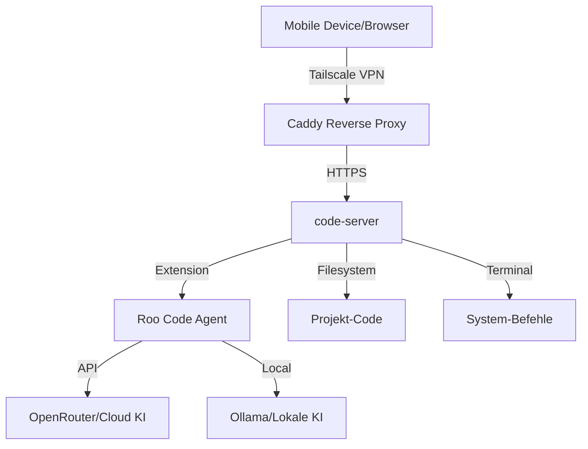

# DevSystem Projektkontext

## Projektziel
Vollständig remote nutzbare, KI-gestützte Entwicklungsumgebung für mobile Steuerung (Smartphone/Tablet) mit autonomen Multi-Agent-KI-Unterstützung.

## Architektur-Übersicht

## Infrastruktur
- **Host**: IONOS Ubuntu VPS
- **Zugang**: SSH über Tailscale-IP (Root)
- **Steuerung**: Windows PC (lokal) → VPS (remote)

## Benutzerrolle
- Primär als Reviewer (Approve/Reject)
- KI-Agenten führen Code-Änderungen und Terminal-Befehle aus
- Benutzer gibt strategische Richtung vor

## Aktuelle Projektphase
MVP-Entwicklung mit Fokus auf:
1. Sichere VPN-Verbindung (Tailscale)
2. HTTPS-Reverse-Proxy (Caddy)
3. Web-IDE-Zugang (code-server)
4. KI-Integration (Roo Code + OpenRouter/Ollama)

## Wichtige Verzeichnisse
- `/plans/`: Konzeptdokumente und Architektur
- `/scripts/`: Setup- und Deployment-Skripte
- `todo.md`: Zentrale Aufgabenliste
- `git-workflow.md`: Git-Prozess-Dokumentation

## Fachliche Anforderungen

### 1. Mobiler und geräteunabhängiger Zugriff
- Web-Anwendung (PWA-fähig) im Browser
- Nutzung über Smartphones/Tablets zur KI-Steuerung
- Reibungslose Skript-Ausführung von mobilen Geräten

### 2. Autonome Multi-Agent-KI-Unterstützung
- KI-Agenten agieren direkt in der IDE
- Lesen des Projektkontexts (Dateisystem)
- Code schreiben und Terminal-Befehle ausführen
- Benutzer als Reviewer (Approve/Reject)

### 3. Hybride KI-Strategie
- **Cloud-Modelle**: High-End-Modelle (Claude 3.5 Sonnet) über OpenRouter
- **Lokale Modelle**: Ollama auf VPS für einfache/datenschutzkritische Aufgaben

### 4. Sicherheit und Zero-Trust-Zugriff
- Keine öffentliche Internet-Erreichbarkeit
- Zugriff ausschließlich über privates VPN (Tailscale)
- HTTPS-verschlüsselter Datenverkehr (SSL)
