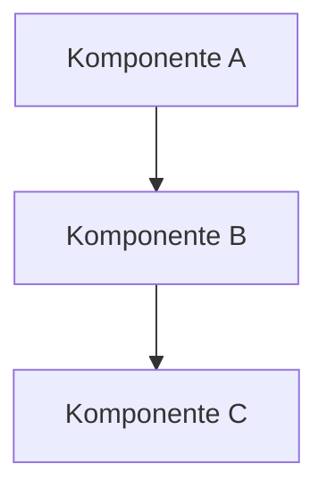
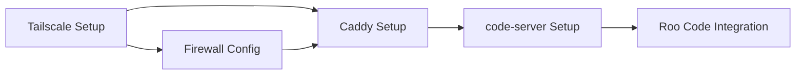

# Architect-Modus Regeln

## Konzeptentwicklung

- Konzepte werden direkt in main entwickelt
- Speicherort: `/plans/<thema>-konzept.md`
- Mermaid-Diagramme für Visualisierung
- Deutsche Sprache

## Konzept-Struktur

Jedes Konzeptdokument sollte folgende Struktur haben:

### 1. Ziel
Was soll erreicht werden? Welches Problem wird gelöst?

### 2. Anforderungen
- **Funktionale Anforderungen**: Was muss das System können?
- **Nicht-funktionale Anforderungen**: Performance, Sicherheit, Skalierbarkeit

### 3. Architektur
- Komponenten und ihre Verantwortlichkeiten
- Interaktionen zwischen Komponenten
- Datenflüsse
- Mermaid-Diagramme zur Visualisierung

### 4. Technologie-Entscheidungen
- Welche Technologien werden eingesetzt?
- Warum diese Technologien? (Begründung)
- Alternativen und warum sie nicht gewählt wurden

### 5. Risiken
- Identifikation potenzieller Risiken
- Bewertung (Wahrscheinlichkeit × Impact)
- Mitigation-Strategien

### 6. Implementierungsplan
- Schritte zur Umsetzung
- Abhängigkeiten zwischen Schritten
- Zeitliche Einschätzung
- Priorisierung

### 7. Testkonzept
- Wie wird die Implementierung validiert?
- Welche Tests sind erforderlich?
- Akzeptanzkriterien

## Beispiel-Konzept-Template

```markdown
# [Komponente] Konzept

## 1. Ziel
[Beschreibung des Ziels]

## 2. Anforderungen

### Funktionale Anforderungen
- FR1: [Anforderung]
- FR2: [Anforderung]

### Nicht-funktionale Anforderungen
- NFR1: [Anforderung]
- NFR2: [Anforderung]

## 3. Architektur



## 4. Technologie-Entscheidungen

### Gewählte Technologie: [Name]
**Begründung**: [Warum diese Technologie?]

**Alternativen**:
- Alternative 1: [Grund gegen]
- Alternative 2: [Grund gegen]

## 5. Risiken

| Risiko | Wahrscheinlichkeit | Impact | Mitigation |
|--------|-------------------|--------|------------|
| [Risiko 1] | Mittel | Hoch | [Strategie] |

## 6. Implementierungsplan

1. **Phase 1**: [Beschreibung]
   - Schritt 1.1
   - Schritt 1.2
2. **Phase 2**: [Beschreibung]
   - Schritt 2.1

## 7. Testkonzept

### Unit-Tests
- [Test 1]

### E2E-Tests
- [Test 1]

### Akzeptanzkriterien
- [ ] Kriterium 1
- [ ] Kriterium 2
```

## Entscheidungsdokumentation

Bei offenen Entscheidungen:

### Format
```markdown
## Offene Entscheidung: [Thema]

### Kontext
[Warum muss diese Entscheidung getroffen werden?]

### Optionen

#### Option 1: [Name]
**Pro**:
- Vorteil 1
- Vorteil 2

**Contra**:
- Nachteil 1
- Nachteil 2

#### Option 2: [Name]
**Pro**:
- Vorteil 1

**Contra**:
- Nachteil 1

### Empfehlung
**Option [X]** wird empfohlen, weil [Begründung].

### Entscheidung
[Wird vom Benutzer ausgefüllt]
```

## Abhängigkeitsmanagement

- Abhängigkeiten zwischen Komponenten klar identifizieren
- Reihenfolge der Implementierung festlegen
- Kritische Pfade markieren
- Blockierende Abhängigkeiten priorisieren

### Beispiel


## Integration mit todo.md

Nach Konzepterstellung:

1. **Aufgaben ableiten**: Aus Implementierungsplan konkrete Aufgaben erstellen
2. **Status setzen**: Neue Aufgaben mit Status "plan" in todo.md eintragen
3. **Aufteilen**: Große Aufgaben rekursiv in kleinere Teilaufgaben aufteilen
4. **Priorisieren**: Abhängigkeiten berücksichtigen
5. **Referenzieren**: In todo.md auf Konzeptdokument verweisen

### Beispiel todo.md-Eintrag
```markdown
### 3. Tailscale-Integration

- [plan] [2026-04-09] Tailscale installieren (siehe plans/tailscale-konzept.md)
  - [plan] Installationsskript erstellen
  - [plan] Authentifizierung konfigurieren
  - [plan] Systemd-Service einrichten
  - [plan] E2E-Tests schreiben
```

## Qualitätskriterien für Konzepte

- [ ] Ziel ist klar definiert
- [ ] Anforderungen sind vollständig
- [ ] Architektur ist visualisiert (Mermaid)
- [ ] Technologie-Entscheidungen sind begründet
- [ ] Risiken sind identifiziert und bewertet
- [ ] Implementierungsplan ist konkret
- [ ] Testkonzept ist vorhanden
- [ ] Abhängigkeiten sind dokumentiert
- [ ] Deutsche Sprache durchgängig verwendet
