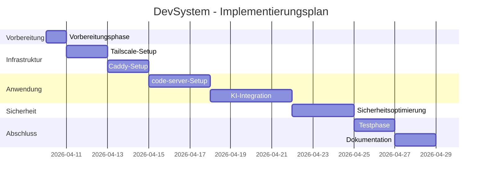

# DevSystem - Implementierungsplan

## Übersicht

Dieser Implementierungsplan definiert die Reihenfolge und den Umfang der Arbeiten für die Umsetzung des DevSystem-Projekts. Der Plan folgt dem in der Branch-Strategie definierten Workflow und berücksichtigt die Abhängigkeiten zwischen den Komponenten.

## Implementierungsphasen

Der Implementierungsprozess ist in folgende Phasen unterteilt:

1. **Vorbereitungsphase**: Einrichtung der Entwicklungsumgebung und Vorbereitung des Ubuntu VPS
2. **Basisinfrastruktur**: Installation und Konfiguration von Tailscale
3. **Middleware**: Installation und Konfiguration von Caddy als Reverse Proxy
4. **Anwendungsebene**: Installation und Konfiguration von code-server
5. **Erweiterungen**: Integration von KI-Komponenten (Roo Code, OpenRouter, Ollama)
6. **Sicherheitsoptimierung**: Implementierung zusätzlicher Sicherheitsmaßnahmen
7. **Testphase**: Durchführung von E2E-Tests und Validierung
8. **Dokumentation**: Finalisierung der Dokumentation und Übergabe

## Detaillierter Implementierungsplan

### Phase 1: Vorbereitungsphase

**Branch**: `feature/vps-preparation`

**Aufgaben**:
- Initiale SSH-Verbindung zum Ubuntu VPS herstellen
- Grundlegende Systemaktualisierung durchführen
- Notwendige Pakete installieren (curl, wget, git, etc.)
- Firewall (UFW) konfigurieren
- Systemhärtung gemäß Sicherheitskonzept durchführen

**Abhängigkeiten**: Keine

**Geschätzter Aufwand**: 1 Tag

### Phase 2: Basisinfrastruktur (Tailscale)

**Branch**: `feature/tailscale-setup`

**Aufgaben**:
- Tailscale installieren
- Tailscale-Authentifizierung einrichten
- ACLs konfigurieren
- DNS-Konfiguration vornehmen
- Verbindungstest durchführen
- Automatischen Start konfigurieren
- E2E-Tests für Tailscale durchführen

**Abhängigkeiten**: Phase 1

**Geschätzter Aufwand**: 2 Tage

### Phase 3: Middleware (Caddy)

**Branch**: `feature/caddy-setup`

**Aufgaben**:
- Caddy installieren
- Grundlegende Caddyfile erstellen
- Tailscale-Integration konfigurieren
- HTTPS mit Tailscale-Zertifikaten einrichten
- Sicherheitsheader konfigurieren
- Logging einrichten
- E2E-Tests für Caddy durchführen

**Abhängigkeiten**: Phase 2

**Geschätzter Aufwand**: 2 Tage

### Phase 4: Anwendungsebene (code-server)

**Branch**: `feature/code-server-setup`

**Aufgaben**:
- code-server installieren
- Workspace-Verzeichnisse einrichten
- Authentifizierung konfigurieren
- Integration mit Caddy einrichten
- Grundlegende Einstellungen konfigurieren
- Automatischen Start einrichten
- E2E-Tests für code-server durchführen

**Abhängigkeiten**: Phase 3

**Geschätzter Aufwand**: 3 Tage

### Phase 5: Erweiterungen (KI-Komponenten)

**Branch**: `feature/ai-integration`

**Aufgaben**:
- Roo Code Extension installieren und konfigurieren
- OpenRouter API-Integration einrichten
- Ollama installieren und konfigurieren
- Lokale Modelle herunterladen und einrichten
- Integration zwischen den KI-Komponenten testen
- E2E-Tests für KI-Funktionalität durchführen

**Abhängigkeiten**: Phase 4

**Geschätzter Aufwand**: 4 Tage

### Phase 6: Sicherheitsoptimierung

**Branch**: `feature/security-hardening`

**Aufgaben**:
- Zusätzliche Sicherheitsmaßnahmen implementieren
- Regelmäßige Backup-Skripte einrichten
- Monitoring und Alerting konfigurieren
- Intrusion Detection System einrichten
- Sicherheitsaudits durchführen
- Penetrationstests durchführen

**Abhängigkeiten**: Phase 5

**Geschätzter Aufwand**: 3 Tage

### Phase 7: Testphase

**Branch**: `feature/e2e-testing`

**Aufgaben**:
- Umfassende E2E-Tests für alle Komponenten durchführen
- Log-Validierungstests durchführen
- Performance-Tests durchführen
- Fehlerszenarien testen
- Benutzerakzeptanztests durchführen
- Fehlerbehebung und Optimierung

**Abhängigkeiten**: Phase 6

**Geschätzter Aufwand**: 2 Tage

### Phase 8: Dokumentation

**Branch**: `feature/documentation`

**Aufgaben**:
- Installationsdokumentation finalisieren
- Benutzerhandbuch erstellen
- Administratorhandbuch erstellen
- Troubleshooting-Guide erstellen
- Wartungsdokumentation erstellen
- Übergabedokumentation erstellen

**Abhängigkeiten**: Phase 7

**Geschätzter Aufwand**: 2 Tage

## Gesamtzeitplan

| Phase | Beschreibung | Abhängigkeiten | Geschätzter Aufwand |
|-------|--------------|----------------|---------------------|
| 1 | Vorbereitungsphase | Keine | 1 Tag |
| 2 | Basisinfrastruktur (Tailscale) | Phase 1 | 2 Tage |
| 3 | Middleware (Caddy) | Phase 2 | 2 Tage |
| 4 | Anwendungsebene (code-server) | Phase 3 | 3 Tage |
| 5 | Erweiterungen (KI-Komponenten) | Phase 4 | 4 Tage |
| 6 | Sicherheitsoptimierung | Phase 5 | 3 Tage |
| 7 | Testphase | Phase 6 | 2 Tage |
| 8 | Dokumentation | Phase 7 | 2 Tage |
| **Gesamt** | | | **19 Tage** |

## Implementierungsdiagramm

## Risiken und Mitigationsstrategien

| Risiko | Wahrscheinlichkeit | Auswirkung | Mitigationsstrategie |
|--------|-------------------|------------|----------------------|
| Verzögerungen bei der Tailscale-Authentifizierung | Mittel | Hoch | Vorab-Test der Authentifizierung, alternative Zugangsmethoden bereithalten |
| Kompatibilitätsprobleme zwischen Caddy und code-server | Niedrig | Mittel | Vorab-Tests in einer lokalen Umgebung, Versionspinning |
| Performance-Probleme bei KI-Komponenten | Mittel | Mittel | Ressourcenlimits konfigurieren, Skalierungsoptionen vorbereiten |
| Sicherheitslücken in Drittanbieter-Software | Niedrig | Hoch | Regelmäßige Updates, Sicherheitsaudits, Defense-in-Depth-Strategie |
| Datenverlust während der Implementierung | Niedrig | Hoch | Regelmäßige Backups, Snapshot vor kritischen Änderungen |

## Nächste Schritte

1. Überprüfung und Freigabe des Implementierungsplans
2. Einrichtung der Entwicklungsumgebung
3. Erstellung des ersten Feature-Branches (`feature/vps-preparation`)
4. Beginn der Implementierung gemäß dem Plan

## Hinweise zur Implementierung

- Alle Implementierungsschritte müssen den in der Branch-Strategie definierten Workflow befolgen
- Jede Phase muss mit erfolgreichen E2E-Tests abgeschlossen werden, bevor mit der nächsten Phase begonnen wird
- Regelmäßige Commits mit aussagekräftigen Commit-Nachrichten sind erforderlich
- Code-Reviews sind für alle Feature-Branches obligatorisch
- Die Dokumentation muss parallel zur Implementierung aktualisiert werden