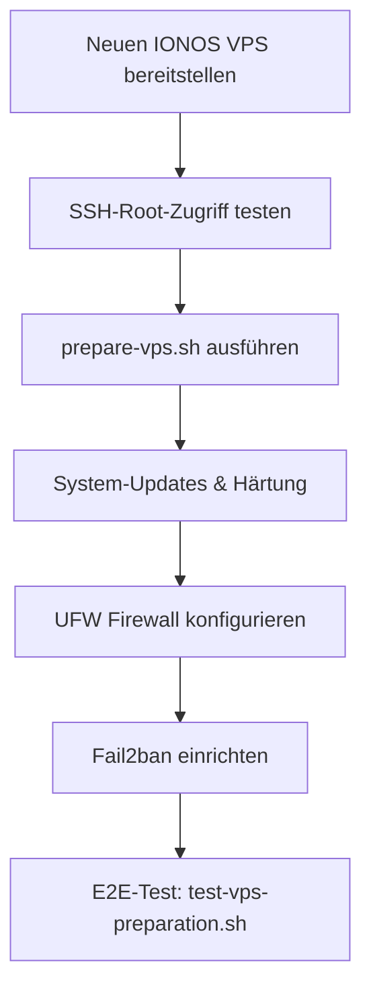
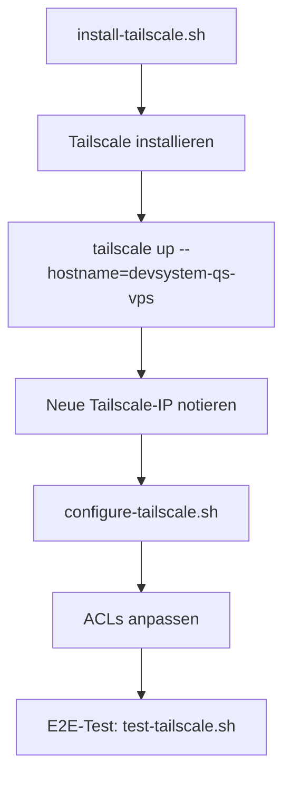
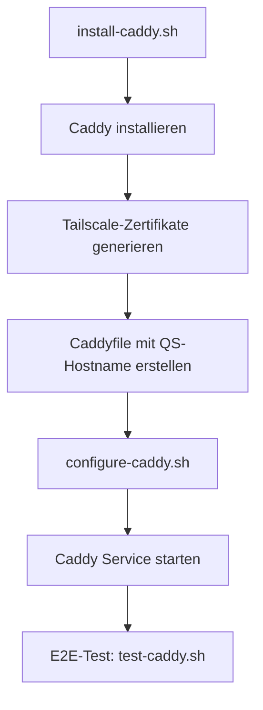
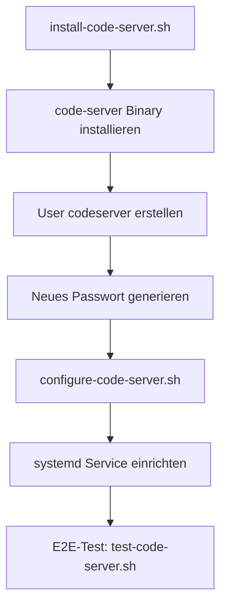
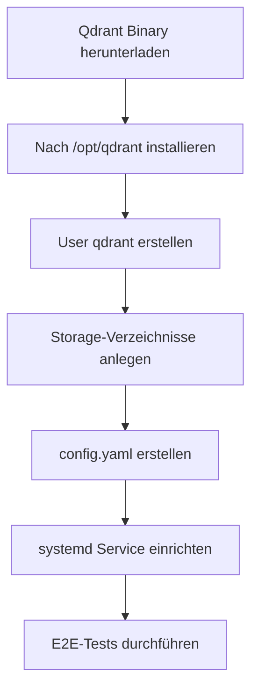
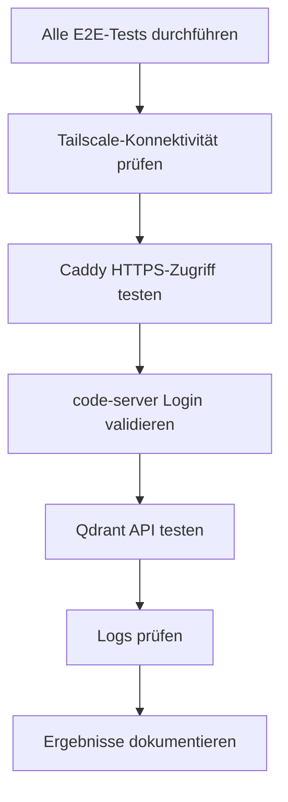

# Quality-Server (QS) VPS - Vollständiges Konzeptdokument

**Erstellt:** 2026-04-09  
**Version:** 1.0  
**Status:** Konzeptphase

## 1. Ziel und Zweck des QS-VPS

### 1.1 Primäres Ziel

Der Quality-Server (QS-VPS) ist eine **vollständige 1:1 Kopie** des bestehenden DevSystem-Produktiv-VPS. Er dient als **isolierte Testing-Umgebung** zur Qualitätssicherung vor dem Deployment von Änderungen auf den Produktiv-VPS.

### 1.2 Anwendungsfälle

- **Pre-Production Testing:** Alle Änderungen werden zuerst auf dem QS-VPS getestet
- **E2E-Validierung:** Vollständige End-to-End-Tests in produktionsnaher Umgebung
- **Feature-Entwicklung:** Sichere Entwicklung neuer Features ohne Produktionsrisiko
- **Disaster Recovery Testing:** Validierung von Backup- und Recovery-Prozessen
- **Performance-Tests:** Lasttests und Performance-Optimierungen ohne Produktionsrisiko
- **Schulung:** Sichere Umgebung für Training und Experimentierung

### 1.3 Designprinzipien

- ✅ **Isolation:** Vollständig getrennt vom Produktiv-VPS
- ✅ **Parität:** Identische Konfiguration zum Produktiv-VPS (nur mit angepassten Naming/IPs)
- ✅ **Reproduzierbarkeit:** Alle Installationen über versionierte Scripts
- ✅ **Sicherheit:** Gleiche Sicherheitsstandards wie Produktiv-VPS

## 2. Vollständige Komponentenliste

### 2.1 Infrastruktur-Basis

| Komponente | Version | Zweck | Status Produktiv |
|------------|---------|-------|------------------|
| **Betriebssystem** | Ubuntu 24.04 LTS | Basis-OS | ✅ Produktiv |
| **IONOS VPS** | - | Hosting-Plattform | ✅ Aktiv |
| **Fail2ban** | Latest | Intrusion Prevention | ✅ Konfiguriert |
| **UFW Firewall** | Latest | System-Firewall | ✅ Aktiv |

### 2.2 Netzwerk-Schicht

| Komponente | Version | Port | Zweck | Status Produktiv |
|------------|---------|------|-------|------------------|
| **Tailscale VPN** | Latest | 41641/udp | Zero-Trust-Netzwerk | ✅ Produktiv (IP: 100.100.221.56) |
| **Caddy Reverse Proxy** | Latest | 9443 | HTTPS-Terminierung, Routing | ✅ Produktiv (18/19 Tests OK) |

### 2.3 Anwendungsebene

| Komponente | Version | Port (intern) | Zweck | Status Produktiv |
|------------|---------|---------------|-------|------------------|
| **code-server** | 4.114.1+ | 8080 | Web-IDE | ✅ Produktiv (>43min Uptime) |
| **Qdrant** | 1.7.4 | 6333 (HTTP), 6334 (gRPC) | Vektordatenbank | ✅ Produktiv |
| **Ollama** | Latest | 11434 | Lokale KI-Modelle | 🔵 Backlog (Post-MVP) |

### 2.4 KI-Komponenten

| Komponente | Typ | Zweck | Status Produktiv |
|------------|-----|-------|------------------|
| **Roo Code Extension** | VS Code Extension | Multi-Agent KI-System | 🔵 Backlog (Post-MVP) |
| **OpenRouter API** | Cloud Service | Zugriff auf Cloud-KI-Modelle | 🔵 Backlog (Post-MVP) |

### 2.5 Benutzer und Berechtigungen

| User | Zweck | Home-Verzeichnis | Shell |
|------|-------|------------------|-------|
| `root` | System-Administration | /root | /bin/bash |
| `codeserver` | code-server Service | /home/codeserver | /usr/sbin/nologin |
| `qdrant` | Qdrant Service | /var/lib/qdrant | /bin/false |
| `caddy` | Caddy Service | /var/lib/caddy | /usr/sbin/nologin |

## 3. Netzwerk-Konfiguration QS-VPS

### 3.1 Naming-Konvention

| Komponente | Produktiv-VPS | QS-VPS (NEU) |
|------------|---------------|---------------|
| **Hostname** | `devsystem-vps` | `devsystem-qs-vps` |
| **Tailscale-Hostname** | `devsystem-vps.tailcfea8a.ts.net` | `devsystem-qs-vps.tailcfea8a.ts.net` |
| **Interner DNS** | `code.devsystem.internal` | `code.devsystem-qs.internal` |

### 3.2 IP-Adressen und Ports

#### Tailscale-IP (wird bei Registrierung vergeben)
- **Produktiv-VPS:** `100.100.221.56`
- **QS-VPS:** `100.x.y.z` (wird automatisch zugewiesen)

#### Port-Mapping

| Service | Port | Binding | Zugriff |
|---------|------|---------|---------|
| **Tailscale** | 41641/udp | 0.0.0.0 | VPN-Koordination |
| **Caddy HTTPS** | 9443/tcp | Tailscale-IP | Über Tailscale VPN |
| **code-server** | 8080/tcp | 127.0.0.1 | Nur via Caddy Proxy |
| **Qdrant HTTP** | 6333/tcp | 127.0.0.1 | Nur localhost |
| **Qdrant gRPC** | 6334/tcp | 127.0.0.1 | Nur localhost |
| **Ollama** | 11434/tcp | 127.0.0.1 | Nur localhost (Backlog) |

### 3.3 Caddy-Konfiguration (QS-spezifisch)

```caddyfile
# Global Settings
{
    admin off
    log {
        output file /var/log/caddy/access.log
        format json
    }
}

# code-server auf QS-VPS
https://100.x.y.z:9443, https://devsystem-qs-vps.tailcfea8a.ts.net:9443 {
    # Nur Zugriff über Tailscale erlauben
    @tailscale {
        remote_ip 100.64.0.0/10
    }
    
    # Reverse Proxy zu code-server
    reverse_proxy @tailscale localhost:8080 {
        header_up Connection {http.request.header.Connection}
        header_up Upgrade {http.request.header.Upgrade}
        
        transport http {
            keepalive 30m
            keepalive_idle_conns 10
        }
    }
    
    # Zugriff verweigern für nicht-Tailscale-Traffic
    respond !@tailscale 403 {
        body "QS-VPS: Zugriff nur über Tailscale erlaubt"
    }
    
    # Sicherheits-Header
    header {
        Strict-Transport-Security "max-age=31536000"
        X-Frame-Options "SAMEORIGIN"
        X-Content-Type-Options "nosniff"
        -Server
    }
}
```

### 3.4 Tailscale ACL-Konfiguration

```json
{
  "hosts": {
    "devsystem-prod": "100.100.221.56",
    "devsystem-qs": "100.x.y.z"
  },
  "acls": [
    {
      "action": "accept",
      "src": ["autogroup:admin"],
      "dst": ["devsystem-prod:9443", "devsystem-qs:9443"]
    }
  ]
}
```

## 4. Unterschiede zum Produktiv-VPS

### 4.1 Kennzeichnung und Naming

| Aspekt | Produktiv-VPS | QS-VPS |
|--------|---------------|--------|
| **Hostname** | `devsystem-vps` | `devsystem-qs-vps` |
| **Tailscale-Name** | `devsystem-vps` | `devsystem-qs-vps` |
| **Zugriffs-URL** | `https://100.100.221.56:9443` | `https://100.x.y.z:9443` |
| **code-server Passwort** | `P4eJISeX9RPPVQcn0os9544sjaFAFVEV` | NEU generieren (separate Credentials) |
| **Caddy Fehlerseite** | Standard | "QS-VPS" Kennzeichnung |

### 4.2 Daten und Konfiguration

- **Code-Repositories:** Initial identisch, dann unabhängig (separate Git-Branches für QS-Tests)
- **Qdrant Collections:** Leere Datenbank (keine Produktionsdaten)
- **Logs/Monitoring:** Separates Logging mit "QS-" Prefix
- **Backup-Ziel:** Separater Backup-Speicherort

### 4.3 Funktionale Unterschiede

- **Keine Produktionsdaten:** QS-VPS enthält keine echten Produktionsdaten
- **Experimenteller Charakter:** Neue Features werden zuerst hier getestet
- **Destruktive Tests:** Disaster-Recovery und Failure-Szenarien können sicher getestet werden

## 5. Installations-Reihenfolge (Schritt-für-Schritt)

### Phase 1: VPS-Vorbereitung (Dauer: ~30 Min)


**Skripte:**
- `scripts/prepare-vps.sh` (existiert bereits)
- `scripts/test-vps-preparation.sh` (existiert bereits)

### Phase 2: Tailscale VPN (Dauer: ~20 Min)


**Skripte:**
- `scripts/install-tailscale.sh` (existiert bereits)
- `scripts/configure-tailscale.sh` (existiert bereits - QS-anpassen)
- `scripts/test-tailscale.sh` (existiert bereits)

**Anpassung erforderlich:**
- Hostname: `devsystem-qs-vps` statt `devsystem-vps`

### Phase 3: Caddy Reverse Proxy (Dauer: ~30 Min)


**Skripte:**
- `scripts/install-caddy.sh` (existiert bereits)
- `scripts/configure-caddy.sh` (existiert bereits - QS-anpassen)
- `scripts/test-caddy.sh` (existiert bereits - QS-anpassen)

**Anpassung erforderlich:**
- Caddyfile: Neue Tailscale-IP und Hostname
- Fehlerseiten: "QS-VPS" Kennzeichnung

### Phase 4: code-server Web-IDE (Dauer: ~40 Min)


**Skripte:**
- `scripts/install-code-server.sh` (existiert bereits)
- `scripts/configure-code-server.sh` (existiert bereits - QS-anpassen)
- `scripts/test-code-server.sh` (existiert bereits - QS-anpassen)

**Anpassung erforderlich:**
- Neues Passwort generieren (nicht Produktiv-Passwort verwenden)
- Config: Separate Workspace-Verzeichnisse

### Phase 5: Qdrant Vektordatenbank (Dauer: ~30 Min)


**Skripte:**
- Verwendet bestehende Prozedur aus `vps-deployment-qdrant.md`
- Keine QS-spezifischen Anpassungen nötig

### Phase 6: Validierung und Dokumentation (Dauer: ~20 Min)



**Deliverables:**
- `vps-test-results-qs.md` (nach Produktiv-Vorlage)
- Screenshot/Test-Logs
- Zugriffsdaten dokumentieren

## 6. Installations-Scripts und Anpassungen

### 6.1 Bestehende Scripts (wiederverwendbar)

✅ **Direkt verwendbar ohne Anpassung:**
- `scripts/prepare-vps.sh`
- `scripts/test-vps-preparation.sh`
- `scripts/install-tailscale.sh`
- `scripts/install-caddy.sh`
- `scripts/install-code-server.sh`

### 6.2 Scripts die QS-Anpassungen benötigen

🔧 **Anpassung erforderlich (Hostname/IP):**
- `scripts/configure-tailscale.sh` → QS-Hostname
- `scripts/configure-caddy.sh` → QS-IP und Fehlerseiten
- `scripts/configure-code-server.sh` → QS-Passwort
- `scripts/test-caddy.sh` → QS-URLs
- `scripts/test-code-server.sh` → QS-URLs

### 6.3 Neue Scripts (zu erstellen)

📝 **Neu zu erstellen:**
- `scripts/qs-init.sh` - Automatische Initialisierung mit QS-Parametern
- `scripts/qs-full-test.sh` - Vollständiger E2E-Test-Suite für QS-VPS
- `scripts/qs-sync-from-prod.sh` - Sync von Konfigurationen vom Produktiv-VPS

## 7. Offene Entscheidungen

### Entscheidung 1: VPS-Zugangsdaten und Spezifikationen

**Frage:** Welche VPS-Zugangsdaten und Server-Spezifikationen hat der neue QS-VPS?

**Benötigte Informationen:**
- Root-SSH-IP-Adresse des neuen QS-VPS
- Root-Passwort oder SSH-Key für initialen Zugriff
- VPS-Spezifikationen (RAM, CPU, Storage)
- Ist der QS-VPS bereits bei IONOS bestellt?

**Alternativen:**
1. **Neuer VPS bei IONOS bestellen:** Empfohlene Spezifikationen: 4 CPU, 8GB RAM, 200GB Storage (identisch zu Produktiv-VPS)
2. **Bestehender VPS:** Falls bereits vorhanden, Zugangsdaten bereitstellen

**Empfehlung:** Ich empfehle die Bestellung eines neuen IONOS VPS mit identischen Spezifikationen zum Produktiv-VPS (Option 1), um vollständige Parität zu gewährleisten.

**Status:** ⏸️ Warte auf Rückmeldung

---

### Entscheidung 2: Passwort-Strategie für QS-VPS

**Frage:** Soll der QS-VPS das gleiche code-server-Passwort wie der Produktiv-VPS verwenden, oder ein separates Passwort?

**Alternativen:**
1. **Identisches Passwort:** Einfacher zu merken, aber weniger sicher (beide Umgebungen mit einem Passwort)
2. **Separates Passwort:** Höhere Sicherheit, klare Trennung zwischen QS und Produktion
3. **Automatisch generiertes Passwort:** Skript generiert neues sicheres Passwort bei Installation

**Empfehlung:** Ich empfehle **Option 3** (automatisch generiertes Passwort) mit dokumentierter Speicherung in einem Password-Manager oder `.qs-credentials.md`. Dies gewährleistet maximale Sicherheit und klare Trennung.

**Status:** ⏸️ Warte auf Rückmeldung

---

### Entscheidung 3: Datensynchronisation zwischen Produktiv und QS

**Frage:** Soll der QS-VPS eine initiale Kopie der Produktiv-Repositories und Workspaces erhalten?

**Alternativen:**
1. **Leere Installation:** QS startet komplett leer, nur System-Konfiguration identisch
2. **Repository-Clone:** Git-Repositories werden geklont, aber keine Daten kopiert
3. **Snapshot-basiert:** Periodische Snapshots vom Produktiv-VPS auf QS replizieren (ohne sensible Daten)

**Empfehlung:** Ich empfehle **Option 2** (Repository-Clone). Der QS-VPS sollte die gleichen Git-Repositories klonen, aber auf feature/test-Branches arbeiten. Keine Produktionsdaten sollten kopiert werden. Dies ermöglicht realistische Tests ohne Datenschutzrisiken.

**Status:** ⏸️ Warte auf Rückmeldung

---

### Entscheidung 4: Backup-Strategie für QS-VPS

**Frage:** Benötigt der QS-VPS ein eigenes Backup-System oder ist er als "wegwerfbar" zu betrachten?

**Alternativen:**
1. **Keine Backups:** QS ist vollständig reproduzierbar über Scripts, kein Backup nötig
2. **Minimales Backup:** Nur Konfigurationsdateien und Scripts
3. **Vollständiges Backup:** Gleiches Backup-System wie Produktiv-VPS
4. **Snapshot-basiert:** Manuelle Snapshots vor größeren Tests

**Empfehlung:** Ich empfehle **Option 1** (keine Backups) mit gelegentlichen manuellen **Snapshots (Option 4)** vor kritischen Disaster-Recovery-Tests. Der QS-VPS sollte jederzeit über die Scripts vollständig neu aufgebaut werden können. Dies fördert die Reproduzierbarkeit und testet gleichzeitig die Installations-Scripts.

**Status:** ⏸️ Warte auf Rückmeldung

---

### Entscheidung 5: Tailscale-Netzwerk-Strategie

**Frage:** Soll der QS-VPS im gleichen Tailscale-Netzwerk (Tailnet) wie der Produktiv-VPS sein?

**Alternativen:**
1. **Gleiches Tailnet:** QS und Produktiv im selben VPN (einfacher, beide gleichzeitig erreichbar)
2. **Separates Tailnet:** Komplett getrennte Netzwerke (maximale Isolation)
3. **Gleiches Tailnet mit ACL-Trennung:** Im selben Netz, aber via ACLs getrennt

**Empfehlung:** Ich empfehle **Option 1** (gleiches Tailnet). Beide Server im gleichen Tailscale-Netzwerk ermöglichen einfachen Zugriff und Vergleich. Die Trennung erfolgt über unterschiedliche Hostnamen und IP-Adressen. ACLs können bei Bedarf zusätzliche Isolation bieten.

**Status:** ⏸️ Warte auf Rückmeldung

---

### Entscheidung 6: Zeitpunkt der KI-Komponenten-Installation

**Frage:** Sollen Ollama und Roo Code Extension bereits auf dem QS-VPS installiert werden, obwohl sie noch im Backlog des Produktiv-VPS sind?

**Alternativen:**
1. **Jetzt installieren:** QS kann als Testbed für die KI-Integration dienen
2. **Warten auf Produktiv:** Erst auf Produktiv installieren, dann auf QS replizieren
3. **Später entscheiden:** QS-VPS zunächst ohne KI-Komponenten aufsetzen

**Empfehlung:** Ich empfehle **Option 1** (jetzt installieren). Der QS-VPS sollte aktiv für die Entwicklung und Testing der KI-Integration genutzt werden. Das ist der eigentliche Zweck einer QS-Umgebung. Dies erfordert eine Erweiterung des Konzepts um Ollama- und Roo-Code-Installationsschritte.

**Status:** ⏸️ Warte auf Rückmeldung

## 8. Geschätzter Gesamt-Zeitaufwand

| Phase | Beschreibung | Geschätzte Dauer |
|-------|--------------|------------------|
| 1 | VPS-Vorbereitung | ~30 Min |
| 2 | Tailscale VPN | ~20 Min |
| 3 | Caddy Reverse Proxy | ~30 Min |
| 4 | code-server Web-IDE | ~40 Min |
| 5 | Qdrant Vektordatenbank | ~30 Min |
| 6 | Validierung & Dokumentation | ~20 Min |
| **Gesamt** | **End-to-End Installation** | **~2.5 Stunden** |

*Hinweis: Zeitangaben basieren auf Erfahrung mit Produktiv-VPS Installation. Bei Automatisierung über Scripts kann die Dauer reduziert werden.*

## 9. Risiken und Mitigationsstrategien

| Risiko | Wahrscheinlichkeit | Auswirkung | Mitigation |
|--------|-------------------|------------|------------|
| IP-Adresse kollidiert mit Produktiv-VPS | Niedrig | Hoch | Tailscale vergibt automatisch eindeutige IPs |
| Verwechslung QS/Produktiv durch Benutzer | Mittel | Hoch | Klare Kennzeichnung in UI, separate Passwörter |
| Skript-Anpassungen fehlerhaft | Mittel | Mittel | Alle Scripts vor Ausführung auf QS validieren |
| Ressourcen-Überlastung bei parallelem Betrieb | Niedrig | Niedrig | Beide VPS haben ausreichend Ressourcen |
| Ungewollte Datensynchronisation | Niedrig | Hoch | Keine automatische Sync einrichten, nur manuell |

## 10. Success Criteria

Der QS-VPS gilt als erfolgreich implementiert, wenn:

✅ Alle Services laufen stabil (systemctl status)  
✅ QS-VPS über Tailscale VPN erreichbar  
✅ HTTPS über Caddy funktioniert (Port 9443)  
✅ code-server Login und IDE funktionsfähig  
✅ Qdrant API antwortet korrekt  
✅ Alle E2E-Tests bestanden  
✅ Logs zeigen keine kritischen Fehler  
✅ QS-VPS ist eindeutig als "Quality-Server" erkennbar  
✅ Dokumentation vollständig (Zugangsdaten, URLs, Passwörter)

## 11. Nächste Schritte

1. **Entscheidungen klären:** Alle 6 offenen Entscheidungen mit dem Benutzer besprechen
2. **VPS bereitstellen:** Neuen IONOS VPS bestellen (falls noch nicht geschehen)
3. **Scripts anpassen:** QS-spezifische Varianten der Config-Scripts erstellen
4. **Installation durchführen:** Phase-für-Phase gemäß Installations-Reihenfolge
5. **Validierung:** Vollständige E2E-Tests durchführen
6. **Dokumentation:** Test-Ergebnisse und Zugangsdaten dokumentieren

## 12. Anhang

### 12.1 Referenz-URLs

**Produktiv-VPS:**
- URL: `https://100.100.221.56:9443`
- Alt-URL: `https://devsystem-vps.tailcfea8a.ts.net:9443`

**QS-VPS (nach Installation):**
- URL: `https://100.x.y.z:9443` (IP wird bei Tailscale-Registrierung vergeben)
- Alt-URL: `https://devsystem-qs-vps.tailcfea8a.ts.net:9443`

### 12.2 Verzeichnis-Struktur (identisch zu Produktiv)

```
/opt/
├── qdrant/              # Qdrant Binary und Config
│   ├── qdrant
│   └── config.yaml

/etc/
├── caddy/               # Caddy Konfiguration
│   ├── Caddyfile
│   └── tls/
├── systemd/system/      # Service-Definitionen
│   ├── caddy.service
│   ├── code-server@.service
│   └── qdrant.service

/var/
├── lib/
│   ├── caddy/           # Caddy Daten
│   ├── qdrant/          # Qdrant Storage
│   └── code-server/
├── log/
│   ├── caddy/           # Caddy Logs
│   ├── qdrant/          # Qdrant Logs
│   └── code-server/     # code-server Logs

/home/
└── codeserver/          # code-server Workspace
    ├── .config/code-server/
    └── workspaces/
```

### 12.3 Relevante Dokumentation

- [`VISION.md`](../../VISION.md) - Projekt-Vision und Fachliche Anforderungen
- [GitHub Issues](https://github.com/HaraldKiessling/DevSystem/issues) - Projekt-Status und Aufgaben
- [`plans/implementierungsplan.md`](implementierungsplan.md) - Implementierungs-Roadmap
- [`plans/tailscale-konzept.md`](tailscale-konzept.md) - Tailscale-Details
- [`plans/caddy-konzept.md`](caddy-konzept.md) - Caddy-Details
- [`plans/code-server-konzept-vollstaendig.md`](code-server-konzept-vollstaendig.md) - code-server-Details
- [`vps-deployment-qdrant.md`](../vps-deployment-qdrant.md) - Qdrant-Installation

---

**Dokument-Status:** ✅ Vollständig erstellt, wartet auf Freigabe und Klärung offener Entscheidungen

**Letzte Aktualisierung:** 2026-04-09 17:12 UTC
