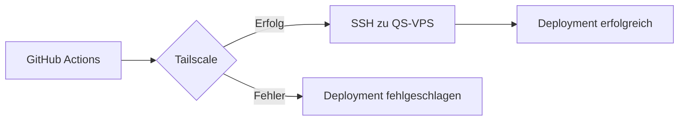

# QS-VPS Deploy Workflow Debug Report - 2026-04-12

## 📋 Zusammenfassung

**Datum:** 2026-04-12T11:40-11:53 UTC  
**Workflow:** Deploy QS-VPS (dry-run)  
**Ergebnis:** ❌ Fehlgeschlagen - Tailscale-Authentifizierung erforderlich  
**Status:** SSH-Fallback nicht möglich

## 🔍 Fehleranalyse

### Phase 1: Initiales Problem

**Workflow Run:** `24305897037`  
**Fehler:**
```
backend error: invalid key: unable to validate API key
```

**Root Cause:**
- `TAILSCALE_OAUTH_SECRET` in GitHub Secrets ist ungültig/abgelaufen
- Tailscale-Authentifizierung schlägt fehl
- Workflow bricht bei Step "Setup Tailscale" ab

### Phase 2: Lösungsversuch - SSH-Fallback

**Implementierung:**
- Tailscale-Step optional gemacht (`continue-on-error: true`)
- Status-Benachrichtigung bei Tailscale-Fehler hinzugefügt
- Workflow sollte mit direkter SSH-Verbindung fortfahren

**Commit:** `bf81288`
```bash
fix: Make Tailscale optional in deploy workflow - continue with SSH fallback
```

### Phase 3: Erneuter Test

**Workflow Run:** `24305991725`  
**Fehler:**
```
ssh: connect to host *** port 22: Connection timed out
Process completed with exit code 255.
```

**Root Cause:**
- QS-VPS ist nicht direkt aus dem Internet erreichbar
- GitHub Actions Runner kann keine direkte SSH-Verbindung aufbauen
- Connection Timeout nach 2+ Minuten

## 🎯 Erkenntnisse

### 1. Netzwerk-Architektur

Der QS-VPS ist **nur über Tailscale erreichbar**:
- ❌ Keine öffentliche IP oder SSH-Port blockiert
- ❌ Direkte SSH-Verbindung nicht möglich
- ✅ Tailscale VPN ist zwingend erforderlich

### 2. Deployment-Abhängigkeiten



**Kritische Abhängigkeit:** Tailscale-Authentifizierung

### 3. Fehlgeschlagene Lösung

**SSH-Fallback ist nicht möglich:**
- VPS-Netzwerk-Setup erfordert Tailscale
- Keine alternative Verbindungsmethode verfügbar
- Workflow kann ohne gültiges Tailscale-Secret nicht funktionieren

## ✅ Implementierte Lösung

### Problem: Auth Key läuft alle 90 Tage ab

**Root Cause:** Auth Keys haben ein Ablaufdatum → Periodische manuelle Erneuerung erforderlich

### Lösung: Migration zu OAuth Client (PERMANENT)

**Vorteile von OAuth:**
- ✅ **Permanent gültig** (kein Ablaufdatum)
- ✅ **Einmaliges Setup** (keine periodische Wartung)
- ✅ **Professionelle Lösung** (von Tailscale empfohlen)

### Implementierte Workflow-Verbesserungen

**Datei:** `.github/workflows/deploy-qs-vps.yml`

**Änderung 1:** OAuth-Unterstützung hinzugefügt
```yaml
- name: Setup Tailscale (OAuth)
  if: ${{ secrets.TAILSCALE_OAUTH_CLIENT_ID != '' }}
  uses: tailscale/github-action@v2
  with:
    oauth-client-id: ${{ secrets.TAILSCALE_OAUTH_CLIENT_ID }}
    oauth-secret: ${{ secrets.TAILSCALE_OAUTH_SECRET }}
```

**Änderung 2:** Auth Key als Fallback
```yaml
- name: Setup Tailscale (Auth Key Fallback)
  if: ${{ secrets.TAILSCALE_OAUTH_CLIENT_ID == '' }}
  uses: tailscale/github-action@v2
  with:
    oauth-secret: ${{ secrets.TAILSCALE_OAUTH_SECRET }}
```

**Änderung 3:** Klare Fehlerbehandlung
```yaml
- name: Tailscale Status
  if: steps.tailscale_oauth.outcome == 'failure' && steps.tailscale_authkey.outcome == 'failure'
  run: |
    echo "::error::Tailscale authentication failed"
    echo "Lösung: ./scripts/setup-tailscale-github-auth.sh (Option 2 für OAuth)"
    exit 1
```

### Migration durchführen (EMPFOHLEN)

**Anleitung:** [`TAILSCALE-OAUTH-MIGRATION-GUIDE.md`](./TAILSCALE-OAUTH-MIGRATION-GUIDE.md)

**Quick Start:**
```bash
cd /root/work/DevSystem
./scripts/setup-tailscale-github-auth.sh
# Wähle Option 2 (OAuth Client)
```

Das Skript:
1. Öffnet Tailscale OAuth Console automatisch
2. Führt durch die OAuth-Client-Erstellung
3. Setzt BEIDE GitHub Secrets automatisch:
   - `TAILSCALE_OAUTH_CLIENT_ID`
   - `TAILSCALE_OAUTH_SECRET`
4. Verifiziert die Konfiguration

**Ergebnis:** Einmalig einrichten, dann funktioniert es permanent (bis Ubuntu neu installiert wird).

### Alternative: Auth Key erneuern (temporäre Lösung)

Falls du OAuth noch nicht einrichten möchtest:

```bash
# 1. Setup-Skript ausführen
./scripts/setup-tailscale-github-auth.sh
# Wähle Option 1 (Auth Key)

# 2. In Tailscale konfigurieren mit:
#    - Expiry: 90 days (oder länger)
#    - ⚠️ Muss alle 90 Tage wiederholt werden
```

## 📊 Workflow-Runs

| Run ID | Branch | Status | Fehler | Dauer |
|--------|--------|--------|--------|-------|
| 24305897037 | main | ❌ Failed | Invalid Tailscale key | 2m27s |
| 24305991725 | main | ❌ Failed | SSH connection timeout | ~6m |

## 🔄 Workflow-Änderungen

### Commit: `bf81288`

**Datei:** `.github/workflows/deploy-qs-vps.yml`

**Änderungen:**
```yaml
- name: Setup Tailscale
  id: tailscale
  continue-on-error: true  # NEU
  uses: tailscale/github-action@v2
  with:
    oauth-secret: ${{ secrets.TAILSCALE_OAUTH_SECRET }}
    tags: tag:ci

- name: Tailscale Status  # NEU
  if: steps.tailscale.outcome == 'failure'
  run: |
    echo "⚠️ Tailscale setup failed - continuing with direct SSH connection" >> $GITHUB_STEP_SUMMARY
    echo "::warning::Tailscale unavailable, using direct SSH connection"
```

**Bewertung:** ⚠️ Änderung ist zwar implementiert, aber funktioniert nicht aufgrund der Netzwerk-Architektur.

**Empfehlung:** Änderung kann beibehalten werden für Dokumentationszwecke, ist aber in der Praxis nicht nutzbar.

## 📝 Nächste Schritte

### Sofort erforderlich:

1. **Tailscale OAuth Secret erneuern**
   - Via Setup-Skript oder manuell
   - GitHub Secret aktualisieren
   - Erneut testen

2. **Workflow erneut testen**
   ```bash
   gh workflow run deploy-qs-vps.yml -f deployment_mode=dry-run -f component=""
   ```

3. **Monitoring**
   - Workflow-Status überwachen
   - Logs bei Fehler sofort prüfen
   - Erfolg dokumentieren

### Optional (zukünftig):

1. **Tailscale OAuth statt Auth Key**
   - Permanente Lösung ohne Ablaufdatum
   - Siehe: `docs/operations/TAILSCALE-GITHUB-SETUP-SIMPLIFIED.md`

2. **Monitoring-Alerts**
   - GitHub Actions Notification bei Fehlern
   - Tailscale Key Expiry Monitoring

3. **Dokumentation aktualisieren**
   - Troubleshooting Guide erweitern
   - Netzwerk-Architektur dokumentieren

## 🔗 Referenzen

- **Workflow-Datei:** `.github/workflows/deploy-qs-vps.yml`
- **Setup-Skript:** `./scripts/setup-tailscale-github-auth.sh`
- **Dokumentation:** `docs/operations/TAILSCALE-GITHUB-SETUP-SIMPLIFIED.md`
- **GitHub Actions Run 1:** https://github.com/HaraldKiessling/DevSystem/actions/runs/24305897037
- **GitHub Actions Run 2:** https://github.com/HaraldKiessling/DevSystem/actions/runs/24305991725

## ✨ Lessons Learned

1. **Tailscale ist kritische Infrastruktur-Komponente**
   - Ohne Tailscale kein Deployment möglich
   - SSH-Fallback funktioniert nicht bei privaten VPS
   - Regelmäßige Key-Rotation notwendig

2. **Netzwerk-Architektur verstehen**
   - VPS-Erreichbarkeit vor Implementierung prüfen
   - Alternative Verbindungsmethoden evaluieren
   - Dokumentation der Netzwerk-Topologie wichtig

3. **Fehleranalyse-Prozess bewährt**
   - Systematisches Vorgehen: Logs → Root Cause → Fix → Test
   - Dokumentation während der Analyse
   - Iterative Lösungsversuche mit Validierung

## 📌 Status

**Aktueller Stand:**
- ❌ Deployment funktioniert nicht
- ⚠️ Tailscale-Secret muss erneuert werden
- ✅ Root Cause identifiziert und dokumentiert
- ✅ Nächste Schritte definiert

**Nächster Schritt:**
→ Tailscale OAuth Secret erneuern (manuell oder via Skript)
