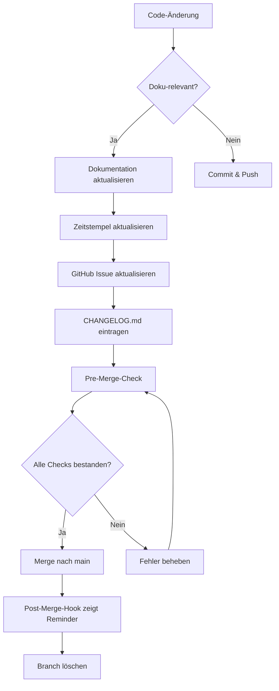
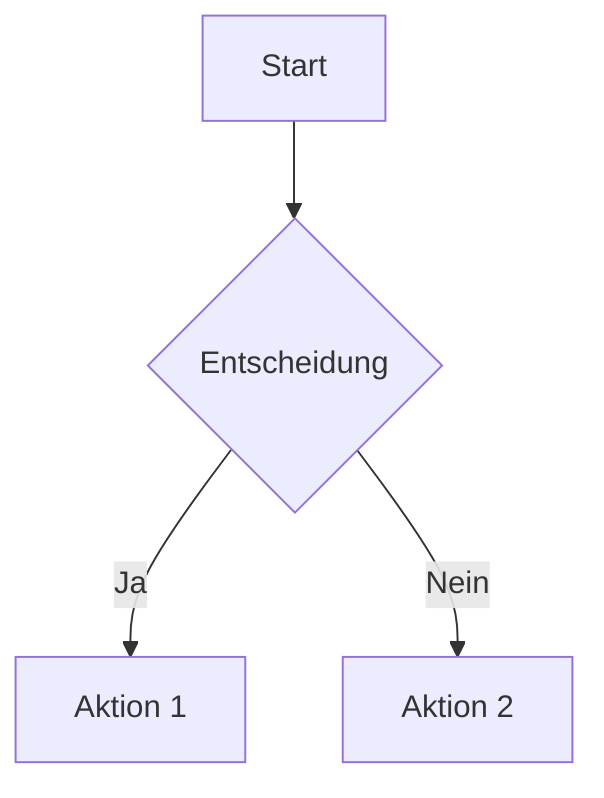

# Dokumentations-Governance

**Version:** 1.0.0  
**Erstellt:** 2026-04-11  
**Letzte Aktualisierung:** 2026-04-12 04:19 UTC  
**Status:** Aktiv

---

## Überblick

Dieses Dokument definiert die Governance für die Projekt-Dokumentation, einschließlich Verantwortlichkeiten, Standards, Prozesse und Qualitätssicherung.

**Zweck:** Verhinderung von Dokumentations-Drift und Sicherstellung einer konsistenten, aktuellen Dokumentation.

**Geltungsbereich:** Alle Markdown-Dateien in `docs/`, `CHANGELOG.md`, `README.md` und verwandte Dokumentation.

---

## 1. Prinzipien

### 1.1 Single Source of Truth

**Regel:** Jede Information hat EINE authoritative Quelle.

**Hierarchie:**
1. **Live-System** (höchste Priorität bei Service-Status)
2. **Git-History** (unveränderbare Wahrheit über Code-Änderungen)
3. **CHANGELOG.md** (Was wurde WANN geändert)
4. **GitHub Issues/Projects** (Was ist AKTUELL zu tun)
5. **docs/reports/** (Wie ist der AKTUELLE Stand)
6. **docs/archive/** (Was war HISTORISCH)

**Anti-Patterns:**
- ❌ Informationen in mehreren Dokumenten duplizieren
- ❌ Archive als Haupt-Informationsquelle verwenden
- ❌ Kritische Infos nur in Commit-Messages

### 1.2 Documentation is Code

**Regel:** Dokumentation ist ein Pflicht-Bestandteil jeder Implementation.

**Konsequenzen:**
- 📋 Dokumentations-Updates sind Teil der Definition of Done
- 🚫 Merges ohne Dokumentations-Update sind Prozess-Verstöße
- ✅ Code-Reviews prüfen auch Dokumentation

### 1.3 Automation over Manual Work

**Regel:** Automatisiere Validierung und Prüfung wo möglich.

**Implementiert:**
- ✅ CI/CD: [`.github/workflows/docs-validation.yml`](../../.github/workflows/docs-validation.yml)
- ✅ Pre-Merge-Check: [`scripts/docs/pre-merge-check.sh`](../../scripts/docs/pre-merge-check.sh)
- ✅ Post-Merge-Hook: [`scripts/docs/post-merge-hook-template.sh`](../../scripts/docs/post-merge-hook-template.sh)

### 1.4 Timestamps are Mandatory

**Regel:** Jedes Dokument muss einen klaren Zeitstempel haben.

**Format:**
```markdown
**Stand:** YYYY-MM-DD HH:MM UTC
```

**Aktualisierung:** Bei jeder inhaltlichen Änderung (nicht bei Tippfehlern).

---

## 2. Ownership & Verantwortlichkeiten

### 2.1 Dokumentations-Ownership-Matrix

| Dokument | Primary Owner | Update-Trigger | Max. Delay |
|----------|---------------|----------------|------------|
| [GitHub Issues](https://github.com/HaraldKiessling/DevSystem/issues) | Project-Lead / AI-Agent | Nach Task-Abschluss | Real-time |
| [`CHANGELOG.md`](../../CHANGELOG.md) | Developer / AI-Agent | Vor jedem Merge | 0h |
| [`docs/reports/DevSystem-Implementation-Status.md`](../reports/DevSystem-Implementation-Status.md) | Tech-Lead | Nach Major Milestones | 1 Woche |
| [`docs/archive/`](../archive/) | Automated (CI/CD) | Nach Deployment-Success | Sofort |
| [`docs/project/VISION.md`](../project/VISION.md) | Product-Owner | Bei Strategic Changes | Quarterly |
| [`docs/concepts/`](../concepts/) | Architect | Bei Konzept-Änderungen | Bei Änderung |
| [`docs/operations/`](../operations/) | DevOps-Lead | Bei Prozess-Änderungen | Bei Änderung |

### 2.2 Verantwortlichkeiten

**Project-Lead:**
- GitHub Issues/Projects aktuell halten
- Offene Entscheidungen tracken
- Releases koordinieren

**Tech-Lead:**
- Status-Reports nach Major Milestones
- Architektur-Dokumentation pflegen
- Code-Review inkl. Dokumentation

**Developer / AI-Agent:**
- CHANGELOG.md bei jedem Feature
- Konzept-Dokumente bei neuen Features
- Definition of Done einhalten

**DevOps-Lead:**
- Operations-Dokumentation
- Workflow-Dokumentation
- CI/CD-Wartung

---

## 3. Dokumentations-Standards

### 3.1 Zeitstempel-Format

**Standard:**
```markdown
**Stand:** 2026-04-12 04:19 UTC
```

**Kurzform (nur Datum):**
```markdown
**Erstellt:** 2026-04-11
```

**ISO-8601 (für Logs):**
```markdown
2026-04-12T04:19:00Z
```

### 3.2 Status-Marker

| Status | Marker | Bedeutung | Verwendung |
|--------|--------|-----------|-----------|
| Abgeschlossen | `[x]` | Task vollständig erledigt | GitHub Issues |
| In Arbeit | `[-]` | Aktiv in Bearbeitung | Orchestrator Reminders |
| Offen | `[ ]` | Noch nicht begonnen | Default für neue Tasks |
| Blockiert | `[!]` | Wartet auf Dependency | Bei Blocker-Situation |
| Übersprungen | `[~]` | Nicht mehr relevant | Bei Scope-Änderung |
| Verifiziert | ✅ | Getestet und validiert | Status-Reports |
| Warning | ⚠️ | Teilweise/eingeschränkt | Dokumentations-Checks |
| Error | ❌ | Fehler/nicht verfügbar | Kritische Probleme |

### 3.3 Markdown-Konventionen

**Überschriften:**
```markdown
# H1: Dokument-Titel (nur 1x pro Dokument)
## H2: Hauptsektionen
### H3: Untersektionen
#### H4: Details (sparsam verwenden)
```

**Links:**
```markdown
# Relative Links (bevorzugt)
[Git Workflow](git-workflow.md)
[Definition of Done](git-workflow.md#definition-of-done-dod)

# Externe Links
[Conventional Commits](https://www.conventionalcommits.org/)
```

**Code-Blöcke:**
````markdown
```bash
# Bash-Befehle mit Language-Marker
git commit -m "feat: add feature"
```

```yaml
# YAML-Konfigurationen
name: workflow-name
```
````

**Tabellen:**
```markdown
| Header 1 | Header 2 |
|----------|----------|
| Cell 1   | Cell 2   |
```

### 3.4 Archivierungs-Standards

**Wann archivieren:**
- ✅ Dokument beschreibt abgeschlossene Phase
- ✅ Informationen sind rein historisch
- ✅ Mehrere Versionen existieren (alte archivieren)
- ✅ Dokument war temporärer Workaround

**Wohin archivieren:**
```
docs/archive/
├── phases/              # Projekt-Phasen
├── retrospectives/      # Post-Mortems, Lessons Learned
├── test-results/        # Historische Test-Reports
├── troubleshooting/     # Gelöste Probleme
├── concepts/            # Veraltete Konzept-Versionen
└── [datum]/             # Snapshots (optional)
```

**Archiv-Metadaten:**
```markdown
# [Original-Titel]

**Status:** 🗃️ ARCHIVIERT  
**Archiviert am:** 2026-04-11  
**Grund:** Phase abgeschlossen  
**Nachfolger:** [Link zum aktuellen Dokument]
```

---

## 4. Review-Zyklen & Qualitätssicherung

### 4.1 Dokumentations-Review-Frequenzen

| Frequenz | Aktivität | Verantwortlich | Aufwand | Checkliste |
|----------|-----------|----------------|---------|------------|
| **Täglich** | Quick-Check | Developer/AI | 5 Min | GitHub Issues vs. Git-Status |
| **Wöchentlich** | Full-Review | Tech-Lead | 30 Min | Alle Haupt-Docs vs. Archive |
| **Monatlich** | Audit | Product-Owner | 2h | Struktur-Review, Redundanzen |
| **Quarterly** | Strategic Review | Stakeholder | 4h | Vision-Alignment, Roadmap |

### 4.2 Quick-Check-Checkliste (Täglich)

```bash
# 1. GitHub Issues prüfen
gh issue list --state open
# ⚠️ Sind alle Issues aktuell?

# 2. Uncommitted Documentation
git status docs/

# 3. Branch-Referenzen
git branch --show-current
grep -r "$(git branch --show-current)" docs/
# ⚠️ Wenn gefunden: entfernen

# 4. CI/CD Status
# → GitHub Actions prüfen
```

### 4.3 Full-Review-Checkliste (Wöchentlich)

- [ ] **GitHub Issues:** Keine veralteten/geschlossenen Issues offen
- [ ] **CHANGELOG.md:** Alle Merges dokumentiert
- [ ] **Status-Reports:** Aktuell mit Live-System synchron
- [ ] **Archive vs. Main:** Keine Duplikate, klare Trennung
- [ ] **Broken Links:** `bash scripts/docs/pre-merge-check.sh`
- [ ] **Branch-Referenzen:** Keine Feature-Branches in Dokumentation
- [ ] **CI/CD:** Workflow-Runs erfolgreich (grün)

### 4.4 Audit-Checkliste (Monatlich)

- [ ] **Dokumentations-Struktur:** Logisch und navigierbar
- [ ] **Redundanzen:** Keine duplizierten Informationen
- [ ] **Single-Source-of-Truth:** Hierarchie eingehalten
- [ ] **Veraltete Dokumente:** Candidates für Archivierung
- [ ] **Template-Vollständigkeit:** Alle nötigen Templates vorhanden
- [ ] **Ownership-Matrix:** Aktuell und befolgt
- [ ] **Metrics:** Dokumentations-Health-Score (aus CI/CD)

---

## 5. Prozesse & Workflows

### 5.1 Dokumentations-Update-Workflow



### 5.2 Archivierungs-Workflow

1. **Dokument als archivierungswürdig identifizieren**
2. **Archiv-Metadaten hinzufügen** (Status, Grund, Nachfolger)
3. **Nach `docs/archive/[kategorie]/` verschieben**
4. **Referenzen im Hauptdokument aktualisieren**
5. **GitHub Issues & CHANGELOG.md aktualisieren**
6. **Commit:** `chore(docs): archive [document-name]`

### 5.3 Eskalations-Prozess

**Stufe 1: Warnung** (Dokumentation >24h alt)
- CI/CD zeigt Warning in Step Summary
- Developer erhält GitHub Notification

**Stufe 2: Error** (Dokumentation >7 Tage alt)
- CI/CD schlägt fehl (roter Status)
- Merges werden blockiert
- Tech-Lead wird informiert

**Stufe 3: Post-Mortem** (>3 Verstöße in 30 Tagen)
- Pflicht-Retrospektive
- Prozess-Anpassungen definieren
- Ownership-Matrix überprüfen

---

## 6. Tools & Automatisierung

### 6.1 Validierungs-Tools

| Tool | Zweck | Verwendung | Frequenz |
|------|-------|------------|----------|
| [`pre-merge-check.sh`](../../scripts/docs/pre-merge-check.sh) | Pre-Merge Validierung | Manuell vor Merge | Vor jedem Merge |
| [`docs-validation.yml`](../../.github/workflows/docs-validation.yml) | CI/CD Checks | Automatisch | Push, PR, täglich |
| [`post-merge-hook`](../../scripts/docs/post-merge-hook-template.sh) | Reminder | Automatisch nach Merge | Nach jedem Merge |
| [`setup-git-hooks.sh`](../../scripts/docs/setup-git-hooks.sh) | Hook-Installation | Manuell nach Clone | Einmalig |

### 6.2 Automatisierungs-Roadmap

**Bereits implementiert:**
- ✅ Pre-Merge-Check-Script
- ✅ GitHub Actions CI/CD
- ✅ Post-Merge-Hook
- ✅ Timestamp-Staleness-Detection
- ✅ Branch-Reference-Check

**Geplant (Q2 2026):**
- 📋 CHANGELOG-Generator (git-cliff)
- 📋 Automatische Archive-Generierung
- 📋 Markdown-Linter-Integration
- 📋 Link-Checker-Erweiterung

**Evaluierung (Q3 2026):**
- 🔍 Migration zu GitHub Issues
- 🔍 Automatische Status-Report-Generierung
- 🔍 Documentation-as-Code Pipeline

---

## 7. Templates & Best Practices

### 7.1 Verfügbare Templates

**Status-Update:**
```markdown
# Status-Update: [Feature-Name]

**Datum:** YYYY-MM-DD HH:MM UTC
**Branch:** feature/xyz
**Status:** ✅ Abgeschlossen | 🚧 In Progress | ⏸️ Paused

## Änderungen
- [x] Task XYZ abgeschlossen
- [x] Tests erfolgreich

## Aktualisierte Dokumente
- [x] GitHub Issues
- [x] CHANGELOG.md

## Nächste Schritte
1. ...
```

**Deployment-Success:**
```markdown
# Deployment Success: [Component-Name]

**Datum:** YYYY-MM-DD HH:MM UTC
**Version:** vX.Y.Z
**Environment:** Production

## Deployment-Details
- Komponente: [Name]
- Uptime: Xh Ymin
- Health-Check: ✅ Passed

## Validierung
- [x] Service läuft
- [x] Logs sauber
- [x] E2E-Tests passed

## Dokumentation
- [x] GitHub Issues aktualisiert
- [x] CHANGELOG.md aktualisiert
```

### 7.2 Best Practices

**DO:**
- ✅ Zeitstempel bei jeder Änderung aktualisieren
- ✅ Relative Links verwenden
- ✅ Dokumentation vor Code-Commit aktualisieren
- ✅ Pre-Merge-Check ausführen
- ✅ Archive für historische Dokumente nutzen

**DON'T:**
- ❌ Zeitstempel vergessen
- ❌ Absolute Pfade in Links
- ❌ "Dokumentiere ich später" denken
- ❌ Archive als Haupt-Quelle verwenden
- ❌ Informationen duplizieren

---

## 8. Metriken & KPIs

### 8.1 Dokumentations-Health-Score

**Formel:**
```
Health-Score = (Aktualität × 0.4) + (Vollständigkeit × 0.3) + 
               (Konsistenz × 0.2) + (Zugänglichkeit × 0.1)
```

**Komponenten:**
- **Aktualität:** Durchschnittliches Timestamp-Alter (0-100%)
- **Vollständigkeit:** % der Dokumente mit Timestamps (0-100%)
- **Konsistenz:** % ohne Broken Links (0-100%)
- **Zugänglichkeit:** % mit korrekter Struktur (0-100%)

**Ziel:** Health-Score > 85%

### 8.2 Tracking-Metriken

| Metrik | Target | Messung | Frequenz |
|--------|--------|---------|----------|
| **Dokumentations-Drift** | < 4h | Zeitdifferenz Code→Doku-Update | CI/CD |
| **Fehlerquote** | < 5% | Anteil veralteter/falscher Infos | Weekly |
| **Update-Frequenz** | > 3x/Woche | Anzahl Doku-Commits | Weekly |
| **Todo-Completion** | > 80% | Abgeschlossene vs. Gesamt-Tasks | Monthly |
| **CI/CD-Success-Rate** | > 95% | Erfolgreiche vs. fehlgeschlagene Runs | Weekly |

---

## 9. Governance-Enforcement

### 9.1 Definition of Done Compliance

**Regel:** Jeder Merge MUSS Definition of Done erfüllen.

**Validierung:**
1. Pre-Merge-Check ausgeführt (`bash scripts/docs/pre-merge-check.sh`)
2. Alle Checks grün oder Warnings acknowledged
3. Merge-Commit-Message folgt Template
4. Post-Merge-Hook Reminder befolgt

**Bei Nicht-Einhaltung:**
- Merge-Revert erwägen
- Post-Mortem wenn kritisch
- Ownership-Matrix-Review

### 9.2 Eskalations-Matrix

| Drift-Level | Action | Verantwortlich | Timeline |
|-------------|--------|----------------|----------|
| < 24h | Keine Aktion | - | - |
| 24-72h | ⚠️ Warning in CI/CD | Automation | Sofort |
| 72h-7d | 📧 Notification | Tech-Lead | 12h |
| > 7 Tage | ❌ Merge-Block | CI/CD + Tech-Lead | Sofort |
| 3 Verstöße/30d | 📋 Post-Mortem | Product-Owner | 48h |

---

## 10. Referenzen & Weiterführende Dokumente

### 10.1 Kern-Dokumente

- [Git Workflow & Definition of Done](git-workflow.md)
- [Git-Hooks Setup](git-hooks-setup.md)
- [Root-Cause-Analyse](../archive/retrospectives/DOCUMENTATION-SYNC-ROOT-CAUSE-ANALYSIS-20260411.md)
- [Pre-Merge-Check Script](../../scripts/docs/pre-merge-check.sh)
- [CI/CD Workflow](../../.github/workflows/docs-validation.yml)

### 10.2 Templates

- Status-Update: Siehe Sektion 7.1
- Deployment-Success: Siehe Sektion 7.1
- Merge-Commit-Message: Siehe [git-workflow.md](git-workflow.md)

### 10.3 Tools

- **Pre-Merge-Check:** `bash scripts/docs/pre-merge-check.sh`
- **Git-Hooks Setup:** `bash scripts/docs/setup-git-hooks.sh`
- **CI/CD:** GitHub Actions → Documentation Validation

---

## 11. Diagrammrichtlinien

### 11.1 Unterstützte Diagrammtypen

**Mermaid** (bevorzugt - nativ in GitHub):
- Flowcharts: `graph TD` / `graph LR`
- Sequence Diagrams: `sequenceDiagram`
- State Diagrams: `stateDiagram-v2`
- Class Diagrams: `classDiagram`
- Entity Relationship: `erDiagram`

**Beispiel:**


**PlantUML, Graphviz/DOT** (erweitert):
- PlantUML: ```plantuml```
- Graphviz: ```dot```, ```graphviz```

### 11.2 Diagramme & Zeilenzählung

Diagramm-Zeilen werden **NICHT** zur Dokumentengröße gezählt:
- Ermöglicht umfangreiche Visualisierungen
- Fördert verständliche Dokumentation
- Validierungsskript ignoriert Diagramm-Blöcke automatisch

**Validierungs-Ausgabe:**
```
ℹ️  docs/strategies/branch-strategie.md: 442 Zeilen (30 Diagramm-Zeilen ausgenommen)
```

### 11.3 Wann Diagramme verwenden?

✅ **Geeignet für:**
- Workflows mit >3 Schritten
- Architektur mit >4 Komponenten
- State Machines mit >3 Zuständen
- Deployment-Prozesse
- Komplexe Datenflüsse

❌ **Nicht geeignet für:**
- Einfache Listen
- Lineare 2-Schritt-Prozesse
- Rein textuelle Informationen
- Tabellen (nutze Markdown-Tabellen)

### 11.4 Best Practices

**DO:**
- ✅ Diagramme für komplexe Zusammenhänge nutzen
- ✅ Kurze Textbeschreibung vor/nach Diagramm
- ✅ Mermaid bevorzugen (GitHub native)
- ✅ Konsistente Notation innerhalb eines Dokuments

**DON'T:**
- ❌ Diagramme für triviale Prozesse
- ❌ Diagramme ohne Kontext
- ❌ Übermäßig komplexe Diagramme (>15 Knoten)
- ❌ Verschiedene Diagramm-Typen für gleichen Zweck mischen

## Automatische Regelüberwachung

### Pre-commit Hook
```bash
# Einmalig einrichten:
cp scripts/docs/validate-docs.sh .git/hooks/pre-commit
chmod +x .git/hooks/pre-commit
```

### GitHub Actions
Automatische Validierung bei jedem PR:
- Dokumentengröße (100-500 Zeilen)
- todo.md-Referenzen
- Broken Links
- Markdown-Syntax

Siehe [`.github/workflows/docs-validation.yml`](../../.github/workflows/docs-validation.yml)

### Manuelle Prüfung
```bash
./scripts/docs/validate-docs.sh
```

### Geprüfte Regeln

| Regel | Beschreibung | Ausnahmen |
|-------|--------------|-----------|
| **Mindestgröße** | Min. 100 Zeilen pro Dokument | README.md, CHANGELOG.md |
| **Maximalgröße** | Max. 500 Zeilen pro Dokument | issue-examples.md |
| **todo.md-Referenzen** | Keine Verweise auf todo.md | Archivierte Dokumente |
| **Broken Links** | Alle Links müssen gültig sein | localhost-Links |

### Konfiguration

**Ausnahmen definieren:**
Bearbeite [`scripts/docs/validate-docs.sh`](../../scripts/docs/validate-docs.sh):
```bash
MAX_LINES_EXCEPTIONS="issue-examples.md other-file.md"
```

**Link-Check-Anpassungen:**
Bearbeite [`.github/markdown-link-check-config.json`](../../.github/markdown-link-check-config.json)

---

## 12. Branch Protection & Deployment

### Branch Protection Rules

**Requirement:** Alle Änderungen an `docs/**` müssen CI/CD-Validierung bestehen.

**Geschützte Checks:**
- ✅ **Validate Documentation Rules** (validate-docs.sh)
  - Dokumentengröße: 100-500 Zeilen (ohne Diagramme)
  - Keine todo.md-Referenzen
  - Keine gebrochenen Links

**Konfiguration:**
- Status Check: `Validate Documentation Rules` (required)
- Strict: Branch muss up-to-date sein
- Force Pushes: Verboten
- Branch Deletion: Verboten
- Admin Bypass: Enabled (für Notfälle)

**Setup-Anleitung:**

#### Via GitHub CLI (empfohlen):
```bash
# Status prüfen
gh api repos/HaraldKiessling/DevSystem/branches/main/protection

# Branch Protection aktivieren
gh api --method PUT repos/HaraldKiessling/DevSystem/branches/main/protection \
  --field required_status_checks[strict]=true \
  --field required_status_checks[contexts][]=Validate\ Documentation\ Rules \
  --field enforce_admins=false \
  --field allow_force_pushes=false \
  --field allow_deletions=false
```

#### Via GitHub Web UI:
1. Gehe zu: https://github.com/HaraldKiessling/DevSystem/settings/branches
2. Klicke "Add branch protection rule"
3. Branch name pattern: `main`
4. Aktiviere: ☑️ "Require status checks to pass before merging"
5. Suche und wähle: `Validate Documentation Rules`
6. Aktiviere: ☑️ "Require branches to be up to date before merging"
7. Klicke "Create"

### Deployment-Workflow

**1. Feature-Branch erstellen:**
```bash
git checkout -b docs/update-readme
# Ändere Dokumentation
git add docs/
git commit -m "docs: Update README with new info"
git push origin docs/update-readme
```

**2. GitHub Actions prüft automatisch:**
- Dokumentenstruktur ✅
- Größenregeln ✅
- todo.md-Referenzen ✅

**3. Bei Success:**
```bash
# Merge via CLI
gh pr create --title "docs: Update README" --body "Updates README with..."
gh pr merge --auto --squash

# Oder: Direct merge (nach CI/CD Success)
git checkout main
git pull
git merge docs/update-readme
git push origin main
```

**4. Bei Failure:**
- Fehler in GitHub Actions Log analysieren
- Lokal mit `./scripts/docs/validate-docs.sh` prüfen
- Fehler beheben
- Erneut pushen → CI/CD läuft automatisch

### Green Green Deployment

**Konzept:**
- Nur dokumentationskonformer Code landet in `main`
- CI/CD validiert jeden Push/PR
- Automatische Blockierung bei Verstößen
- Keine manuellen Reviews für Dokumentationsregeln nötig

**Status:**
- ✅ Aktiviert seit: 2026-04-12
- ✅ Status Check: `Validate Documentation Rules`
- ✅ Branch: `main` geschützt

---

## Änderungshistorie

### 2026-04-12 14:14 UTC
- Abschnitt "Branch Protection & Deployment" hinzugefügt
- Setup-Anleitung (GitHub CLI + Web UI)
- Deployment-Workflow dokumentiert
- Green Green Deployment-Konzept beschrieben

### 2026-04-12 13:30 UTC
- Abschnitt "Automatische Regelüberwachung" hinzugefügt
- Dokumentation der Pre-commit Hook-Installation
- GitHub Actions-Workflow-Beschreibung
- Übersicht der geprüften Regeln mit Ausnahmen
- Konfigurationsanleitung

### 2026-04-12 04:19 UTC
- Initiale Version 1.0.0 erstellt
- Alle Governance-Regeln, Standards und Prozesse definiert
- Ownership-Matrix, Review-Zyklen und Metriken etabliert
- Tools und Automatisierung dokumentiert
- Grund: Systematische Lösung des Dokumentations-Synchronisations-Problems

---

**Governance-Framework erstellt am:** 2026-04-12 04:19 UTC
**Letzte Aktualisierung:** 2026-04-12 13:30 UTC
**Basierend auf:** Root-Cause-Analyse vom 2026-04-11
**Status:** ✅ Aktiv und enforced via CI/CD
