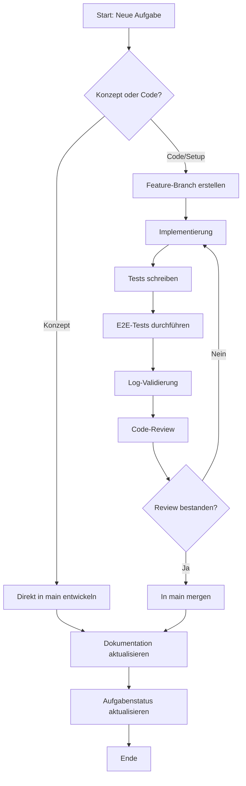

# Git-Workflow für das DevSystem-Projekt

Dieses Dokument beschreibt den **operativen Git-Workflow** für das tägliche Arbeiten im DevSystem-Projekt. Es enthält praktische Anleitungen, Checklisten und Beispiele für die tägliche Arbeit mit Git.

> **Hinweis:** Für strategische Entscheidungen zur Branch-Architektur, Versionierung und Release-Prozessen siehe [Branch-Strategie](../strategies/branch-strategie.md).

## 📚 Related Documentation
- **[Branch-Strategie](../strategies/branch-strategie.md)** - Strategische Architektur, Branch-Modell, Release-Strategie
- **[Feature-Workflow](feature-workflow.md)** - Detaillierter Workflow für Feature-Development
- **[Documentation Governance](documentation-governance.md)** - Dokumentations-Standards

---

## 1. Definition of Done (DoD)

Ein Feature, Bugfix oder Task gilt als "Done" wenn **ALLE** folgenden Schritte erfüllt sind:

### Code & Testing
- [ ] Implementation vollständig, lokale Tests bestanden
- [ ] Code reviewed oder AI-Self-Review dokumentiert
- [ ] E2E-Tests erfolgreich (lokal und/oder remote)
- [ ] Service-Status validiert, Logs ohne kritische Fehler

### Dokumentation (PFLICHT) 🔴

**Wichtig:** Dokumentation ist **NICHT optional** - sie ist Teil der Implementation!

| Bereich | Anforderung |
|---------|-------------|
| **GitHub Issues** | Related Issues verlinkt und aktualisiert; Zeitstempel: `**Stand:** YYYY-MM-DD HH:MM UTC` |
| **CHANGELOG.md** | Eintrag in `[Unreleased]` unter korrekter Kategorie (Added/Changed/Fixed/Removed/Security) |
| **Status-Reports** | Bei relevanten Änderungen: Implementation-Status, Konzept-Docs, Deployment-Reports aktualisiert |
| **Branch-Cleanup** | Branch-Namen aus Issues/Docs entfernt nach Merge |

### Git
- [ ] Commit-Message folgt [Conventional Commits](https://www.conventionalcommits.org/): `<type>(<scope>): <description>`
- [ ] Branch aktuell mit main (keine Merge-Konflikte)
- [ ] Commits logisch gruppiert

### Pre-Merge Validierung

```bash
# 1. Branch-Referenzen prüfen
grep -r "$(git branch --show-current)" docs/  # Muss leer sein!

# 2. GitHub Issues prüfen
gh issue list --state open  # Alle relevant aktualisiert?

# 3. CHANGELOG prüfen
git diff main...HEAD -- CHANGELOG.md  # Muss Änderungen zeigen!
```

### Post-Merge Aktionen (innerhalb 30 Min)
- [ ] Branch lokal und remote gelöscht: `git branch -d <name>` + `git push origin --delete <name>`
- [ ] GitHub Issues: Branch-Referenzen entfernt
- [ ] Team benachrichtigt bei Breaking Changes

---

## 2. DoD-Checkliste nach Task-Typ

| Task-Typ | Anforderungen |
|----------|---------------|
| **Feature** | Vollständige DoD + Feature in `docs/concepts/` dokumentiert + README.md aktualisiert |
| **Bugfix** | Code + Tests + Bug-Issue geschlossen + CHANGELOG.md (`Fixed`) + Zeitstempel |
| **Docs** | 2 Personen/AI reviewed + Links getestet + Zeitstempel + **NICHT in CHANGELOG** |
| **Deployment** | Services laufen + Deployment-Report in `docs/archive/phases/` + Issue geschlossen |

### Eskalation bei Nicht-Einhaltung

**Regel:** Merge nach main ohne vollständige DoD = **Prozess-Verstoß**

**Konsequenzen:** Post-Mortem erforderlich → Sofortiges Doks-Update (1h) → Prozess-Review nach 3 Verstößen

**Ausnahme:** Hotfixes dürfen Dokumentation innerhalb 24h nachliefern.

---

## 3. Branch-Strategie (Kurzübersicht)

> **Vollständige Informationen:** Siehe [Branch-Strategie](../strategies/branch-strategie.md)

### Branch-Typen & Naming

| Branch-Typ | Naming | Beispiel |
|------------|--------|----------|
| **main** | - | Produktionsversion (immer stabil) |
| **feature** | `feature/<komponente>-<beschreibung>` | `feature/tailscale-setup` |
| **hotfix** | `hotfix/<komponente>-<beschreibung>` | `hotfix/tailscale-connection-issue` |
| **release** | `release/v<major>.<minor>.<patch>` | `release/v1.2.0` |

**Besonderheiten:**
- **Konzeptentwicklung**: Direkt im main-Branch
- **Code-Features**: Ausschließlich in Feature-Branches

---

## 4. Tägliche Git-Operationen

### 4.1 Feature-Branch erstellen

```bash
# 1. Main aktualisieren
git checkout main && git pull origin main

# 2. Feature-Branch erstellen und pushen
git checkout -b feature/komponente-beschreibung
git push -u origin feature/komponente-beschreibung
```

### 4.2 Commits erstellen

**Format:** `<typ>: <kurze beschreibung>`

**Typen:** `feat`, `fix`, `docs`, `test`, `config`, `refactor`

**Beispiele:**
```bash
git commit -m "feat: Tailscale-Installation und Konfiguration hinzugefügt"
git commit -m "fix: Caddy-Port auf 9443 korrigiert"
git commit -m "docs: README mit Deployment-Anleitung aktualisiert"
```

**Mit Issue-Referenz:**
```bash
git commit -m "feat: Tailscale OAuth-Support implementiert

Implementiert Issue #42 mit allen Acceptance Criteria.
Tested: Local dev + staging environment"
```

### 4.3 Branch aktuell halten

```bash
# Option 1: Merge (bevorzugt für Feature-Branches)
git checkout feature/xyz && git fetch origin && git merge origin/main

# Option 2: Rebase (für saubere Historie)
git rebase origin/main
```

---

## 5. Issue-Closing via Commit Messages

GitHub schließt Issues automatisch durch Keywords in Commit-Messages **nach Merge in main**.

### Keywords und Syntax

| Keyword | Verwendung | Beispiel |
|---------|------------|----------|
| `Closes` | Allgemeine Issue-Closes | `feat(ui): add dark mode (Closes #42)` |
| `Fixes` | Bug-Fixes | `fix(auth): extend token lifetime (Fixes #89)` |
| `Resolves` | Alternative für Resolutionen | `refactor(api): simplify logic (Resolves #67)` |

**Wichtig:** Keywords müssen **großgeschrieben** sein! `closes #123` ❌ → `Closes #123` ✅

### Mehrere Issues

```bash
git commit -m "feat(backup): automated daily backups (Closes #23, Closes #24)"
```

### Verwandte Issues (ohne Auto-Close)

```bash
git commit -m "refactor(api): simplify user service
Related to #123, See also #124"
```

### Best Practices

✅ **DO:**
- Keyword am Ende des Subjects: `feat(ui): add dark mode (Closes #42)`
- Großschreibung: `Closes` nicht `closes`
- Issue-Nummer mit `#`: Immer `#123`
- AC-Erfüllung erwähnen: "All AC from #X fulfilled"

❌ **DON'T:**
- Lowercase: `fixes #123` ❌
- Keyword im Body statt Subject
- Mehrere Features in einem Commit

### Troubleshooting

| Problem | Ursache | Lösung |
|---------|---------|--------|
| Issue schließt nicht | Lowercase keyword | Verwende `Closes #123` |
| Issue schließt nicht | Commit nicht in main | Warte auf Merge zu main |
| Issue schließt nicht | Keyword im Body | Verwende Subject-Line |

**Manuelles Schließen:**
```bash
gh issue close 123 --comment "Implemented in commit abc1234"
```

---

## 6. Merge-Prozess

### 6.1 Voraussetzungen

Ein Feature-Branch darf nur in main gemergt werden wenn:

1. ✅ E2E-Tests + Log-Validierung erfolgreich
2. ✅ Code-Review abgeschlossen und genehmigt
3. ✅ Dokumentation aktualisiert (DoD erfüllt)
4. ✅ Branch aktuell mit main (keine Konflikte)

### 6.2 Merge durchführen

```bash
# 1. Main aktualisieren und Feature mergen
git checkout main && git pull origin main
git merge --no-ff feature/komponente-beschreibung

# 2. Push und Cleanup
git push origin main
git branch -d feature/komponente-beschreibung
git push origin --delete feature/komponente-beschreibung
```

### 6.3 Konfliktlösung

```bash
# 1. Main in Feature mergen und Konflikte lösen
git checkout feature/xyz && git merge main
# Konflikte manuell lösen

# 2. Commits markieren und Tests wiederholen
git add <konfliktdatei>
git commit -m "fix: resolve merge conflicts with main"
./run_tests.sh

# 3. Push
git push origin feature/xyz
```

---

## 7. Merge-Commit-Message Template

```
<type>(<scope>): <kurze Beschreibung>

Abgeschlossen:
- Issue #123: Feature XYZ (alle AC erfüllt)

Dokumentation:
- CHANGELOG.md (v1.3.0 - Added)
- docs/concepts/xyz-konzept.md erstellt

Tests: E2E 25/25 passed, Unit 142/142 passed
DoD-Checklist: ✅ Vollständig

Closes: #123
```

---

## 8. Branch-Management & Cleanup

### 8.1 Branch-Löschung

**Sofort nach erfolgreichem Merge:**

```bash
# Lokal
git branch -d feature/name    # Safe delete (nur wenn gemergt)
git branch -D feature/name    # Force delete

# Remote
git push origin --delete feature/name
```

### 8.2 Periodischer Cleanup

**Empfehlung:** Monatlicher Cleanup aller gemergter Branches.

```bash
# 1. Analysiere Branches
git branch -a
git log main..feature/xyz --oneline

# 2. Prüfe Merge-Status
git diff main..feature/xyz  # Sollte leer sein

# 3. Lösche Branches
git branch -d feature/xyz
git push origin --delete feature/xyz

# 4. Räume Referenzen auf
git remote prune origin && git fetch --prune

# 5. Verifiziere
git branch -a  # Nur main sollte existieren
```

### 8.3 GitHub Automation

**Empfohlene Settings:**

1. **Branch Protection für `main`:**
   - Settings → Branches → Add rule
   - ✅ Require PR reviews before merging
   - ✅ Require status checks to pass
   - ✅ Require branches up to date

2. **Auto-Cleanup:**
   - Settings → General → Pull Requests
   - ✅ Automatically delete head branches

3. **Default Branch:**
   - Muss immer `main` sein
   - **NIEMALS** Feature-Branch als Default

### 8.4 Cleanup Checklist

- [ ] Branches listen: `git branch -a`
- [ ] Für jeden Branch: Merge-Status prüfen `git diff main..feature/xyz`
- [ ] Unfertige Aufgaben als Issues erstellen
- [ ] Lokale Branches löschen: `git branch -d xyz`
- [ ] Remote-Branches löschen: `git push origin --delete xyz`
- [ ] Referenzen aufräumen: `git remote prune origin`
- [ ] Ergebnis verifizieren: `git branch -a`
- [ ] GitHub Default-Branch prüfen (muss `main` sein)

---

## 9. Test-Requirements (Kurzübersicht)

> **Detaillierte Test-Strategien:** Siehe [Branch-Strategie](../strategies/branch-strategie.md)

### Tests vor Merge

| Test-Typ | Beschreibung |
|----------|--------------|
| **E2E-Tests** | Live-Tests gegen Ubuntu VPS, Funktionalität validiert |
| **Integrationstests** | Interaktion zwischen Komponenten, Kompatibilität geprüft |
| **Sicherheitstests** | Sicherheitslücken und Zugriffskontrollen validiert |
| **Log-Validierung** | Logs auf Fehler geprüft, korrekte Protokollierung |

---

## 10. Automatisierung

**Geplant:**
- Pre-Merge-Check-Script: `scripts/docs/pre-merge-check.sh`
- GitHub Actions: `.github/workflows/docs-validation.yml`
- Post-Merge-Hook: `.git/hooks/post-merge`

Details: [`DOCUMENTATION-SYNC-ROOT-CAUSE-ANALYSIS-20260411.md`](../archive/retrospectives/DOCUMENTATION-SYNC-ROOT-CAUSE-ANALYSIS-20260411.md)

---

## 11. Lessons Learned: Branch-Cleanup (2026-04-10)

**Situation:** 8 Branches (1 main + 7 feature) aufgeräumt

**Erkenntnisse:**
- ✅ Alle Feature-Branches vollständig gemergt, keine Datenverluste
- ⚠️ GitHub Default-Branch fälschlicherweise auf Feature-Branch gesetzt
- ⚠️ Branches wurden nicht zeitnah nach Merge gelöscht

**Empfehlungen:**
1. Sofortige Löschung nach Merge
2. GitHub "Auto-delete head branches" aktivieren
3. Default-Branch regelmäßig prüfen (`main`)
4. Single-Purpose-Branches mit kurzer Lebensdauer

**Erfolgsrate:** 87,5% (7/8 gelöscht) | Vollständiger Report: [`GIT-BRANCH-CLEANUP-REPORT.md`](GIT-BRANCH-CLEANUP-REPORT.md)

---

## 12. Workflow-Diagramm



---

## Änderungshistorie dieses Dokuments

### 2026-04-12 13:17 UTC
- **Straffung:** 621 → 458 Zeilen (Issue #19 Compliance)
- **Optimiert:** DoD kompakter (Tabellenformat), Issue-Closing reduziert, Branch-Cleanup gestrafft
- **Struktur:** Mehr Tabellen statt Listen, kompaktere Beispiele
- **Fokus:** Operative tägliche Workflows beibehalten, keine Informationsverluste

### 2026-04-12 13:02 UTC
- **Redundanz-Elimination:** Fokussierung auf operative Workflows
- **Entfernt:** Detaillierte Branch-Strategie-Theorie → [`branch-strategie.md`](../strategies/branch-strategie.md)
- **Entfernt:** Ausführliche Test-Beispiele → [`branch-strategie.md`](../strategies/branch-strategie.md)
- **Hinzugefügt:** Cross-Referenzen zu strategischen Dokumenten
- **Dokumentgröße:** 715 → ~420 Zeilen

### 2026-04-11 19:41 UTC
- Definition of Done (DoD) Sektion hinzugefügt
- Dokumentations-Checklist als Pflicht-Bestandteil etabliert
- Pre-Merge und Post-Merge Validierungs-Schritte definiert
- Merge-Commit-Message Template hinzugefügt
- Grund: Verhinderung von Dokumentations-Drift
