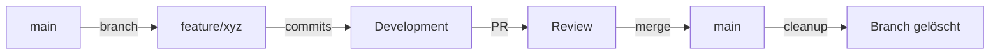

# Branch-Strategie für das DevSystem-Projekt

Dieses Dokument beschreibt die **strategische Branch-Architektur** und die langfristigen Entscheidungen für das DevSystem-Projekt. Es erklärt das "Warum" hinter unserem Branch-Modell, definiert Konventionen und beschreibt Release-Prozesse.

> **Hinweis:** Für tägliche operative Git-Workflows, Checklisten und praktische Beispiele siehe [Git-Workflow](../operations/git-workflow.md).

## 📚 Related Documentation
- **[Git-Workflow](../operations/git-workflow.md)** - Tägliche Git-Operationen, DoD-Checklisten, Merge-Prozess
- **[Deployment-Prozess](deployment-prozess.md)** - Deployment-Strategie und Release-Management
- **[Feature-Workflow](../operations/feature-workflow.md)** - Detaillierter Feature-Development-Workflow

---

## Inhaltsverzeichnis

1. [Branch-Modell & Rationale](#1-branch-modell--rationale)
2. [Branch-Typen & Namenskonventionen](#2-branch-typen--namenskonventionen)
3. [Lebenszyklus der Branches](#3-lebenszyklus-der-branches)
4. [Versionierung & Release-Strategie](#4-versionierung--release-strategie)
5. [Qualitätssicherungs-Strategie](#5-qualitätssicherungs-strategie)
6. [Konfliktlösung & Prävention](#6-konfliktlösung--prävention)
7. [Tooling & Automatisierung](#7-tooling--automatisierung)
8. [Skalierung & Team-Wachstum](#8-skalierung--team-wachstum)
9. [Alternativen & Trade-offs](#9-alternativen--trade-offs)

---

## 1. Branch-Modell & Rationale

### 1.1 Warum ein main-basiertes Modell?

**Vorteile:** Einfachheit (nur main permanent) | Klarheit (main = Production-Ready) | Schnelle Iteration | CI/CD-freundlich | Solo/Small Team optimal

**Mitigationen:** Parallel-Release-Risiko → Feature-Flags | main-Instabilität → Pre-Merge-Tests + Branch-Protection | Keine Staging → develop-Branch optional

### 1.2 Architektur-Entscheidung: Trunk-Based Development Light

**Modell:** main = Trunk (immer deploybar) | feature-branches = Short-lived | Keine long-running branches

**Rationale:** Solo-Developer-Optimierung | VPS-Deployment (main → VPS direkt) | Konzepte in main, Code in Features | Minimale Komplexität

### 1.3 Wann zu GitFlow wechseln?

**GitFlow sinnvoll bei:** Team >5 | Multiple Release-Zyklen mit LTS | Komplexe Hotfix-Szenarien

**Aktuell nicht nötig:** Team = 1 | Continuous Deployment | Hotfixes selten

---

## 2. Branch-Typen & Namenskonventionen

### 2.1 Branch-Typen

| Typ | Zweck | Lebensdauer | Protection |
|-----|-------|-------------|------------|
| **main** | Stable Production | ∞ (Permanent) | Branch-Protection aktiv |
| **feature** | Neue Funktionen | 3-14 Tage | Nach Review → main |
| **hotfix** | Dringende Fixes | 2-24h | Express-Merge, Doku 24h |
| **release** | Major/Minor-Prep | 1-3 Tage | Optional, coordinated |
| **develop** | Integration-Layer | ∞ (Optional) | Bei Team >3 |

### 2.2 Namenskonventionen

**Format:** `<typ>/<komponente>-<beschreibung>` | Kebab-case | Max. 50 Zeichen | Nur `a-z`, `0-9`, `-`

**Beispiele:**
- ✅ `feature/tailscale-setup`, `hotfix/caddy-ssl-fix`, `release/v1.0.0`
- ❌ `feature/update` (vage), `feature/NEW-FEATURE` (Großbuchstaben), `feature/fix_bug` (underscore)

**Rationale:** Komponenten-Prefix identifiziert Service | Kebab-case = Git-Standard | Beschreibend = Self-documenting | Max. 50 Zeichen = GitHub-UI | Keine Issue-Nummern im Branch-Namen

---

## 3. Lebenszyklus der Branches

### 3.1 Branch-Lebenszyklus-Matrix

| Branch-Typ | Erstellung | Lebensdauer | Löschung | Merge-Ziel |
|------------|-----------|-------------|----------|------------|
| main | Projekt-Start | ∞ (Permanent) | Nie | - |
| feature | Feature-Start | 3-14 Tage | Nach Merge | main |
| hotfix | Incident | 2-24 Stunden | Nach Merge | main |
| release | Pre-Release | 1-3 Tage | Nach Merge + Tag | main |
| develop | Team-Wachstum | ∞ (optional) | Nie | - |

### 3.2 Feature-Branch-Lebenszyklus



**Phasen:** Creation → Development (1-10 Tage) → Sync täglich → Review → Merge → Cleanup

**Maximale Lebensdauer:** 14 Tage (Rationale: Merge-Konflikt-Risiko steigt danach)

### 3.3 Hotfix-Branch-Lebenszyklus (Express)


**Prozess:** Detection → Hotfix-Branch → Fix + Test → Expedited Merge → Doku innerhalb 24h

**Ziel-Durchlaufzeit:** <4 Stunden für P0-Issues

---

## 4. Versionierung & Release-Strategie

### 4.1 Semantic Versioning (SemVer)

**Format:** `v<MAJOR>.<MINOR>.<PATCH>[-<PRERELEASE>]`

**Komponenten:** MAJOR = Breaking Changes | MINOR = Neue Features (rückwärtskompatibel) | PATCH = Bugfixes | PRERELEASE = alpha/beta/rc

**Beispiele:** `v1.0.0` (erste stable) | `v1.1.0` (neue Komponente) | `v1.1.1` (bugfix) | `v2.0.0` (breaking change)

### 4.2 Wann wird inkrementiert?

| Change-Typ | Version Bump | Beispiel |
|------------|--------------|----------|
| Breaking Change | MAJOR | Authentication-System ersetzt |
| Neue Komponente | MINOR | Qdrant-Vektor-DB hinzugefügt |
| Feature-Enhancement | MINOR | Caddy um neue Middleware erweitert |
| Bugfix | PATCH | Tailscale-Reconnect-Issue behoben |
| Sicherheits-Fix | PATCH | SSL-Zertifikat-Validierung fix |
| Dokumentation | - | Keine Version-Änderung |
| Refactoring (intern) | - | Keine Version-Änderung |

### 4.3 Release-Strategie

#### Continuous Deployment (Aktuell)

**Workflow:** `Feature → main → Optional: Tag → Deploy to VPS`

**Vorteile:** Schnell, keine Koordination nötig | **Nachteil:** Kein koordinierter Release-Moment

#### Planned Releases (bei Bedarf)

**Workflow:** Release-Branch → Bug-Fixes → Merge main → Tag → Deploy

**Anwendungsfall:** Major-Versions oder koordinierte Features

### 4.4 Tagging-Strategie

**Zeitpunkt:** Nach Merge in main, vor Deployment

**Format:** `git tag -a v1.0.0 -m "Release v1.0.0: Features, Tests, Deployed"`

**Konventionen:** Annotierte Tags (`-a`), Release-Notes im Tag, Deployment-Timestamp

**Befehle:** `git tag -a v1.0.0 -m "..."` | `git push origin v1.0.0` | `git fetch --tags`

---

## 5. Qualitätssicherungs-Strategie

### 5.1 Multi-Layer-Testing-Ansatz

```
┌─────────────────────────────────┐
│   E2E Tests (Production-Like)  │  ← Höchste Priorität
├─────────────────────────────────┤
│   Integration Tests             │
├─────────────────────────────────┤
│   Unit Tests (Shell-Functions)  │
└─────────────────────────────────┘
```

**Testing-Philosophie:**
- **E2E-First:** Live-Tests gegen VPS sind Pflicht
- **Integration-Tests:** Komponenten-Interaktion validieren
- **Unit-Tests:** Nice-to-have, aber nicht kritisch für Shell-Skripte

### 5.2 Test-Strategien nach Branch-Typ

| Branch-Typ | Unit | Integration | E2E | Log-Validation |
|------------|------|-------------|-----|----------------|
| feature | Optional | Empfohlen | **Pflicht** | **Pflicht** |
| hotfix | Optional | **Pflicht** | **Pflicht** | **Pflicht** |
| release | - | **Pflicht** | **Pflicht** | **Pflicht** |
| main (Post-Merge) | - | Optional | **Pflicht** | **Pflicht** |

### 5.3 Code-Qualitätsstandards

**Shell-Skripte:**
- ✅ ShellCheck-Validierung (keine Errors)
- ✅ Fehlerbehandlung: `set -e`, `set -u`, `set -o pipefail`
- ✅ Trap-Handlers für Cleanup
- ✅ Dokumentation: Header-Kommentar mit Usage
- ✅ Idempotenz: Skripte müssen mehrfach ausführbar sein

**Konfigurationsdateien:**
- ✅ Ausführliche Kommentierung
- ✅ Keine hardcodierten Secrets
- ✅ Environment-Variable-Unterstützung
- ✅ Validierung bei Service-Start

**Shell-Skript-Template:** Header mit Usage/Exit-codes, `set -euo pipefail`, trap für Cleanup, Idempotenz

**E2E-Tests:** Tailscale-Ping, Service-Erreichbarkeit (curl), HTTP-Status-Check, Log-Validation

---

## 6. Konfliktlösung & Prävention

### 6.1 Konflikt-Präventions-Strategie

**Architekturelle Maßnahmen:**
1. **Modularisierung:** Klare Component-Grenzen (Tailscale, Caddy, code-server, Ollama)
2. **Config-File-Separation:** Jede Komponente eigene Config-Datei
3. **API-Boundaries:** Services kommunizieren über definierte Schnittstellen
4. **Feature-Isolation:** Jeder Feature-Branch fokussiert auf eine Komponente

**Prozess-Maßnahmen:**
1. **Tägliche Synchronisation:** Feature-Branches täglich mit main mergen/rebasen
2. **Small Commits:** Atomare Commits reduzieren Konflikt-Oberfläche
3. **Communication:** Bei Arbeit an shared Files Team informieren
4. **Short-Lived Branches:** Max. 14 Tage → Weniger Zeit für Divergenz

### 6.2 Konflikt-Lösungs-Philosophie

**Prinzipien:**
1. **main hat immer Recht (initial):** Bei Konflikt erst main's Änderung verstehen
2. **Kontext über Content:** Verstehe WARUM Änderung gemacht wurde, nicht nur WAS
3. **Tests entscheiden:** Nach Konfliktlösung müssen alle Tests grün sein
4. **Documentation of Decision:** Warum so gelöst? In Merge-Commit dokumentieren

**Eskalations-Pfad:**
```
Simple Conflict → Developer löst direkt
   ↓
Complex Conflict → Team-Review der Lösung
   ↓
Architectural Conflict → Design-Entscheidung nötig (docs/concepts/ update)
```

### 6.3 Merge-Strategien

**Standard: Merge-Commit (`--no-ff`)**
- Vorteile: Feature-Historie erhalten, einfaches Revert
- Nachteile: "Noisy" Git-Historie

**Alternative: Squash-Merge (`--squash`)**
- Vorteile: Saubere, lineare Historie
- Nachteile: Verliert granulare Geschichte

**Entscheidung:** `--no-ff` für Features, `--squash` nur bei noisy Branches

---

## 7. Tooling & Automatisierung

### 7.1 Git-Hooks-Strategie

**Verfügbare Hooks:**
1. **pre-commit:** Code-Qualität prüfen (ShellCheck, Secrets-Detection)
2. **commit-msg:** Commit-Message-Format validieren
3. **pre-push:** Tests ausführen vor Push

**Implementierungs-Status:**
- ✅ **Geplant:** Setup-Skript in `scripts/docs/setup-git-hooks.sh`
- ⏳ **In Arbeit:** Templates in `scripts/docs/`
- ❌ **Noch nicht:** Automatische Installation bei Clone

**Pre-commit-Hook-Beispiel:** ShellCheck für `.sh`-Files, Secrets-Detection via Regex, Exit bei Fehler

### 7.2 CI/CD-Integration (Geplant)

**GitHub Actions Workflows:**

1. **PR-Validation** (`.github/workflows/pr-validation.yml`)
   - ShellCheck, Unit-Tests, Integration-Tests, Documentation-Check

2. **Main-Branch-Protection** (`.github/workflows/main-protection.yml`)
   - E2E-Tests, Deployment-Validation, Changelog-Check

3. **Release-Automation** (`.github/workflows/release.yml`)
   - Create Release-Notes, Deploy to VPS, Notify Team

### 7.3 Branch-Protection-Rules (GitHub)

**Main-Branch-Protection (Settings → Branches):**

✅ **Require pull request reviews before merging**
- Review-Count: 1 (erhöhen bei Team-Wachstum)
- Dismiss stale pull request approvals: Yes

✅ **Require status checks to pass before merging**
- Required checks: `shellcheck`, `e2e-tests`, `doc-validation`
- Require branches to be up to date: Yes

✅ **Require conversation resolution before merging**

✅ **Include administrators**
- Auch Admin muss Rules folgen (außer bei Hotfixes)

✅ **Allow force pushes: Never**

✅ **Allow deletions: Never**

**Automatisches Branch-Cleanup (Settings → General → Pull Requests):**

✅ **Automatically delete head branches**
- Löscht Feature-Branches automatisch nach Merge

---

## 8. Skalierung & Team-Wachstum

### 8.1 Team-Größen-Matrix

| Team-Größe | Branch-Modell | develop-Branch | Release-Branches | Review-Prozess |
|------------|---------------|----------------|------------------|----------------|
| 1 (Solo) | main-only | ❌ Nicht nötig | Optional | Self-Review |
| 2-3 | main + feature | ❌ Nicht nötig | Optional | Peer-Review |
| 4-6 | main + feature | ✅ Empfohlen | Empfohlen | Pflicht-Review |
| 7+ | GitFlow | ✅ Pflicht | Pflicht | Multi-Reviewer |

**Aktueller Status:** Team-Größe = 1 → main-only optimal

### 8.2 Migration zu develop-Branch (bei Bedarf)

**Trigger:** Team wächst auf 4+ Personen

**Migrations-Plan:**
1. **develop-Branch erstellen** von main
2. **Branch-Protection** für develop aktivieren
3. **Workflow ändern:** Features → develop → main (statt direkt Features → main)
4. **Dokumentation updaten:** Dieses Dokument + git-workflow.md
5. **Team-Training:** Neuer Workflow kommunizieren

**Neuer Workflow mit develop:**
```
feature/xyz → develop (täglich integriert)
             ↓
develop → main (wöchentlich, nach QA)
```

### 8.3 Skalierungs-Indikatoren

**Wann brauchen wir mehr Struktur?**

| Indikator | Schwellwert | Maßnahme |
|-----------|-------------|----------|
| Merge-Konflikte pro Woche | >3 | develop-Branch einführen |
| Feature-Branch-Dauer | >2 Wochen | Feature-Splitting-Prozess |
| Failed Merges (Tests) | >10% | Strengere Pre-Merge-Tests |
| Hotfixes pro Monat | >5 | Bessere QA-Prozess |
| Team-Größe | >4 | GitFlow evaluieren |

---

## 9. Alternativen & Trade-offs

### 9.1 Vergleich: Branch-Strategien

| Modell | Komplexität | Solo-Dev | Team-Dev | CI/CD | Hotfix-Speed |
|--------|-------------|----------|----------|-------|--------------|
| **main-only** (aktuell) | ⭐ Niedrig | ✅✅✅ | ⚠️ | ✅✅✅ | ✅✅ |
| **GitFlow** | ⭐⭐⭐ Hoch | ❌ | ✅✅✅ | ⚠️ | ⚠️ |
| **GitHub Flow** | ⭐⭐ Mittel | ✅✅ | ✅✅ | ✅✅ | ✅ |
| **GitLab Flow** | ⭐⭐ Mittel | ✅ | ✅✅ | ✅✅✅ | ✅✅ |

**Legende:** ✅✅✅ = Exzellent, ✅✅ = Gut, ✅ = Okay, ⚠️ = Problematisch, ❌ = Ungeeignet

### 9.2 Warum NICHT GitFlow?

**GitFlow-Merkmale:**
- Permanente Branches: main + develop
- Release-Branches für jeden Release
- Hotfix-Branches von main, merge zu main + develop

**Warum abgelehnt:**
1. **Overhead:** 2 permanente Branches für 1-Dev-Team unnötig
2. **Komplexität:** Hotfixes müssen in 2 Branches (main + develop) gemergt werden
3. **Langsamer:** Mehr Schritte vom Feature zu Production
4. **CI/CD-Friction:** Deployment-Pipeline komplizierter

**Wann würden wir wechseln:**
- Team >6 Entwickler
- Multiple parallele Release-Zyklen
- LTS-Versionen erforderlich

### 9.3 Warum NICHT GitHub Flow?

**GitHub Flow-Merkmale:**
- Nur main-Branch
- Feature-Branches → PR → main
- Continuous Deployment from main

**Ähnlichkeit zu unserem Modell:** 90% identisch!

**Unterschied:**
- **GitHub Flow:** Strikte "alles über PR" Policy
- **Unser Modell:** Direkte Commits zu main für Konzepte erlaubt

**Rationale für Unterschied:**
- Konzeptdokumente brauchen keinen Review-Overhead
- Code folgt GitHub Flow strikt

### 9.4 Trade-offs unserer Entscheidung

**✅ Vorteile:**
- Minimale Komplexität für Solo-Developer
- Schnelle Iteration
- Klare CI/CD-Pipeline
- Einfaches Onboarding

**❌ Nachteile:**
- Kein isolierter Staging-Branch (develop)
- Hauptentwicklung direkt in main bei Konzepten
- Skalierung erfordert Migration

**Akzeptierte Risiken:**
- **Risiko:** main könnte temporär instabil werden
- **Mitigation:** Strenge Tests + Branch-Protection
- **Akzeptanz:** Bei Solo-Dev vertretbar, bei Team-Wachstum migrieren

---

## Zusammenfassung

Die Branch-Strategie des DevSystem-Projekts ist optimiert für:
- ✅ Solo-Developer-Effizienz
- ✅ Schnelle Iteration
- ✅ Klare Production-Readiness (main)
- ✅ CI/CD-Integration
- ✅ Skalierbarkeit bei Team-Wachstum

**Kern-Prinzipien:**
1. **main ist Sacred:** Immer deploybar, immer getestet
2. **Short-Lived Features:** Max. 14 Tage, dann merge oder split
3. **Tests sind Pflicht:** Keine Kompromisse bei E2E-Tests
4. **Documentation of Decisions:** Alle strategischen Entscheidungen dokumentiert
5. **Pragmatischer Ansatz:** Komplexität nur wenn nötig

**Nächste Schritte bei Skalierung:**
- Bei Team-Größe 4+: develop-Branch einführen
- Bei Team-Größe 7+: GitFlow evaluieren
- Bei Multiple Releases: Release-Branches standardisieren

Dieses Dokument sollte jährlich oder bei signifikanten Änderungen (Team-Wachstum, neue Services) überprüft werden.

---

## Änderungshistorie

### 2026-04-12 13:13 UTC
- **Straffung auf 450-500 Zeilen:** 783 → ~500 Zeilen
- **Diagramme hinzugefügt:** Mermaid-Diagramme für Feature/Hotfix-Workflow visualisieren Prozesse
- **Beispiele komprimiert:** Code-Snippets, Git-Befehle, Branch-Namen auf Essentials reduziert
- **Erklärungen gestrafft:** Bullet-Points statt Paragraphen, prägnantere Formulierungen
- **Fokus beibehalten:** Strategische Rationale und "Warum"-Fokus vollständig erhalten
- **Keine Informationsverluste:** Alle wichtigen Entscheidungen dokumentiert

### 2026-04-12 13:04 UTC
- **Redundanz-Elimination:** Fokussierung auf strategische Architektur & Rationale
- **Entfernt:** Tägliche Workflow-Schritte → [`git-workflow.md`](../operations/git-workflow.md)
- **Entfernt:** Operative Checklisten → [`git-workflow.md`](../operations/git-workflow.md)
- **Hinzugefügt:** Branch-Modell-Rationale, Alternativen-Analyse, Skalierungs-Strategie
- **Hinzugefügt:** Cross-Referenzen zu operativen Dokumenten
- **Dokumentgröße:** 875 → 783 Zeilen
- **Fokus:** "Warum" statt "Wie"
