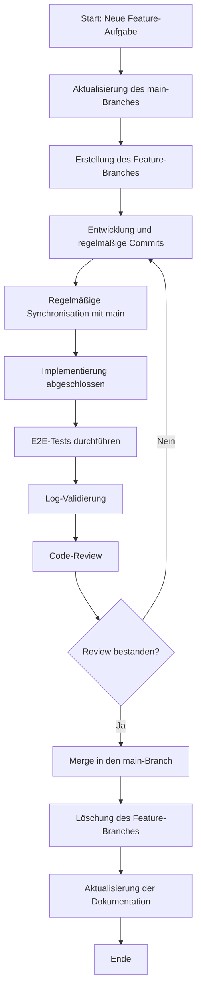
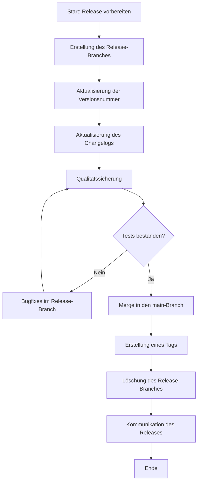

# Branch-Strategie für die Feature-Entwicklung im DevSystem-Projekt

Dieses Dokument beschreibt die detaillierte Branch-Strategie für die Feature-Entwicklung im DevSystem-Projekt. Es baut auf dem bestehenden [Git-Workflow](../git-workflow.md) auf und erweitert diesen um spezifische Details zur Branch-Strategie.

## Inhaltsverzeichnis

1. [Branch-Typen](#1-branch-typen)
   - [Definition der Branch-Typen](#11-definition-der-branch-typen)
   - [Namenskonventionen](#12-namenskonventionen)
   - [Lebenszyklus der Branches](#13-lebenszyklus-der-branches)
2. [Workflow für Feature-Entwicklung](#2-workflow-für-feature-entwicklung)
   - [Erstellung eines Feature-Branches](#21-erstellung-eines-feature-branches)
   - [Entwicklung und Commits](#22-entwicklung-und-commits)
   - [Code-Review-Prozess](#23-code-review-prozess)
   - [Merge in den main-Branch](#24-merge-in-den-main-branch)
3. [Qualitätssicherung](#3-qualitätssicherung)
   - [Tests vor dem Merge](#31-tests-vor-dem-merge)
   - [Code-Qualitätsstandards](#32-code-qualitätsstandards)
   - [Dokumentationsanforderungen](#33-dokumentationsanforderungen)
4. [Versionierung](#4-versionierung)
   - [Versionierungsschema](#41-versionierungsschema)
   - [Release-Prozess](#42-release-prozess)
   - [Tagging-Strategie](#43-tagging-strategie)
5. [Konfliktlösung](#5-konfliktlösung)
   - [Vermeidung von Merge-Konflikten](#51-vermeidung-von-merge-konflikten)
   - [Prozess zur Lösung von Konflikten](#52-prozess-zur-lösung-von-konflikten)
   - [Kommunikation bei Konflikten](#53-kommunikation-bei-konflikten)
6. [Tooling und Automatisierung](#6-tooling-und-automatisierung)
   - [Git-Hooks für Qualitätssicherung](#61-git-hooks-für-qualitätssicherung)
   - [CI/CD-Integration](#62-cicd-integration)
   - [Automatisierte Tests](#63-automatisierte-tests)

## 1. Branch-Typen

### 1.1 Definition der Branch-Typen

Das DevSystem-Projekt verwendet folgende Branch-Typen:

- **main**: Der Hauptbranch enthält die stabile Produktionsversion des Projekts. Dieser Branch sollte immer in einem funktionsfähigen Zustand sein und dient als Basis für Deployments.

- **feature**: Feature-Branches werden für die Entwicklung neuer Funktionen und Komponenten verwendet. Sie werden vom main-Branch abgezweigt und nach Fertigstellung wieder in diesen zurückgeführt.

- **hotfix**: Hotfix-Branches werden für dringende Fehlerbehebungen in der Produktionsversion verwendet. Sie werden vom main-Branch abgezweigt und nach Fertigstellung wieder in diesen zurückgeführt.

- **release**: Release-Branches werden für die Vorbereitung einer neuen Produktionsversion verwendet. Sie ermöglichen letzte Anpassungen und Bugfixes vor dem Release.

- **develop** (optional): In größeren Teams kann ein develop-Branch als Integrationsebene zwischen feature-Branches und dem main-Branch dienen. Feature-Branches werden zunächst in den develop-Branch gemergt, bevor dieser in den main-Branch überführt wird.

### 1.2 Namenskonventionen

Für eine klare und konsistente Benennung der Branches gelten folgende Konventionen:

- **main**: Immer `main` (keine Variationen)

- **feature**: `feature/<komponente>-<beschreibung>`
  - Beispiele:
    - `feature/tailscale-setup`
    - `feature/caddy-config`
    - `feature/code-server-installation`
    - `feature/ollama-integration`

- **hotfix**: `hotfix/<komponente>-<beschreibung>`
  - Beispiele:
    - `hotfix/tailscale-connection-issue`
    - `hotfix/caddy-ssl-fix`

- **release**: `release/v<major>.<minor>.<patch>`
  - Beispiele:
    - `release/v1.0.0`
    - `release/v1.1.0`

- **develop**: Immer `develop` (falls verwendet)

Die Beschreibung sollte kurz und prägnant sein, in Kebab-Case (mit Bindestrichen zwischen Wörtern) und nur Kleinbuchstaben enthalten. Sie sollte den Zweck des Branches klar kommunizieren.

### 1.3 Lebenszyklus der Branches

Jeder Branch-Typ hat einen definierten Lebenszyklus:

#### main-Branch
- **Erstellung**: Zu Beginn des Projekts
- **Lebensdauer**: Permanent
- **Löschung**: Nie

#### feature-Branch
- **Erstellung**: Bei Beginn der Entwicklung einer neuen Funktion
- **Lebensdauer**: Bis die Funktion vollständig implementiert, getestet und in den main-Branch gemergt wurde
- **Löschung**: Nach erfolgreichem Merge in den main-Branch

#### hotfix-Branch
- **Erstellung**: Bei Entdeckung eines kritischen Fehlers in der Produktionsversion
- **Lebensdauer**: Bis der Fehler behoben, getestet und in den main-Branch gemergt wurde
- **Löschung**: Nach erfolgreichem Merge in den main-Branch

#### release-Branch
- **Erstellung**: Bei Vorbereitung einer neuen Produktionsversion
- **Lebensdauer**: Bis die Version finalisiert und in den main-Branch gemergt wurde
- **Löschung**: Nach erfolgreichem Merge in den main-Branch und Tagging

#### develop-Branch (optional)
- **Erstellung**: Zu Beginn des Projekts (falls verwendet)
- **Lebensdauer**: Permanent
- **Löschung**: Nie

## 2. Workflow für Feature-Entwicklung

### 2.1 Erstellung eines Feature-Branches

Der Prozess zur Erstellung eines Feature-Branches umfasst folgende Schritte:

1. **Aktualisierung des lokalen main-Branches**:
   ```bash
   git checkout main
   git pull origin main
   ```

2. **Erstellung des Feature-Branches**:
   ```bash
   git checkout -b feature/komponente-beschreibung
   ```

3. **Push des initialen Feature-Branches** (optional, für Sichtbarkeit im Team):
   ```bash
   git push -u origin feature/komponente-beschreibung
   ```

4. **Aktualisierung der todo.md**:
   - Markieren der entsprechenden Aufgabe als "Entwicklung"
   - Hinzufügen eines Verweises auf den Feature-Branch

### 2.2 Entwicklung und Commits

Während der Entwicklung im Feature-Branch gelten folgende Richtlinien:

1. **Regelmäßige Commits**:
   - Commits sollten logisch zusammenhängende Änderungen enthalten
   - Jeder Commit sollte eine klare, aussagekräftige Commit-Nachricht haben
   - Format: `<typ>: <kurze beschreibung>`
   - Beispiel: `feat: Tailscale-Installation und Konfiguration hinzugefügt`

2. **Commit-Typen**:
   - `feat`: Neue Funktionalität
   - `fix`: Fehlerbehebung
   - `docs`: Dokumentationsänderungen
   - `test`: Hinzufügen oder Ändern von Tests
   - `config`: Konfigurationsänderungen
   - `refactor`: Code-Refactoring ohne Funktionsänderung

3. **Regelmäßige Synchronisation mit dem main-Branch**:
   ```bash
   git checkout feature/komponente-beschreibung
   git fetch origin
   git merge origin/main
   ```
   oder
   ```bash
   git rebase origin/main
   ```

4. **Push der Änderungen**:
   ```bash
   git push origin feature/komponente-beschreibung
   ```

5. **Dokumentation der Änderungen**:
   - Aktualisierung der relevanten Dokumentation
   - Hinzufügen von Kommentaren zu komplexem Code
   - Aktualisierung der todo.md mit dem Fortschritt

### 2.3 Code-Review-Prozess

Der Code-Review-Prozess für Feature-Branches umfasst folgende Schritte:

1. **Vorbereitung für den Review**:
   - Sicherstellen, dass alle Tests erfolgreich durchlaufen
   - Überprüfen der Code-Qualität und Einhaltung der Standards
   - Aktualisieren der Dokumentation

2. **Erstellung eines Pull Requests**:
   - Titel: Kurze Beschreibung der Funktion
   - Beschreibung:
     - Detaillierte Beschreibung der implementierten Funktion
     - Referenz zur entsprechenden Aufgabe in der todo.md
     - Checkliste der durchgeführten Tests
     - Screenshots oder Demos (falls relevant)

3. **Review-Prozess**:
   - Mindestens ein Teammitglied sollte den Code reviewen
   - Reviewer prüfen:
     - Funktionalität
     - Code-Qualität
     - Einhaltung der Projektstandards
     - Vollständigkeit der Tests
     - Vollständigkeit der Dokumentation
   - Feedback wird als Kommentare im Pull Request gegeben

4. **Adressierung von Feedback**:
   - Entwickler bearbeitet das Feedback und pusht weitere Commits
   - Jeder Feedback-Punkt sollte explizit adressiert werden
   - Nach Abschluss der Änderungen wird der Reviewer informiert

5. **Abschluss des Reviews**:
   - Reviewer genehmigen den Pull Request
   - Bei Bedarf können mehrere Review-Runden durchgeführt werden

### 2.4 Merge in den main-Branch

Der Merge-Prozess in den main-Branch umfasst folgende Schritte:

1. **Voraussetzungen für den Merge**:
   - Alle E2E-Tests wurden erfolgreich durchgeführt
   - Die Log-Validierung wurde durchgeführt und zeigt keine Fehler
   - Der Code wurde reviewt und genehmigt
   - Die Dokumentation wurde aktualisiert

2. **Merge-Optionen**:
   - **Squash-Merge**: Alle Commits des Feature-Branches werden zu einem einzigen Commit zusammengefasst
     ```bash
     git checkout main
     git merge --squash feature/komponente-beschreibung
     git commit -m "feat: Komponente XYZ implementiert"
     ```
   - **Merge-Commit**: Erhält die vollständige Commit-Historie des Feature-Branches
     ```bash
     git checkout main
     git merge --no-ff feature/komponente-beschreibung
     ```

3. **Push des main-Branches**:
   ```bash
   git push origin main
   ```

4. **Löschung des Feature-Branches**:
   ```bash
   git branch -d feature/komponente-beschreibung
   git push origin --delete feature/komponente-beschreibung
   ```

5. **Aktualisierung der todo.md**:
   - Markieren der entsprechenden Aufgabe als "fertig"
   - Hinzufügen eines Verweises auf den Merge-Commit

## 3. Qualitätssicherung

### 3.1 Tests vor dem Merge

Vor einem Merge in den main-Branch müssen folgende Tests erfolgreich durchgeführt werden:

1. **E2E-Tests**:
   - Live-Tests gegen den Ubuntu VPS
   - Überprüfung der Funktionalität der implementierten Features
   - Validierung der Benutzerinteraktion
   - Beispiel für Tailscale:
     ```bash
     # Verbindungstest
     tailscale ping devsystem-vps.ts.net
     
     # Zugriff auf Dienste über Tailscale
     curl -I https://code.devsystem.internal
     ```

2. **Integrationstests**:
   - Tests der Interaktion zwischen verschiedenen Komponenten
   - Überprüfung der Kompatibilität mit bestehenden Systemen
   - Beispiel für Caddy und code-server:
     ```bash
     # Test der Reverse-Proxy-Konfiguration
     curl -I https://code.devsystem.internal
     
     # Test der WebSocket-Verbindung
     # (Manueller Test über Browser-Verbindung)
     ```

3. **Sicherheitstests**:
   - Überprüfung auf potenzielle Sicherheitslücken
   - Validierung der Zugriffskontrollen
   - Beispiel für Tailscale-Sicherheit:
     ```bash
     # Test des Zugriffs ohne Tailscale-Verbindung (sollte fehlschlagen)
     curl -I http://public-ip:8080
     ```

4. **Log-Validierung**:
   - Überprüfung der Log-Einträge auf Fehler und Warnungen
   - Validierung der korrekten Protokollierung von Ereignissen
   - Beispiel:
     ```bash
     # Überprüfung der Caddy-Logs
     sudo journalctl -u caddy | grep -i error
     
     # Überprüfung der code-server-Logs
     sudo journalctl -u code-server@$USER | grep -i error
     ```

### 3.2 Code-Qualitätsstandards

Für das DevSystem-Projekt gelten folgende Code-Qualitätsstandards:

1. **Allgemeine Standards**:
   - Konsistente Einrückung und Formatierung
   - Aussagekräftige Variablen- und Funktionsnamen
   - Vermeidung von dupliziertem Code
   - Einhaltung des DRY-Prinzips (Don't Repeat Yourself)

2. **Shell-Skripte**:
   - Verwendung von ShellCheck zur Validierung
   - Fehlerbehandlung mit `set -e` und `trap`
   - Dokumentation aller Parameter und Rückgabewerte
   - Beispiel:
     ```bash
     #!/bin/bash
     set -e
     
     # Funktion zur Installation von Tailscale
     # $1: Version (optional)
     install_tailscale() {
       local version=${1:-latest}
       echo "Installing Tailscale version: $version"
       # Installation code
     }
     
     # Hauptfunktion
     main() {
       install_tailscale "$@"
     }
     
     main "$@"
     ```

3. **Konfigurationsdateien**:
   - Konsistente Struktur und Formatierung
   - Ausführliche Kommentierung
   - Vermeidung von hartcodierten Werten
   - Beispiel für Caddy-Konfiguration:
     ```
     # Globale Variablen
     {
       email admin@example.com
       # Weitere globale Einstellungen
     }
     
     # code-server Konfiguration
     code.devsystem.internal {
       # Reverse Proxy zu code-server
       reverse_proxy localhost:8080
       # Weitere Einstellungen
     }
     ```

4. **Dokumentation im Code**:
   - Jede Funktion sollte dokumentiert sein
   - Komplexe Logik sollte erklärt werden
   - Bekannte Einschränkungen sollten dokumentiert werden

### 3.3 Dokumentationsanforderungen

Für jeden Feature-Branch gelten folgende Dokumentationsanforderungen:

1. **Aktualisierung der todo.md**:
   - Statusänderungen der Aufgaben
   - Hinzufügen neuer Aufgaben, die während der Entwicklung identifiziert wurden
   - Dokumentation von Abhängigkeiten zwischen Aufgaben

2. **Aktualisierung von Konzeptdokumenten**:
   - Anpassung der Konzeptdokumente an die tatsächliche Implementierung
   - Dokumentation von Designentscheidungen und deren Begründung
   - Aktualisierung von Diagrammen und Schaubildern

3. **Erstellung oder Aktualisierung von Benutzeranleitungen**:
   - Schrittweise Anleitungen zur Nutzung der implementierten Funktionen
   - Screenshots oder Diagramme zur Veranschaulichung
   - Beispiele für typische Anwendungsfälle

4. **Technische Dokumentation**:
   - Beschreibung der Architektur und Komponenten
   - Dokumentation von APIs und Schnittstellen
   - Erklärung von Konfigurationsoptionen

5. **Changelog-Einträge**:
   - Beschreibung der Änderungen für das Changelog
   - Kategorisierung der Änderungen (Feature, Bugfix, etc.)
   - Referenz zum entsprechenden Issue oder Pull Request

## 4. Versionierung

### 4.1 Versionierungsschema

Das DevSystem-Projekt verwendet Semantic Versioning (SemVer) für die Versionierung:

- **Format**: `v<major>.<minor>.<patch>`
  - **major**: Inkompatible API-Änderungen
  - **minor**: Rückwärtskompatible Funktionserweiterungen
  - **patch**: Rückwärtskompatible Bugfixes

Beispiele:
- `v1.0.0`: Erste stabile Version
- `v1.1.0`: Hinzufügen einer neuen Komponente oder Funktion
- `v1.1.1`: Bugfix für eine bestehende Funktion

Zusätzlich können Pre-Release-Bezeichner verwendet werden:
- `v1.0.0-alpha.1`: Alpha-Version
- `v1.0.0-beta.1`: Beta-Version
- `v1.0.0-rc.1`: Release Candidate

### 4.2 Release-Prozess

Der Release-Prozess umfasst folgende Schritte:

1. **Vorbereitung des Releases**:
   - Erstellung eines release-Branches vom main-Branch
     ```bash
     git checkout main
     git pull origin main
     git checkout -b release/v1.0.0
     ```
   - Aktualisierung der Versionsnummer in relevanten Dateien
   - Aktualisierung des Changelogs

2. **Qualitätssicherung**:
   - Durchführung aller Tests
   - Überprüfung der Dokumentation
   - Validierung der Installationsanleitung

3. **Finalisierung des Releases**:
   - Merge des release-Branches in den main-Branch
     ```bash
     git checkout main
     git merge --no-ff release/v1.0.0
     ```
   - Erstellung eines Tags für die Version
     ```bash
     git tag -a v1.0.0 -m "Release v1.0.0"
     git push origin v1.0.0
     ```

4. **Nachbereitung**:
   - Löschung des release-Branches
     ```bash
     git branch -d release/v1.0.0
     git push origin --delete release/v1.0.0
     ```
   - Aktualisierung der Projektdokumentation
   - Kommunikation des Releases an das Team

### 4.3 Tagging-Strategie

Die Tagging-Strategie für das DevSystem-Projekt umfasst folgende Aspekte:

1. **Annotierte Tags**:
   - Verwendung von annotierten Tags für Releases
     ```bash
     git tag -a v1.0.0 -m "Release v1.0.0"
     ```
   - Die Tag-Nachricht sollte eine kurze Zusammenfassung des Releases enthalten

2. **Tagging-Zeitpunkt**:
   - Tags werden nach dem erfolgreichen Merge in den main-Branch erstellt
   - Vor dem Tagging sollten alle Tests erfolgreich durchlaufen sein

3. **Tag-Konventionen**:
   - Release-Tags: `v<major>.<minor>.<patch>`
   - Pre-Release-Tags: `v<major>.<minor>.<patch>-<pre-release>`
   - Milestone-Tags: `milestone-<name>`

4. **Verteilung von Tags**:
   - Tags werden zum Remote-Repository gepusht
     ```bash
     git push origin v1.0.0
     ```
   - Alle Teammitglieder sollten die Tags pullen
     ```bash
     git fetch --tags
     ```

5. **Dokumentation von Tags**:
   - Jedes Tag sollte im Changelog dokumentiert sein
   - Die Tag-Nachricht sollte auf das entsprechende Changelog verweisen

## 5. Konfliktlösung

### 5.1 Vermeidung von Merge-Konflikten

Um Merge-Konflikte zu vermeiden, werden folgende Strategien empfohlen:

1. **Regelmäßige Synchronisation mit dem main-Branch**:
   - Regelmäßiges Mergen oder Rebasing des main-Branches in den Feature-Branch
     ```bash
     git checkout feature/komponente-beschreibung
     git fetch origin
     git merge origin/main
     ```
     oder
     ```bash
     git rebase origin/main
     ```

2. **Klare Aufgabentrennung**:
   - Vermeidung von Überschneidungen bei der Arbeit an Dateien
   - Kommunikation im Team über die bearbeiteten Bereiche
   - Verwendung von Modulen und Komponenten mit klaren Schnittstellen

3. **Kleine, fokussierte Commits**:
   - Häufige, kleine Commits statt seltener, großer Commits
   - Jeder Commit sollte eine logisch zusammenhängende Änderung enthalten
   - Vermeidung von Änderungen an unrelated Dateien in einem Commit

4. **Strukturierte Dateien**:
   - Logische Aufteilung von Code in Dateien und Module
   - Vermeidung von monolithischen Dateien, die von vielen Entwicklern bearbeitet werden
   - Verwendung von Konfigurationsdateien für umgebungsspezifische Einstellungen

### 5.2 Prozess zur Lösung von Konflikten

Wenn Merge-Konflikte auftreten, wird folgender Prozess zur Lösung empfohlen:

1. **Identifikation der Konflikte**:
   - Nach einem Merge oder Rebase werden Konflikte angezeigt
     ```bash
     git merge origin/main
     # Konflikte werden angezeigt
     ```

2. **Analyse der Konflikte**:
   - Überprüfung der konfliktbehafteten Dateien
     ```bash
     git status
     # Zeigt konfliktbehaftete Dateien an
     ```
   - Verständnis der Änderungen in beiden Branches
     ```bash
     git diff --ours
     # Zeigt Änderungen im aktuellen Branch
     git diff --theirs
     # Zeigt Änderungen im zu mergenden Branch
     ```

3. **Lösung der Konflikte**:
   - Manuelle Bearbeitung der konfliktbehafteten Dateien
   - Verwendung von Merge-Tools
     ```bash
     git mergetool
     ```
   - Entscheidung, welche Änderungen beibehalten werden sollen

4. **Abschluss der Konfliktlösung**:
   - Markieren der Konflikte als gelöst
     ```bash
     git add <konfliktdatei>
     ```
   - Fortsetzen des Merge- oder Rebase-Prozesses
     ```bash
     git merge --continue
     ```
     oder
     ```bash
     git rebase --continue
     ```

5. **Validierung nach der Konfliktlösung**:
   - Durchführung aller Tests
   - Überprüfung der Funktionalität
   - Sicherstellen, dass keine Regressionen eingeführt wurden

### 5.3 Kommunikation bei Konflikten

Bei der Lösung von Konflikten ist eine klare Kommunikation im Team entscheidend:

1. **Benachrichtigung des Teams**:
   - Information über aufgetretene Konflikte
   - Koordination mit anderen Entwicklern, die an den betroffenen Dateien arbeiten

2. **Dokumentation der Entscheidungen**:
   - Erklärung, warum bestimmte Änderungen beibehalten wurden
   - Dokumentation von Kompromissen oder alternativen Lösungen

3. **Review der Konfliktlösung**:
   - Code-Review der gelösten Konflikte
   - Sicherstellen, dass die Lösung den Projektstandards entspricht

4. **Lessons Learned**:
   - Analyse der Ursachen für Konflikte
   - Anpassung der Entwicklungspraktiken zur Vermeidung ähnlicher Konflikte in der Zukunft

## 6. Tooling und Automatisierung

### 6.1 Git-Hooks für Qualitätssicherung

Git-Hooks können verwendet werden, um die Qualitätssicherung zu automatisieren:

1. **pre-commit-Hook**:
   - Überprüfung der Code-Formatierung
   - Linting des Codes
   - Überprüfung auf sensible Daten
   - Beispiel für einen pre-commit-Hook:
     ```bash
     #!/bin/bash
     
     # Überprüfung von Shell-Skripten mit ShellCheck
     for file in $(git diff --cached --name-only | grep -E '\.sh$'); do
       if ! shellcheck "$file"; then
         echo "ShellCheck failed for $file"
         exit 1
       fi
     done
     
     # Überprüfung auf sensible Daten
     if git diff --cached | grep -E '(password|secret|key).*=.*[A-Za-z0-9]'; then
       echo "Potential sensitive data detected"
       exit 1
     fi
     
     exit 0
     ```

2. **commit-msg-Hook**:
   - Überprüfung der Commit-Nachricht auf Konformität
   - Sicherstellen, dass die Commit-Nachricht dem definierten Format entspricht
   - Beispiel für einen commit-msg-Hook:
     ```bash
     #!/bin/bash
     
     commit_msg_file=$1
     commit_msg=$(cat "$commit_msg_file")
     
     # Überprüfung des Formats: <typ>: <beschreibung>
     if ! echo "$commit_msg" | grep -E '^(feat|fix|docs|test|config|refactor): .+$'; then
       echo "Commit message does not match the required format: <typ>: <beschreibung>"
       echo "Allowed types: feat, fix, docs, test, config, refactor"
       exit 1
     fi
     
     exit 0
     ```

3. **pre-push-Hook**:
   - Ausführung von Tests
   - Überprüfung der Code-Qualität
   - Validierung der Dokumentation
   - Beispiel für einen pre-push-Hook:
     ```bash
     #!/bin/bash
     
     # Ausführung von Tests
     if ! ./run_tests.sh; then
       echo "Tests failed"
       exit 1
     fi
     
     # Überprüfung der Dokumentation
     if ! ./validate_docs.sh; then
       echo "Documentation validation failed"
       exit 1
     fi
     
     exit 0
     ```

### 6.2 CI/CD-Integration

Die Integration von CI/CD-Pipelines kann den Entwicklungsprozess weiter automatisieren:

1. **Continuous Integration (CI)**:
   - Automatische Ausführung von Tests bei jedem Push
   - Überprüfung der Code-Qualität
   - Validierung der Dokumentation
   - Beispiel für eine CI-Konfiguration (GitHub Actions):
     ```yaml
     name: CI
     
     on:
       push:
         branches: [ main, feature/*, hotfix/*, release/* ]
       pull_request:
         branches: [ main ]
     
     jobs:
       test:
         runs-on: ubuntu-latest
         steps:
           - uses: actions/checkout@v2
           - name: Run tests
             run: ./run_tests.sh
           - name: Validate documentation
             run: ./validate_docs.sh
     ```

2. **Continuous Deployment (CD)**:
   - Automatische Bereitstellung von Änderungen
   - Deployment in verschiedene Umgebungen (Staging, Produktion)
   - Beispiel für eine CD-Konfiguration (GitHub Actions):
     ```yaml
     name: CD
     
     on:
       push:
         branches: [ main ]
         tags: [ 'v*' ]
     
     jobs:
       deploy:
         runs-on: ubuntu-latest
         steps:
           - uses: actions/checkout@v2
           - name: Deploy to staging
             if: github.ref == 'refs/heads/main'
             run: ./deploy.sh staging
           - name: Deploy to production
             if: startsWith(github.ref, 'refs/tags/v')
             run: ./deploy.sh production
     ```

3. **Automatisierte Code-Reviews**:
   - Verwendung von Tools wie SonarQube oder CodeClimate
   - Automatische Kommentare zu Code-Qualitätsproblemen
   - Beispiel für eine SonarQube-Integration:
     ```yaml
     name: SonarQube Analysis
     
     on:
       push:
         branches: [ main, feature/*, hotfix/*, release/* ]
       pull_request:
         branches: [ main ]
     
     jobs:
       sonarqube:
         runs-on: ubuntu-latest
         steps:
           - uses: actions/checkout@v2
           - name: SonarQube Scan
             uses: SonarSource/sonarqube-scan-action@master
             env:
               SONAR_TOKEN: ${{ secrets.SONAR_TOKEN }}
               SONAR_HOST_URL: ${{ secrets.SONAR_HOST_URL }}
     ```

### 6.3 Automatisierte Tests

Automatisierte Tests sind ein wesentlicher Bestandteil der Qualitätssicherung und können auf verschiedenen Ebenen implementiert werden:

1. **Unit-Tests**:
   - Tests für einzelne Funktionen und Module
   - Überprüfung der korrekten Funktionalität isolierter Komponenten
   - Beispiel für Shell-Skript-Tests mit BATS (Bash Automated Testing System):
     ```bash
     #!/usr/bin/env bats
     
     @test "Tailscale Installation" {
       source ./scripts/install_tailscale.sh
       run install_tailscale
       [ "$status" -eq 0 ]
       [ -f "/usr/bin/tailscale" ]
     }
     ```

2. **Integrationstests**:
   - Tests für die Interaktion zwischen Komponenten
   - Überprüfung der korrekten Kommunikation und Zusammenarbeit
   - Beispiel für einen Integrationstest zwischen Caddy und code-server:
     ```bash
     #!/bin/bash
     
     # Test der Reverse-Proxy-Konfiguration
     response=$(curl -s -o /dev/null -w "%{http_code}" https://code.devsystem.internal)
     if [ "$response" -eq 200 ]; then
       echo "Integration test passed: Caddy correctly proxies to code-server"
       exit 0
     else
       echo "Integration test failed: Caddy does not proxy to code-server correctly"
       exit 1
     fi
     ```

3. **E2E-Tests**:
   - Tests für den gesamten Workflow
   - Überprüfung der Benutzerinteraktion und des Gesamtsystems
   - Beispiel für einen E2E-Test des DevSystem-Projekts:
     ```bash
     #!/bin/bash
     
     # Test der vollständigen Funktionalität
     
     # 1. Verbindung über Tailscale
     if ! tailscale ping devsystem-vps.ts.net; then
       echo "E2E test failed: Cannot connect to VPS via Tailscale"
       exit 1
     fi
     
     # 2. Zugriff auf code-server
     if ! curl -s -o /dev/null -w "%{http_code}" https://code.devsystem.internal | grep -q "200"; then
       echo "E2E test failed: Cannot access code-server"
       exit 1
     fi
     
     # 3. Ollama-API-Test
     if ! curl -s -X POST http://ollama.devsystem.internal/api/generate -d '{"model":"llama3","prompt":"test"}' | grep -q "response"; then
       echo "E2E test failed: Ollama API not responding correctly"
       exit 1
     fi
     
     echo "All E2E tests passed"
     exit 0
     ```

4. **Automatisierte Test-Ausführung**:
   - Regelmäßige Ausführung von Tests (täglich, wöchentlich)
   - Ausführung von Tests bei jedem Push oder Pull Request
   - Beispiel für ein Test-Ausführungsskript:
     ```bash
     #!/bin/bash
     
     # Ausführung aller Tests
     
     echo "Running unit tests..."
     ./tests/run_unit_tests.sh
     
     echo "Running integration tests..."
     ./tests/run_integration_tests.sh
     
     echo "Running E2E tests..."
     ./tests/run_e2e_tests.sh
     
     echo "All tests completed"
     ```

## Zusammenfassung

Die in diesem Dokument beschriebene Branch-Strategie bietet einen strukturierten Ansatz für die Feature-Entwicklung im DevSystem-Projekt. Durch die klare Definition von Branch-Typen, Workflows, Qualitätsstandards, Versionierung, Konfliktlösungsstrategien und Automatisierung wird ein effizienter und qualitätsorientierter Entwicklungsprozess ermöglicht.

Die Einhaltung dieser Strategie gewährleistet:
- Konsistente und nachvollziehbare Entwicklung
- Hohe Code-Qualität und Stabilität
- Effektive Zusammenarbeit im Team
- Klare Versionierung und Release-Management
- Minimierung von Konflikten und Problemen

Dieses Dokument sollte regelmäßig überprüft und bei Bedarf aktualisiert werden, um den sich ändernden Anforderungen des Projekts gerecht zu werden.

## Diagramm: Feature-Branch-Workflow



## Diagramm: Release-Prozess

