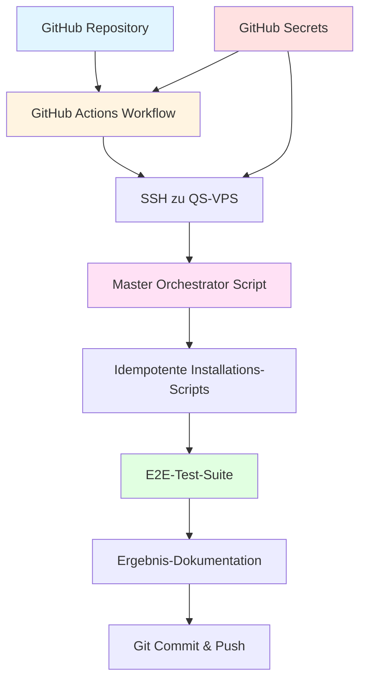

# QS-GitHub-Integration Strategie

**Version:** 1.0  
**Datum:** 2026-04-10  
**Ziel:** Vollautomatisiertes QS-VPS Deployment mit idempotenten Scripts über GitHub

---

## 📋 Executive Summary

Diese Strategie definiert die vollständige Automatisierung der QS-VPS-Deployments über GitHub mit idempotenten Scripts, die von überall aus (auch vom Handy) ausführbar sind.

### Kernziele

1. **Vollständige Idempotenz:** Alle Scripts können mehrfach ausgeführt werden ohne Fehler
2. **GitHub-basiert:** Repository ist Single Source of Truth
3. **Remote-Steuerung:** Deployment über GitHub Actions oder manuelles SSH
4. **E2E-Tests:** Automatisierte Tests nach jedem Deployment
5. **Secrets-Sicher:** Tailscale Auth Keys und Credentials über GitHub Secrets

---

## 🔍 Analyse: Aktueller Stand

### ✅ Vorhandene Komponenten

#### Scripts (scripts/qs/)
- `install-caddy-qs.sh` - Caddy Installation (teilweise idempotent)
- `configure-caddy-qs.sh` - Caddy Konfiguration (benötigt Tailscale-IP)
- `install-code-server-qs.sh` - code-server Installation (teilweise idempotent)
- `configure-code-server-qs.sh` - code-server Konfiguration
- `deploy-qdrant-qs.sh` - Qdrant Deployment (idempotent Binary-Check)
- `test-qs-deployment.sh` - E2E-Tests (6 Test-Kategorien)

#### Dokumentation
- `scripts/QS-VPS-SETUP.md` - Setup-Anleitung
- `scripts/QS-DEVSERVER-WORKFLOW.md` - Kompletter Workflow
- `scripts/setup-qs-vps.sh` - Basis-Setup (Tailscale + Security)

### ❌ Fehlende Komponenten

#### 1. Master-Orchestrator
**Problem:** Keine zentrale Steuerung aller Installations-Scripts  
**Impact:** Manuelle Ausführung jedes Scripts erforderlich

#### 2. Vollständige Idempotenz
**Problem:** Scripts haben inkonsistente Idempotenz-Checks  
**Impact:** Wiederholte Ausführung kann zu Fehlern führen

**Beispiele nicht-idempotenter Code:**
```bash
# ❌ Nicht idempotent - überschreibt immer
cat > /etc/caddy/Caddyfile << EOF

# ✅ Idempotent - prüft zuerst
if [ ! -f /etc/caddy/Caddyfile ]; then
    cat > /etc/caddy/Caddyfile << EOF
fi
```

#### 3. GitHub Actions Workflows
**Problem:** Keine CI/CD-Integration  
**Impact:** Manuelle Deployments erforderlich

#### 4. Remote-E2E-Tests
**Problem:** Tests laufen nur lokal auf QS-VPS  
**Impact:** Keine Validierung von externen Systemen

#### 5. Secrets-Management
**Problem:** Tailscale Auth Keys in lokalen Dateien  
**Impact:** Sicherheitsrisiko, nicht portabel

---

## 🎯 Lösungsarchitektur

### Übersicht



### Komponenten-Design

#### 1. Master-Orchestrator Script

**Datei:** `scripts/qs/deploy-qs-full.sh`

**Funktionen:**
- Orchestriert alle Installations-Scripts in korrekter Reihenfolge
- Idempotenz-Check vor jeder Komponente
- Rollback bei Fehlern (optional)
- Status-Reporting nach GitHub
- Lockfile-Mechanismus für parallele Ausführung

**Pseudocode:**
```bash
#!/bin/bash
# deploy-qs-full.sh - Master Orchestrator

set -euo pipefail

# 1. Lockfile erstellen (verhindert parallele Runs)
acquire_lock

# 2. Systemvorbereitung (idempotent)
run_stage "system-prep" "scripts/setup-qs-vps.sh"

# 3. Caddy (idempotent)
run_stage "caddy-install" "scripts/qs/install-caddy-qs.sh"
run_stage "caddy-config" "scripts/qs/configure-caddy-qs.sh"

# 4. code-server (idempotent)
run_stage "codeserver-install" "scripts/qs/install-code-server-qs.sh"
run_stage "codeserver-config" "scripts/qs/configure-code-server-qs.sh"

# 5. Qdrant (idempotent)
run_stage "qdrant-deploy" "scripts/qs/deploy-qdrant-qs.sh"

# 6. E2E-Tests
run_stage "e2e-tests" "scripts/qs/test-qs-deployment.sh"

# 7. Dokumentation erstellen
generate_deployment_report

# 8. Lockfile entfernen
release_lock
```

**Idempotenz-Mechanismus:**
```bash
run_stage() {
    local stage_name=$1
    local script_path=$2
    local marker="/var/lib/qs-deployment/stages/${stage_name}.complete"
    
    if [ -f "$marker" ]; then
        log "INFO" "Stage $stage_name bereits abgeschlossen - überspringe"
        return 0
    fi
    
    log "STEP" "Führe Stage aus: $stage_name"
    bash "$script_path" || {
        log "ERROR" "Stage $stage_name fehlgeschlagen"
        return 1
    }
    
    # Marker erstellen
    mkdir -p "$(dirname "$marker")"
    echo "$(date)" > "$marker"
    log "SUCCESS" "Stage $stage_name abgeschlossen"
}
```

#### 2. GitHub Actions Workflow

**Datei:** `.github/workflows/deploy-qs-vps.yml`

**Trigger:**
- Manuell via `workflow_dispatch` (mit Input-Parameter)
- Bei Push auf `main` (optional)
- Scheduled (z.B. nächtliches Re-Deployment für Tests)

**Workflow-Steps:**
```yaml
name: Deploy QS-VPS

on:
  workflow_dispatch:
    inputs:
      qs_vps_ip:
        description: 'Tailscale IP des QS-VPS (z.B. 100.100.221.78)'
        required: true
      force_redeploy:
        description: 'Alle Stages neu ausführen (ignoriert Marker)'
        type: boolean
        default: false

jobs:
  deploy:
    runs-on: ubuntu-latest
    
    steps:
      # 1. Repository auschecken
      - name: Checkout Repository
        uses: actions/checkout@v4
      
      # 2. Tailscale verbinden
      - name: Connect to Tailscale
        uses: tailscale/github-action@v2
        with:
          authkey: ${{ secrets.TAILSCALE_AUTH_KEY }}
          version: 1.76.6
      
      # 3. SSH-Key für VPS einrichten
      - name: Setup SSH
        run: |
          mkdir -p ~/.ssh
          echo "${{ secrets.QS_VPS_SSH_KEY }}" > ~/.ssh/id_rsa
          chmod 600 ~/.ssh/id_rsa
          ssh-keyscan -H ${{ inputs.qs_vps_ip }} >> ~/.ssh/known_hosts
      
      # 4. Repository auf QS-VPS klonen/aktualisieren
      - name: Deploy Repository to QS-VPS
        run: |
          ssh root@${{ inputs.qs_vps_ip }} << 'EOF'
            if [ -d /root/DevSystem ]; then
              cd /root/DevSystem
              git pull origin main
            else
              cd /root
              git clone https://github.com/${{ github.repository }}.git
            fi
          EOF
      
      # 5. Master-Orchestrator ausführen
      - name: Run QS Deployment
        run: |
          ssh root@${{ inputs.qs_vps_ip }} << 'EOF'
            cd /root/DevSystem
            
            # Environment-Variables setzen
            export QS_TAILSCALE_IP=${{ inputs.qs_vps_ip }}
            export FORCE_REDEPLOY=${{ inputs.force_redeploy }}
            
            # Master-Script ausführen
            bash scripts/qs/deploy-qs-full.sh
          EOF
      
      # 6. Test-Ergebnisse abrufen
      - name: Fetch Test Results
        run: |
          ssh root@${{ inputs.qs_vps_ip }} \
            "cat /var/log/qs-test-results.log" \
            > qs-test-results-$(date +%Y%m%d-%H%M%S).log
      
      # 7. Test-Ergebnisse committen
      - name: Commit Test Results
        run: |
          git config user.name "GitHub Actions"
          git config user.email "actions@github.com"
          git add qs-test-results-*.log
          git commit -m "✅ QS-VPS Test-Ergebnisse - ${{ inputs.qs_vps_ip }}" || true
          git push
```

#### 3. Idempotenz-Verbesserungen

**Checkliste für jedes Script:**

```bash
# ✅ Standard-Template für idempotente Scripts

#!/bin/bash
set -euo pipefail

# Idempotenz-Marker
SCRIPT_NAME=$(basename "$0" .sh)
MARKER_FILE="/var/lib/qs-deployment/markers/${SCRIPT_NAME}.installed"

# Prüfe ob bereits installiert
if [ -f "$MARKER_FILE" ] && [ "$FORCE_REINSTALL" != "true" ]; then
    echo "✓ $SCRIPT_NAME bereits ausgeführt - überspringe"
    exit 0
fi

# Hauptlogik hier...

# Marker setzen bei Erfolg
mkdir -p "$(dirname "$MARKER_FILE")"
echo "$(date)" > "$MARKER_FILE"
echo "✓ $SCRIPT_NAME erfolgreich abgeschlossen"
```

**Zu aktualisierende Scripts:**

1. **install-caddy-qs.sh**
   - ✅ Hat bereits `check_caddy()` 
   - ❌ Fehlt: Marker-Datei nach Installation
   
2. **configure-caddy-qs.sh**
   - ❌ Überschreibt immer Caddyfile
   - ✅ Braucht: Backup + diff-basiertes Update
   
3. **install-code-server-qs.sh**
   - ✅ Hat bereits `check_code_server()`
   - ❌ Fehlt: Marker-Datei nach Installation
   
4. **configure-code-server-qs.sh**
   - ❌ Überschreibt immer Config
   - ✅ Braucht: Merge-Mechanismus für Konfigurationen
   
5. **deploy-qdrant-qs.sh**
   - ✅ Hat bereits Binary-Check (Zeile 217)
   - ✅ Gut implementiert

#### 4. Remote-E2E-Tests

**Konzept:**  
Tests laufen auf QS-VPS, aber Ergebnisse werden von GitHub Actions validiert.

**Datei:** `scripts/qs/test-qs-deployment-remote.sh`

```bash
#!/bin/bash
# Remote E2E-Tests von GitHub Actions aus

set -euo pipefail

QS_VPS_IP="${1:?QS-VPS IP required}"
EXPECTED_SERVICES=("tailscaled" "caddy" "code-server@codeserver-qs" "qdrant-qs")

# Test 1: SSH-Verbindung
test_ssh_connectivity() {
    if ssh -o ConnectTimeout=10 root@$QS_VPS_IP "echo test" > /dev/null 2>&1; then
        echo "✓ SSH Connectivity: OK"
        return 0
    else
        echo "✗ SSH Connectivity: FAILED"
        return 1
    fi
}

# Test 2: Services laufen
test_services_running() {
    for service in "${EXPECTED_SERVICES[@]}"; do
        if ssh root@$QS_VPS_IP "systemctl is-active --quiet $service"; then
            echo "✓ Service $service: Running"
        else
            echo "✗ Service $service: NOT Running"
            return 1
        fi
    done
}

# Test 3: HTTPS-Zugriff (über Tailscale)
test_https_access() {
    if curl -f -k -s "https://$QS_VPS_IP:9443" > /dev/null; then
        echo "✓ HTTPS Access: OK"
        return 0
    else
        echo "✗ HTTPS Access: FAILED"
        return 1
    fi
}

# Test 4: Qdrant API (via SSH Tunnel)
test_qdrant_api() {
    local response=$(ssh root@$QS_VPS_IP "curl -s http://localhost:6333/collections")
    if [ -n "$response" ]; then
        echo "✓ Qdrant API: OK"
        echo "  Collections: $response"
        return 0
    else
        echo "✗ Qdrant API: FAILED"
        return 1
    fi
}

# Alle Tests ausführen
main() {
    echo "=== Remote E2E-Tests für QS-VPS: $QS_VPS_IP ==="
    local failed=0
    
    test_ssh_connectivity || ((failed++))
    test_services_running || ((failed++))
    test_https_access || ((failed++))
    test_qdrant_api || ((failed++))
    
    echo ""
    if [ $failed -eq 0 ]; then
        echo "✅ Alle Tests bestanden"
        exit 0
    else
        echo "❌ $failed Tests fehlgeschlagen"
        exit 1
    fi
}

main
```

#### 5. Secrets-Management

**GitHub Secrets (Required):**

| Secret | Beschreibung | Beispiel |
|--------|--------------|----------|
| `TAILSCALE_AUTH_KEY` | Ephemeral Auth Key für GitHub Actions Runner | `tskey-auth-XXXXX` |
| `QS_VPS_SSH_KEY` | Private SSH-Key für QS-VPS Zugriff | RSA Private Key |
| `QS_QDRANT_API_KEY` | Optional: Qdrant API Key | `qs-prod-XXXXX` |

**Setup-Anleitung:**

```bash
# 1. Tailscale Auth Key generieren
# → login.tailscale.com/admin/settings/keys
# → Reusable: YES, Ephemeral: YES, 90 days

# 2. SSH-Key für QS-VPS generieren
ssh-keygen -t rsa -b 4096 -f ~/.ssh/qs-vps-key -N ""

# 3. Public Key auf QS-VPS deployen
ssh-copy-id -i ~/.ssh/qs-vps-key root@<qs-vps-ip>

# 4. Private Key in GitHub Secrets speichern
# → Gehe zu: github.com/REPO/settings/secrets/actions
# → "New repository secret"
# → Name: QS_VPS_SSH_KEY
# → Value: Inhalt von ~/.ssh/qs-vps-key (Private Key!)

# 5. Tailscale Auth Key in GitHub Secrets
# → Name: TAILSCALE_AUTH_KEY
# → Value: tskey-auth-XXXXX
```

**Lokale .env-Datei (für lokale Tests):**

```bash
# .env.qs (NICHT in Git!)
export QS_TAILSCALE_IP="100.100.221.78"
export QS_QDRANT_API_KEY="optional-api-key"
export GITHUB_ACTIONS="false"
```

---

## 📦 Implementierungsplan

### Phase 1: Idempotenz-Verbesserungen (Priorität: HOCH)

#### Aufgaben

1. **Marker-System implementieren**
   - [ ] Verzeichnis `/var/lib/qs-deployment/markers/` erstellen
   - [ ] Marker-Funktionen in alle Scripts integrieren
   - [ ] Cleanup-Script für Marker erstellen (bei Force-Redeploy)

2. **Script-Updates**
   - [ ] `install-caddy-qs.sh` - Marker nach Installation
   - [ ] `configure-caddy-qs.sh` - Backup + Idempotenz
   - [ ] `install-code-server-qs.sh` - Marker nach Installation
   - [ ] `configure-code-server-qs.sh` - Config-Merge statt Overwrite
   - [ ] `deploy-qdrant-qs.sh` - ✅ Bereits gut (nur Marker hinzufügen)

3. **Testing**
   - [ ] Lokaler Test: Script 2x ausführen (soll beim 2. Mal skippen)
   - [ ] Edge-Cases: Teilweise Installation (Script bricht ab)
   - [ ] Cleanup-Test: Marker löschen, Script neu ausführen

**Geschätzter Aufwand:** 8-12 Stunden Code + Tests

---

### Phase 2: Master-Orchestrator (Priorität: HOCH)

#### Aufgaben

1. **Script erstellen**
   - [ ] `scripts/qs/deploy-qs-full.sh` implementieren
   - [ ] Lockfile-Mechanismus (flock)
   - [ ] Stage-basierte Ausführung
   - [ ] Rollback-Logik (optional, kann in v2)

2. **Reporting-System**
   - [ ] Deployment-Report generieren (Markdown)
   - [ ] Status-File: `/var/lib/qs-deployment/last-deployment.json`
   - [ ] Logs aggregieren

3. **Testing**
   - [ ] Komplettes Deployment auf frischem QS-VPS
   - [ ] Re-Deployment (alle Stages sollten skippen)
   - [ ] Force-Redeploy-Flag testen

**Geschätzter Aufwand:** 6-8 Stunden

---

### Phase 3: GitHub Actions Integration (Priorität: MITTEL)

#### Aufgaben

1. **Workflow-Datei erstellen**
   - [ ] `.github/workflows/deploy-qs-vps.yml`
   - [ ] Tailscale GitHub Action integrieren
   - [ ] SSH-Setup automatisieren
   - [ ] Input-Parameter definieren

2. **Secrets einrichten**
   - [ ] Dokumentation: Secrets-Setup-Anleitung
   - [ ] Test mit echten Secrets (Repository Protected)

3. **Testing**
   - [ ] Manueller Workflow-Trigger (workflow_dispatch)
   - [ ] Status-Badges in README.md
   - [ ] Fehlerbehandlung bei SSH-Fehlern

**Geschätzter Aufwand:** 4-6 Stunden

---

### Phase 4: Remote-E2E-Tests (Priorität: NIEDRIG)

#### Aufgaben

1. **Remote-Test-Script**
   - [ ] `scripts/qs/test-qs-deployment-remote.sh` erstellen
   - [ ] Tests von GitHub Actions Runner aus ausführbar
   - [ ] JSON-Output für maschinenlesbare Ergebnisse

2. **Workflow-Integration**
   - [ ] Remote-Tests in `deploy-qs-vps.yml` einbauen
   - [ ] Test-Ergebnisse als GitHub Actions Artefakt
   - [ ] Failure-Notifications (Slack/Discord optional)

**Geschätzter Aufwand:** 3-4 Stunden

---

### Phase 5: Dokumentation & Finalisierung (Priorität: MITTEL)

#### Aufgaben

1. **Dokumentations-Updates**
   - [ ] `QS-DEVSERVER-WORKFLOW.md` aktualisieren (GitHub Actions)
   - [ ] `README.md` mit Workflow-Badges
   - [ ] Troubleshooting-Sektion erweitern

2. **Cleanup**
   - [ ] Alte/deprecated Scripts archivieren
   - [ ] `.gitignore` für `.env.qs` updaten
   - [ ] Changelog erstellen

**Geschätzter Aufwand:** 2-3 Stunden

---

## 🎯 Success Criteria

### MVP (Minimum Viable Product)

- ✅ Alle Scripts sind idempotent (2x ausführen = kein Fehler)
- ✅ Master-Orchestrator kann komplettes QS-VPS deployen
- ✅ GitHub Actions Workflow funktioniert manuell (workflow_dispatch)
- ✅ Secrets sind sicher via GitHub Secrets
- ✅ E2E-Tests laufen automatisch nach Deployment

### Nice-to-Have (v2)

- Scheduled Re-Deployments (nächtlich)
- Rollback-Mechanismus bei Fehlern
- Multi-VPS-Support (mehrere QS-VPS parallel)
- Performance-Monitoring während Deployment
- Slack/Discord-Notifications

---

## 🚀 Quick Start (Nach Implementierung)

### Von GitHub Actions aus deployen

```
1. Gehe zu: github.com/HaraldKiessling/DevSystem/actions
2. Wähle: "Deploy QS-VPS"
3. Klicke: "Run workflow"
4. Input: Tailscale-IP (z.B. 100.100.221.78)
5. Warte: ~15-20 Minuten
6. Result: HTTPS-URL in Logs
```

### Lokal deployen (für Tests)

```bash
# 1. Repository auf QS-VPS klonen
ssh root@100.100.221.78
cd /root
git clone https://github.com/HaraldKiessling/DevSystem.git
cd DevSystem

# 2. Environment setzen
export QS_TAILSCALE_IP=100.100.221.78

# 3. Master-Script ausführen
bash scripts/qs/deploy-qs-full.sh

# 4. Status prüfen
cat /var/lib/qs-deployment/last-deployment.json
```

---

## 📚 Referenzen

- [GitHub Actions - Tailscale](https://github.com/tailscale/github-action)
- [GitHub Actions - SSH](https://github.com/appleboy/ssh-action)
- [Idempotent Shell Scripts Best Practices](https://shotat.co/blog/idempotent-shell-scripts/)
- [Bash Error Handling](https://mywiki.wooledge.org/BashGuide/Practices#Error_Handling)

---

**Nächster Schritt:**  
Phase 1 (Idempotenz-Verbesserungen) implementieren und testen.
