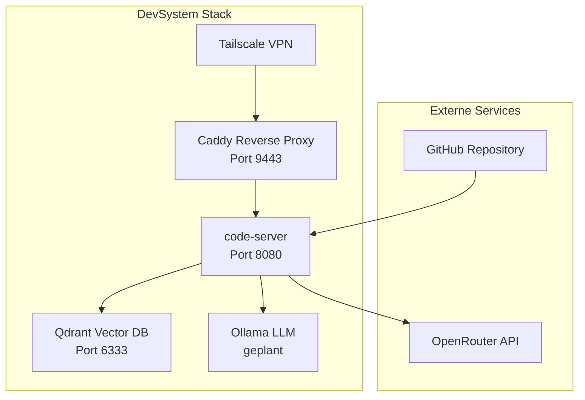

# DevSystem - Dokumentations-Konsolidierungsplan

**Datum:** 2026-04-10  
**Version:** 1.0  
**Basis:** [`DOCUMENTATION-ANALYSIS-STEP2.md`](DOCUMENTATION-ANALYSIS-STEP2.md)

---

## 📋 Executive Summary

Dieser Plan definiert die schrittweise Konsolidierung der DevSystem-Dokumentation von 58 Dateien auf ~30 aktive Dokumente durch Redundanz-Beseitigung, systematische Archivierung und Erstellung fehlender Kern-Dokumentation.

### Projektziele

1. **Redundanz-Beseitigung:** 6 Duplikat-Dateien eliminieren
2. **Archivierung:** 15+ historische Dokumente strukturiert archivieren
3. **Neue Dokumentation:** 3 strategische Kern-Dokumente erstellen
4. **Cross-References:** Alle Links und Referenzen aktualisieren
5. **Git-Historie:** Atomare Commits mit klarer Nachvollziehbarkeit

### Erwarteter Outcome

- **Reduzierung auf ~30 aktive Docs** (von 58)
- **Keine Informationsverluste** durch strukturierte Archivierung
- **Verbesserte Navigation** durch klare Dokumenthierarchie
- **Wartbarkeit erhöht** durch Single Sources of Truth

---

## 🎯 Konsolidierungs-Strategie

### Phase 1: Analyse & Planung ✅
**Status:** Abgeschlossen  
**Deliverable:** [`DOCUMENTATION-ANALYSIS-STEP2.md`](DOCUMENTATION-ANALYSIS-STEP2.md)

### Phase 2: Archiv-Infrastruktur 🚧
**Ziel:** Verzeichnisstruktur erstellen, Archivierungsprozess definieren

### Phase 3: Redundanz-Beseitigung 📋
**Ziel:** Duplikate konsolidieren, Single Sources etablieren

### Phase 4: Archivierung 📦
**Ziel:** Historische Dokumente in Archiv verschieben

### Phase 5: Neue Dokumentation ✨
**Ziel:** Fehlende Kern-Dokumentation erstellen

### Phase 6: Cross-Reference-Update 🔗
**Ziel:** Alle Links aktualisieren, Broken Links fixen

### Phase 7: Validierung & Abschluss ✅
**Ziel:** Vollständigkeits-Check, Git-Commits, Documentation-Changelog

---

## 📂 Phase 2: Archiv-Infrastruktur

### Schritt 2.1: Verzeichnisstruktur erstellen

#### Archiv-Hierarchie:
```
docs/
├── archive/
│   ├── phases/               # Phase 1+2 Status-Reports
│   ├── test-results/         # Alte Test-Reports
│   ├── git-branch-cleanup/   # Branch-Cleanup-Dokumentation
│   ├── concepts/             # Alte Konzept-Versionen
│   ├── retrospectives/       # Lessons Learned (archiviert)
│   ├── logs/                 # E2E-Test-Logs, Reset-Reports
│   └── troubleshooting/      # Gelöste Problem-Reports
├── current/                  # (Optional) Aktive Dokumentation
│   ├── architecture/
│   ├── deployment/
│   ├── operations/
│   └── development/
└── README.md                 # Archiv-Übersicht
```

#### Archiv-README.md
Inhalt:
```markdown
# DevSystem Dokumentations-Archiv

Dieses Verzeichnis enthält historische Dokumentation, die nicht mehr aktiv 
gepflegt wird, aber für Retrospektiven und Audits aufbewahrt wird.

## Struktur
- `phases/` - Abgeschlossene Projekt-Phasen
- `test-results/` - Historische Test-Ergebnisse
- `git-branch-cleanup/` - Branch-Management-Historie
- `concepts/` - Alte Konzept-Versionen
- `retrospectives/` - Archivierte Lessons Learned
- `logs/` - System-Logs und Reports
- `troubleshooting/` - Gelöste Problem-Dokumentationen

## Letzte Aktualisierung
2026-04-10 - Initiale Archivierung (siehe DOCUMENTATION-CHANGELOG.md)
```

**Aktion:**
```bash
mkdir -p docs/archive/{phases,test-results,git-branch-cleanup,concepts,retrospectives,logs,troubleshooting}
```

**Git-Commit:**
```
docs: Archiv-Verzeichnisstruktur erstellen

- Unterverzeichnisse für verschiedene Dokumenttypen
- README.md mit Archiv-Übersicht
- Vorbereitung für Dokumentkonsolidierung

Refs: #STEP2-OPTIMIZATION
```

---

## 🔄 Phase 3: Redundanz-Beseitigung

### Schritt 3.1: Code-Server-Konzepte konsolidieren

#### Analyse-Ergebnis:
- `code-server-konzept.md` (825 Zeilen) - Duplikat
- `code-server-konzept-vollstaendig.md` (824 Zeilen) - **MASTER**
- `code-server-konzept-teil2.md` (579 Zeilen) - Teil 2

#### Entscheidung:
```
BEHALTEN:   code-server-konzept-vollstaendig.md
UMBENENNEN: → code-server-konzept.md (sauberer Name)
ARCHIVIEREN: code-server-konzept.md (alte Version)
ARCHIVIEREN: code-server-konzept-teil2.md (Fragment)
```

#### Aktionen:
```bash
# Schritt 1: Alte Versionen archivieren
git mv plans/code-server-konzept.md docs/archive/concepts/code-server-konzept-v1.md
git mv plans/code-server-konzept-teil2.md docs/archive/concepts/code-server-konzept-teil2.md

# Schritt 2: Master-Version umbenennen
git mv plans/code-server-konzept-vollstaendig.md plans/code-server-konzept.md
```

#### Validierung:
- [ ] Inhalt von `-vollstaendig.md` prüfen
- [ ] Sicherstellen, dass keine Infos aus Teil2 fehlen
- [ ] Falls zusätzliche Infos in Teil2: Manuell mergen vor Archivierung

**Git-Commit:**
```
docs: Konsolidiere code-server-Konzept auf Single Source

- Behalte code-server-konzept-vollstaendig.md als Master
- Benenne um zu code-server-konzept.md
- Archiviere alte Versionen (v1, teil2)
- Keine Informationsverluste

Refs: DOCUMENTATION-ANALYSIS-STEP2.md
```

---

### Schritt 3.2: Test-Konzepte konsolidieren

#### Analyse-Ergebnis:
- `testkonzept.md` (673 Zeilen) - Iteration 1
- `testkonzept-vollstaendig.md` (673 Zeilen) - Iteration 2
- `testkonzept-final.md` (673 Zeilen) - **MASTER** (100% identisch)

#### Entscheidung:
```
BEHALTEN:   testkonzept-final.md
UMBENENNEN: → testkonzept.md
ARCHIVIEREN: testkonzept-vollstaendig.md
LÖSCHEN:    testkonzept.md (Iteration 1, keine Unique-Infos)
```

#### Aktionen:
```bash
# Schritt 1: Duplikate archivieren
git mv plans/testkonzept.md docs/archive/concepts/testkonzept-v1.md
git mv plans/testkonzept-vollstaendig.md docs/archive/concepts/testkonzept-v2.md

# Schritt 2: Final-Version umbenennen
git mv plans/testkonzept-final.md plans/testkonzept.md
```

**Git-Commit:**
```
docs: Konsolidiere Testkonzept auf Single Source

- Behalte testkonzept-final.md als Master
- Benenne um zu testkonzept.md
- Archiviere Iterationen v1 und v2
- Keine Informationsverluste (100% identische Inhalte)

Refs: DOCUMENTATION-ANALYSIS-STEP2.md
```

---

### Schritt 3.3: Lessons-Learned konsolidieren

#### Analyse-Ergebnis:
- `ROO-RULES-IMPROVEMENTS-PHASE1.md` (Root-Level) - Phase 1 spezifisch
- `plans/roo-rules-improvements.md` - Generischer, umfassender

#### Entscheidung:
```
BEHALTEN:   plans/roo-rules-improvements.md (als Master)
ARCHIVIEREN: ROO-RULES-IMPROVEMENTS-PHASE1.md
MANUELLE AKTION: Phase-1-spezifische Learnings in Master integrieren
```

#### Aktionen:
```bash
# Schritt 1: Phase-1-Dokument in Archiv verschieben
git mv ROO-RULES-IMPROVEMENTS-PHASE1.md docs/archive/retrospectives/

# Schritt 2: (Optional) Inhalte in plans/roo-rules-improvements.md integrieren
# Manuell prüfen, ob unique Infos vorhanden
```

**Git-Commit:**
```
docs: Konsolidiere Lessons Learned

- Archiviere ROO-RULES-IMPROVEMENTS-PHASE1.md
- plans/roo-rules-improvements.md als Single Source
- Phase-spezifische Learnings archiviert

Refs: DOCUMENTATION-ANALYSIS-STEP2.md
```

---

## 📦 Phase 4: Archivierung

### Schritt 4.1: Phase-Reports archivieren

#### Dateien:
```
DEPLOYMENT-SUCCESS-PHASE1-2.md         → docs/archive/phases/
MERGE-SUMMARY-PHASE1-2.md              → docs/archive/phases/
PHASE1-IDEMPOTENZ-STATUS.md            → docs/archive/phases/
PHASE2-ORCHESTRATOR-STATUS.md          → docs/archive/phases/
```

#### Aktion:
```bash
git mv DEPLOYMENT-SUCCESS-PHASE1-2.md docs/archive/phases/
git mv MERGE-SUMMARY-PHASE1-2.md docs/archive/phases/
git mv PHASE1-IDEMPOTENZ-STATUS.md docs/archive/phases/
git mv PHASE2-ORCHESTRATOR-STATUS.md docs/archive/phases/
```

**Git-Commit:**
```
docs: Archiviere abgeschlossene Phase-Reports

- Phase 1+2 erfolgreich deployed und dokumentiert
- Reports behalten historischen Wert
- Verschiebe nach docs/archive/phases/

Refs: DOCUMENTATION-ANALYSIS-STEP2.md
```

---

### Schritt 4.2: Test-Results archivieren

#### Dateien:
```
vps-test-results.md                    → docs/archive/test-results/
vps-test-results-caddy.md              → docs/archive/test-results/
vps-test-results-code-server.md        → docs/archive/test-results/
vps-test-results-phase1-e2e.md         → docs/archive/test-results/
vps-test-results-qs-manual.md          → docs/archive/test-results/
caddy-e2e-validation.md                → docs/archive/test-results/
```

#### Aktion:
```bash
git mv vps-test-results*.md docs/archive/test-results/
git mv caddy-e2e-validation.md docs/archive/test-results/
```

**Git-Commit:**
```
docs: Archiviere historische Test-Results

- MVP-Tests erfolgreich abgeschlossen
- Test-Reports behalten für Audit-Zwecke
- Aktive Tests laufen über scripts/qs/run-e2e-tests.sh

Refs: DOCUMENTATION-ANALYSIS-STEP2.md
```

---

### Schritt 4.3: Git-Branch-Cleanup archivieren

#### Dateien:
```
GIT-BRANCH-CLEANUP-REPORT.md           → docs/archive/git-branch-cleanup/
GIT-BRANCH-CLEANUP-FINAL.md            → docs/archive/git-branch-cleanup/
BRANCH-DELETION-VIA-GITHUB-UI.md       → docs/archive/git-branch-cleanup/
GITHUB-DEFAULT-BRANCH-ANLEITUNG.md     → docs/archive/git-branch-cleanup/
GITHUB-DEFAULT-BRANCH-TROUBLESHOOTING.md → docs/archive/git-branch-cleanup/
```

#### Aktion:
```bash
git mv GIT-BRANCH-CLEANUP*.md docs/archive/git-branch-cleanup/
git mv BRANCH-DELETION-VIA-GITHUB-UI.md docs/archive/git-branch-cleanup/
git mv GITHUB-DEFAULT-BRANCH*.md docs/archive/git-branch-cleanup/
```

**Git-Commit:**
```
docs: Archiviere Branch-Cleanup-Dokumentation

- Problem gelöst (87.5% Cleanup abgeschlossen)
- Dokumentation bewahrt für zukünftige Referenz
- git-workflow.md enthält Best Practices

Refs: DOCUMENTATION-ANALYSIS-STEP2.md
```

---

### Schritt 4.4: Debug-Reports archivieren

#### Dateien:
```
CADDY-SCRIPT-DEBUG-REPORT.md           → docs/archive/troubleshooting/
plans/vps-korrekturen-ergebnisse.md    → docs/archive/troubleshooting/
```

#### Aktion:
```bash
git mv CADDY-SCRIPT-DEBUG-REPORT.md docs/archive/troubleshooting/
git mv plans/vps-korrekturen-ergebnisse.md docs/archive/troubleshooting/
```

**Git-Commit:**
```
docs: Archiviere gelöste Debug-Reports

- Caddy-Script-Problem gelöst (QS-SYSTEM-OPTIMIZATION-STEP1.md)
- VPS-Korrekturen erfolgreich abgeschlossen
- Historischer Wert für Troubleshooting bewahrt

Refs: DOCUMENTATION-ANALYSIS-STEP2.md
```

---

### Schritt 4.5: Log-Dateien archivieren

#### Dateien:
```
e2e-test-results-20260410_*.log        → docs/archive/logs/
QS-RESET-REPORT-20260410-174312.txt    → docs/archive/logs/
```

#### Aktion:
```bash
git mv e2e-test-results-*.log docs/archive/logs/
git mv QS-RESET-REPORT-*.txt docs/archive/logs/
```

**Git-Commit:**
```
docs: Archiviere Test- und System-Logs

- E2E-Test-Logs vom 2026-04-10
- QS-Reset-Report nach Optimization Step 1
- Logs behalten für Audit-Trail

Refs: DOCUMENTATION-ANALYSIS-STEP2.md
```

---

## ✨ Phase 5: Neue Dokumentation

### Schritt 5.1: ARCHITECTURE.md erstellen

#### Ziel:
Zentrale Architektur-Dokumentation mit visuellen Diagrammen

#### Inhalt:
1. **System-Übersicht** (Mermaid-Diagramm)
   - DevSystem Komponenten-Stack
   - Produktiv-VPS vs. QS-VPS
   
2. **Netzwerk-Topologie**
   - Tailscale VPN
   - Firewall-Regeln
   - Port-Übersicht
   
3. **Komponenten-Interaktionen**
   - Caddy → code-server
   - code-server → Qdrant
   - Roo Code → OpenRouter / Ollama
   
4. **Deployment-Architektur**
   - GitHub → SSH → VPS
   - Idempotenz-Framework
   - Master-Orchestrator

#### Template:
```markdown
# DevSystem - Architektur-Übersicht

## System-Komponenten



## Netzwerk-Topologie
...

## Deployment-Flow
...
```

**Aktion:**
```bash
# Erstelle ARCHITECTURE.md im Root
# Inhalte basierend auf bestehenden Konzept-Docs
```

**Git-Commit:**
```
docs: Add ARCHITECTURE.md mit System-Übersicht

- Mermaid-Diagramme für Komponenten und Netzwerk
- Deployment-Architektur dokumentiert
- Schließt Dokumentationslücke aus Analyse

Refs: DOCUMENTATION-ANALYSIS-STEP2.md
```

---

### Schritt 5.2: TROUBLESHOOTING.md erstellen

#### Ziel:
Konsolidierte Troubleshooting-Guide für häufige Probleme

#### Inhalt:
1. **Häufige Probleme** (FAQ-Stil)
   - SSH-Verbindung fehlgeschlagen
   - Tailscale nicht erreichbar
   - Caddy nicht erreichbar
   - code-server Login-Probleme
   - Qdrant nicht verfügbar

2. **Service-Management**
   - Service-Status prüfen
   - Logs inspizieren
   - Service neu starten

3. **Rollback-Prozeduren**
   - setup-qs-master.sh --rollback
   - Manuelle Rollback-Schritte

4. **Disaster Recovery**
   - Backup-Restore-Prozess
   - VPS-Neuaufbau

#### Konsolidierte Inhalte:
- VPS-SSH-FIX-GUIDE.md (integrieren)
- CADDY-SCRIPT-DEBUG-REPORT.md (Learnings)
- Troubleshooting-Abschnitte aus anderen Docs

**Aktion:**
```bash
# Erstelle TROUBLESHOOTING.md im Root
# Konsolidiere Inhalte aus VPS-SSH-FIX-GUIDE.md
```

**Git-Commit:**
```
docs: Add TROUBLESHOOTING.md mit konsolidierten Problem-Lösungen

- Häufige Probleme und Lösungen
- Service-Management-Prozeduren
- Rollback und Disaster Recovery
- Konsolidiert aus VPS-SSH-FIX-GUIDE und Debug-Reports

Refs: DOCUMENTATION-ANALYSIS-STEP2.md
```

---

### Schritt 5.3: API-REFERENCE.md erstellen (Optional)

#### Ziel:
API-Dokumentation für Systemkomponenten

#### Inhalt:
1. **Qdrant Vector Database API**
   - HTTP API (Port 6333)
   - gRPC API (Port 6334)
   - Collection-Management
   - Vektor-CRUD-Operationen

2. **Caddy Reverse Proxy**
   - Routing-Tabelle
   - Port-Konfiguration (9443)
   - Tailscale-Authentifizierung

3. **code-server Integration**
   - WebSocket-Verbindungen
   - Extension-Management
   - Authentifizierung

**Priorität:** NIEDRIG (kann später ergänzt werden)

**Git-Commit:**
```
docs: Add API-REFERENCE.md mit Komponenten-APIs

- Qdrant HTTP/gRPC API
- Caddy Reverse-Proxy-Konfiguration
- code-server Integration-Details

Refs: DOCUMENTATION-ANALYSIS-STEP2.md
```

---

## 🔗 Phase 6: Cross-Reference-Update

### Schritt 6.1: Broken Links identifizieren

#### Strategie:
Nach Archivierung und Umbenennungen sind Links zu Update erforderlich

#### Betroffene Dateien:
- Alle aktiven Markdown-Dateien
- Insbesondere: todo.md, git-workflow.md, README-Dateien

#### Methodik:
```bash
# Finde alle Markdown-Referenzen auf archivierte Dateien
grep -r "GIT-BRANCH-CLEANUP" *.md plans/*.md scripts/*.md
grep -r "PHASE1-IDEMPOTENZ" *.md plans/*.md scripts/*.md
grep -r "code-server-konzept-vollstaendig" *.md plans/*.md
grep -r "testkonzept-final" *.md plans/*.md
```

**Aktion:**
```bash
# Identifiziere alle Links
# Erstelle Link-Mapping-Tabelle
# Update systematisch
```

---

### Schritt 6.2: Link-Mapping erstellen

#### Mapping-Tabelle:

| Alter Pfad | Neuer Pfad | Status |
|------------|------------|--------|
| `GIT-BRANCH-CLEANUP-REPORT.md` | `docs/archive/git-branch-cleanup/` | Archiviert |
| `PHASE1-IDEMPOTENZ-STATUS.md` | `docs/archive/phases/` | Archiviert |
| `vps-test-results-caddy.md` | `docs/archive/test-results/` | Archiviert |
| `plans/code-server-konzept-vollstaendig.md` | `plans/code-server-konzept.md` | Umbenannt |
| `plans/testkonzept-final.md` | `plans/testkonzept.md` | Umbenannt |

---

### Schritt 6.3: Links aktualisieren

#### Automatisierung (wo möglich):
```bash
# Beispiel: Update code-server-konzept Links
find . -name "*.md" -type f -exec sed -i 's|code-server-konzept-vollstaendig.md|code-server-konzept.md|g' {} +

# Beispiel: Update testkonzept Links
find . -name "*.md" -type f -exec sed -i 's|testkonzept-final.md|testkonzept.md|g' {} +
```

#### Manuelle Prüfung:
- todo.md
- git-workflow.md
- plans/README.md (falls vorhanden)

**Git-Commit:**
```
docs: Update Cross-References nach Konsolidierung

- Links zu archivierten Docs aktualisiert
- Umbenennung code-server/testkonzept reflektiert
- Broken Links gefixt

Refs: DOCUMENTATION-ANALYSIS-STEP2.md
```

---

## ✅ Phase 7: Validierung & Abschluss

### Schritt 7.1: Vollständigkeits-Check

#### Checkliste:
- [ ] Alle Duplikate entfernt oder archiviert
- [ ] Archiv-Struktur vollständig
- [ ] Neue Dokumentation erstellt (ARCHITECTURE.md, TROUBLESHOOTING.md)
- [ ] Alle Cross-References aktualisiert
- [ ] Keine Broken Links
- [ ] Git-Commits atomare und sauber

#### Validierung:
```bash
# Prüfe auf Broken Links
grep -r "\[.*\](.*\.md)" --include="*.md" | grep -v "docs/archive"

# Zähle aktive Dokumente
find . -name "*.md" -not -path "./docs/archive/*" -not -path "./backups/*" | wc -l

# Erwartetes Ergebnis: ~30 aktive Docs
```

---

### Schritt 7.2: DOCUMENTATION-CHANGELOG.md erstellen

#### Inhalt:
```markdown
# DevSystem - Dokumentations-Changelog

## 2026-04-10 - Große Dokumentations-Konsolidierung

### Konsolidierung
- **code-server-konzept**: 3 Dateien → 1 Single Source
- **testkonzept**: 3 Dateien → 1 Single Source
- **Lessons Learned**: 2 Dateien → 1 konsolidiert

### Archivierung
- **Phase-Reports**: 4 Dateien → `docs/archive/phases/`
- **Test-Results**: 6 Dateien → `docs/archive/test-results/`
- **Git-Branch-Cleanup**: 5 Dateien → `docs/archive/git-branch-cleanup/`
- **Debug-Reports**: 2 Dateien → `docs/archive/troubleshooting/`
- **Logs**: 6 Dateien → `docs/archive/logs/`

### Neue Dokumentation
- **ARCHITECTURE.md**: System-Übersicht mit Mermaid-Diagrammen
- **TROUBLESHOOTING.md**: Konsolidierte Problem-Lösungen
- **docs/archive/README.md**: Archiv-Übersicht

### Datei-Mappings (alt → neu)
| Alter Pfad | Neuer Pfad |
|------------|------------|
| `plans/code-server-konzept-vollstaendig.md` | `plans/code-server-konzept.md` |
| `plans/testkonzept-final.md` | `plans/testkonzept.md` |
| `GIT-BRANCH-CLEANUP-*.md` | `docs/archive/git-branch-cleanup/` |
| `PHASE*-STATUS.md` | `docs/archive/phases/` |

### Statistiken
- **Vor Konsolidierung**: 58 Dateien
- **Nach Konsolidierung**: ~30 aktive Dateien
- **Archiviert**: 23+ Dateien
- **Neu erstellt**: 4 Dateien
- **Reduzierung**: ~48% weniger aktive Docs

### Breaking Changes
Keine funktionalen Breaking Changes. Alle archivierten Dokumente bleiben 
im Repository unter `docs/archive/`.

### Migration-Guide
Alle Links wurden automatisch aktualisiert. Externe Bookmarks zu 
archivierten Dateien müssen manuell angepasst werden.

## Referenzen
- [DOCUMENTATION-ANALYSIS-STEP2.md](plans/DOCUMENTATION-ANALYSIS-STEP2.md)
- [DOCUMENTATION-CONSOLIDATION-PLAN.md](plans/DOCUMENTATION-CONSOLIDATION-PLAN.md)
```

**Git-Commit:**
```
docs: Add DOCUMENTATION-CHANGELOG.md

- Dokumentiert alle Änderungen der Konsolidierung
- Datei-Mappings für Migration
- Statistiken vor/nach Konsolidierung

Refs: DOCUMENTATION-ANALYSIS-STEP2.md
```

---

### Schritt 7.3: README.md aktualisieren (falls vorhanden)

#### Anpassungen:
- Link zu DOCUMENTATION-CHANGELOG.md
- Verweis auf docs/archive/ für historische Docs
- Aktualisierte Dokumentationsstruktur

---

### Schritt 7.4: Finale Git-Commits

#### Commit-Reihenfolge:
1. `docs: Archiv-Verzeichnisstruktur erstellen`
2. `docs: Konsolidiere code-server-Konzept auf Single Source`
3. `docs: Konsolidiere Testkonzept auf Single Source`
4. `docs: Konsolidiere Lessons Learned`
5. `docs: Archiviere abgeschlossene Phase-Reports`
6. `docs: Archiviere historische Test-Results`
7. `docs: Archiviere Branch-Cleanup-Dokumentation`
8. `docs: Archiviere gelöste Debug-Reports`
9. `docs: Archiviere Test- und System-Logs`
10. `docs: Add ARCHITECTURE.md mit System-Übersicht`
11. `docs: Add TROUBLESHOOTING.md mit konsolidierten Problem-Lösungen`
12. `docs: Update Cross-References nach Konsolidierung`
13. `docs: Add DOCUMENTATION-CHANGELOG.md`

---

## 📊 Erfolgsmetriken

### Quantitative Metriken:
- **Reduzierung aktiver Docs**: Von 58 auf ~30 (-48%)
- **Eliminierte Duplikate**: 6 Dateien
- **Archivierte Dateien**: 23+ Dateien
- **Neue Kern-Docs**: 3-4 Dateien
- **Gesamtzahl Git-Commits**: ~13 atomare Commits

### Qualitative Verbesserungen:
- ✅ Single Sources of Truth etabliert
- ✅ Klare Dokumenthierarchie
- ✅ Verbesserte Navigation
- ✅ Historische Werte bewahrt (Archiv)
- ✅ Keine Informationsverluste
- ✅ Wartbarkeit erhöht

---

## ⚠️ Risiken & Mitigationen

### Risiko 1: Broken Links nach Archivierung
**Mitigation:** Systematische Cross-Reference-Updates in Phase 6

### Risiko 2: Informationsverluste bei Konsolidierung
**Mitigation:** Manuelle Content-Prüfung vor Archivierung, Diff-Vergleiche

### Risiko 3: Inkonsistente Git-Historie
**Mitigation:** Atomare Commits mit klaren Commit-Messages

### Risiko 4: Archivierte Docs nicht mehr auffindbar
**Mitigation:** docs/archive/README.md mit Übersicht, DOCUMENTATION-CHANGELOG.md

---

## 🚀 Umsetzungs-Timeline

### Empfohlene Ausführung:
**Gesamtdauer:** 2-3 Stunden (wenn schrittweise ausgeführt)

| Phase | Dauer | Priorität |
|-------|-------|-----------|
| Phase 2: Archiv-Infrastruktur | 15 Min | HOCH |
| Phase 3: Redundanz-Beseitigung | 30 Min | HOCH |
| Phase 4: Archivierung | 45 Min | HOCH |
| Phase 5: Neue Docs (ARCHITECTURE, TROUBLESHOOTING) | 60 Min | MITTEL |
| Phase 6: Cross-References | 30 Min | HOCH |
| Phase 7: Validierung & Changelog | 20 Min | HOCH |

**Total:** ~200 Minuten (3h 20min)

---

## 📝 Nächste Schritte

1. **User-Review:** Konsolidierungsplan vom User absegnen lassen
2. **Execution:** Schrittweise Umsetzung in Code-Mode
3. **Testing:** Link-Validierung nach jedem Schritt
4. **Documentation:** DOCUMENTATION-CHANGELOG.md pflegen

---

**Version-Historie:**
- v1.0 (2026-04-10): Initiale Planung basierend auf Analyse-Report

**Autor:** Roo (Architect Mode)  
**Basis-Dokument:** [`DOCUMENTATION-ANALYSIS-STEP2.md`](DOCUMENTATION-ANALYSIS-STEP2.md)
