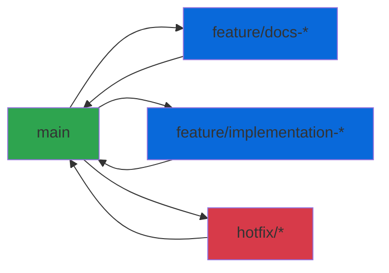
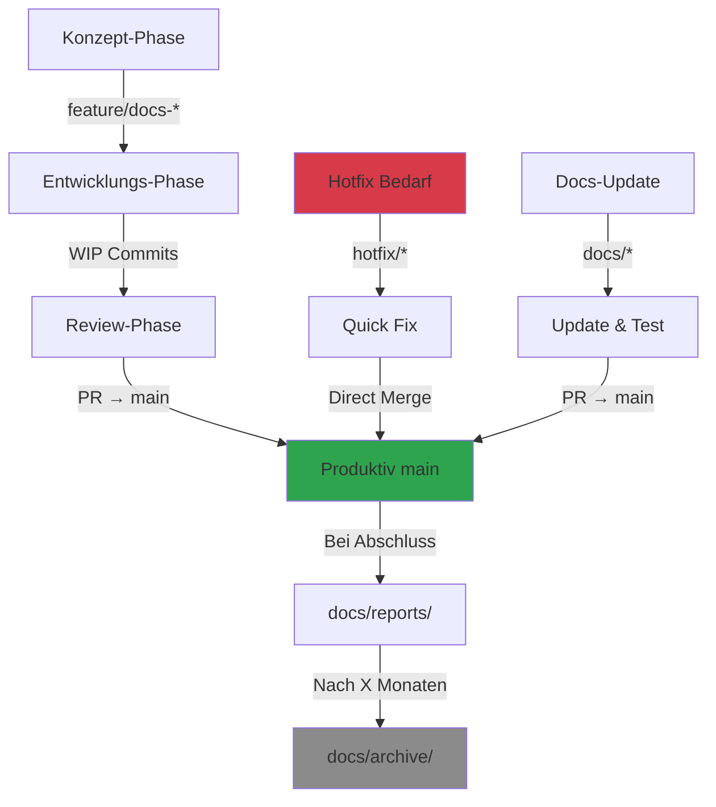

# DevSystem - Strategische Planung: Dokumentenstruktur & Branch-Strategie

**Datum:** 2026-04-11  
**Version:** 1.0  
**Status:** Strategische Planung  
**Autor:** Roo (Architect Mode)

---

## 📋 Executive Summary

Dieses strategische Planungsdokument definiert die Ziel-Architektur für die DevSystem-Dokumentation und etabliert eine nachhaltige Branch-Strategie. Basierend auf der umfassenden Analyse von 46 Markdown-Dokumenten wird ein klarer Weg zur Konsolidierung, Strukturierung und langfristigen Wartung der Projektdokumentation aufgezeigt.

### Kernziele

1. **Strukturoptimierung:** Reduzierung von 46 auf ~25 aktive Dokumente durch Archivierung und Konsolidierung
2. **Redundanzbeseitigung:** Elimination von 6 identifizierten Duplikaten (~3.000 LOC)
3. **Branch-Strategie:** Dokumentation der Branch-Zuordnung für verschiedene Dokumenttypen
4. **Wartbarkeit:** Lifecycle-Management und Review-Prozesse etablieren
5. **Wissensbewahrung:** Archivierung von 23+ historischen Dokumenten ohne Informationsverlust

### Erfolgsmetriken

- **Qualitätsscore:** Von 85/100 auf 95/100 steigern
- **Aktive Dokumente:** Von 46 auf ~25 reduzieren (-46%)
- **Redundanz:** Von 6 Duplikaten auf 0
- **Archivierung:** 23 Dokumente strukturiert archivieren
- **Neue Kern-Dokumentation:** 3-4 strategische Dokumente ergänzen

---

## 📐 Teil 1: Ziel-Dokumentenstruktur

### 1.1 Verzeichnishierarchie

```
DevSystem/
├── README.md                          # Projekt-Übersicht und Einstiegspunkt
├── ARCHITECTURE.md                    # [NEU] System-Architektur mit Diagrammen
├── CHANGELOG.md                       # [NEU] Projekt-Changelog
├── CONTRIBUTING.md                    # [NEU] Contribution Guidelines
├── TROUBLESHOOTING.md                 # [NEU] Konsolidierte Problem-Lösungen
│
├── docs/                              # Haupt-Dokumentationsverzeichnis
│   ├── README.md                      # Dokumentations-Index
│   │
│   ├── architecture/                  # Architektur-Dokumentation
│   │   ├── system-overview.md         # System-Übersicht
│   │   ├── network-topology.md        # Netzwerk-Architektur
│   │   ├── component-interactions.md  # Komponenten-Interaktionen
│   │   └── deployment-architecture.md # Deployment-Architektur
│   │
│   ├── concepts/                      # Technische Konzepte
│   │   ├── code-server-konzept.md     # code-server Integration
│   │   ├── testkonzept.md             # Test-Strategie
│   │   ├── caddy-konzept.md           # Caddy Reverse Proxy
│   │   ├── tailscale-konzept.md       # Tailscale VPN
│   │   ├── qs-vps-konzept.md          # QS-VPS-System
│   │   ├── sicherheitskonzept.md      # Sicherheitsarchitektur
│   │   └── ki-integration-konzept.md  # KI-Integration (Ollama)
│   │
│   ├── deployment/                    # Deployment-Dokumentation
│   │   ├── deployment-prozess.md      # Deployment-Workflow
│   │   ├── vps-deployment-caddy.md    # Caddy-Deployment
│   │   ├── vps-deployment-qdrant-complete.md # Qdrant-Deployment
│   │   └── vps-ssh-fix-guide.md       # SSH-Troubleshooting
│   │
│   ├── operations/                    # Operations & Wartung
│   │   ├── git-workflow.md            # Git-Best-Practices
│   │   ├── branch-strategie.md        # Branch-Management
│   │   ├── qs-github-integration-strategie.md # QS-GitHub-Integration
│   │   └── maintenance-guidelines.md  # [NEU] Wartungsrichtlinien
│   │
│   ├── strategies/                    # Strategische Planung
│   │   ├── qs-implementierungsplan-final.md # QS-Implementierung
│   │   ├── qs-strategy-summary.md     # QS-Strategie-Zusammenfassung
│   │   └── roo-rules-improvements.md  # Lessons Learned
│   │
│   ├── reports/                       # Aktive Reports & Status
│   │   ├── qs-system-optimization-step1.md # QS-Optimierung
│   │   ├── code-review-report-step3.md # Code-Review-Status
│   │   └── devystem-implementation-status.md # Implementation-Status
│   │
│   └── archive/                       # Archivierte Dokumentation
│       ├── README.md                  # Archiv-Index
│       ├── phases/                    # Abgeschlossene Phasen
│       │   ├── DEPLOYMENT-SUCCESS-PHASE1-2.md
│       │   ├── MERGE-SUMMARY-PHASE1-2.md
│       │   ├── PHASE1-IDEMPOTENZ-STATUS.md
│       │   └── PHASE2-ORCHESTRATOR-STATUS.md
│       │
│       ├── test-results/              # Historische Test-Ergebnisse
│       │   ├── vps-test-results.md
│       │   ├── vps-test-results-caddy.md
│       │   ├── vps-test-results-code-server.md
│       │   ├── vps-test-results-phase1-e2e.md
│       │   ├── vps-test-results-qs-manual.md
│       │   ├── caddy-e2e-validation.md
│       │   └── p0.2-e2e-validation-report.md
│       │
│       ├── git-branch-cleanup/        # Branch-Cleanup-Historie
│       │   ├── GIT-BRANCH-CLEANUP-REPORT.md
│       │   ├── GIT-BRANCH-CLEANUP-FINAL.md
│       │   ├── BRANCH-DELETION-VIA-GITHUB-UI.md
│       │   ├── GITHUB-DEFAULT-BRANCH-ANLEITUNG.md
│       │   ├── GITHUB-DEFAULT-BRANCH-TROUBLESHOOTING.md
│       │   └── GIT-SYNC-REPORT-QS-VPS.md
│       │
│       ├── concepts/                  # Alte Konzept-Versionen
│       │   ├── code-server-konzept-v1.md
│       │   ├── code-server-konzept-teil2.md
│       │   ├── testkonzept-v1.md
│       │   └── testkonzept-v2.md
│       │
│       ├── retrospectives/            # Archivierte Retrospektiven
│       │   └── ROO-RULES-IMPROVEMENTS-PHASE1.md
│       │
│       ├── troubleshooting/           # Gelöste Probleme
│       │   ├── CADDY-SCRIPT-DEBUG-REPORT.md
│       │   ├── EXTENSION-LOOP-FIX-REPORT.md
│       │   └── vps-korrekturen-ergebnisse.md
│       │
│       └── logs/                      # System-Logs
│           ├── e2e-test-results-20260410_083954.log
│           ├── e2e-test-results-20260410_111306.log
│           ├── e2e-test-results-20260410_111323.log
│           ├── e2e-test-results-20260410_111543.log
│           ├── e2e-test-results-20260410_114818.log
│           └── QS-RESET-REPORT-20260410-174312.txt
│
├── scripts/                           # Scripts & Automation
│   ├── README.md                      # Script-Übersicht
│   ├── QS-VPS-SETUP.md               # QS-VPS Setup-Guide
│   ├── QS-DEVSERVER-WORKFLOW.md      # DevServer-Workflow
│   ├── qs/                            # QS-spezifische Scripts
│   └── archive/                       # Archivierte Scripts-Docs
│
├── .github/                           # GitHub-Konfiguration
│   └── workflows/
│       └── README.md                  # GitHub-Actions-Dokumentation
│
├── .Roo/                              # Roo-Konfiguration
│   └── [Konfigurationsdateien]
│
├── todo.md                            # Aktives Task-Management
├── DevSystem.md                       # Fachliche Anforderungen
└── SystemProject.md                   # System-Anforderungen
```

### 1.2 Dokumentkategorien & Zweck

#### 1.2.1 Root-Level Dokumente (Dauerhaft)

| Dokument | Zweck | Zielgruppe | Update-Frequenz |
|----------|-------|------------|-----------------|
| `README.md` | Projekt-Einstiegspunkt | Alle | Bei Major Changes |
| `ARCHITECTURE.md` | System-Architektur-Übersicht | Entwickler, Ops | Quartalsweise |
| `CHANGELOG.md` | Versions-Historie | Alle | Bei jedem Release |
| `CONTRIBUTING.md` | Contribution-Guidelines | Entwickler | Jährlich |
| `TROUBLESHOOTING.md` | Häufige Probleme & Lösungen | Ops, Support | Bei neuen Problemen |
| `todo.md` | Aktives Task-Management | Team | Täglich/Wöchentlich |
| `DevSystem.md` | Fachliche Anforderungen | Management, Team | Bei Requirement-Changes |
| `SystemProject.md` | System-Anforderungen | Architekten, Ops | Bei System-Changes |

#### 1.2.2 Architecture-Dokumentation

**Zweck:** Technische System-Architektur mit visuellen Diagrammen

| Dokument | Inhalt | Wartung |
|----------|--------|---------|
| `system-overview.md` | High-Level System-Übersicht, Komponenten-Stack | Quartalsweise |
| `network-topology.md` | Tailscale VPN, Firewall, Port-Konfiguration | Bei Netzwerk-Änderungen |
| `component-interactions.md` | Service-Interaktionen, API-Flows | Bei neuen Integrationen |
| `deployment-architecture.md` | Produktiv vs. QS, Deployment-Flows | Bei Deployment-Änderungen |

#### 1.2.3 Concepts-Dokumentation

**Zweck:** Detaillierte Konzepte für Systemkomponenten

| Dokument | Beschreibung | Status |
|----------|--------------|--------|
| `code-server-konzept.md` | code-server Integration, Extensions | Aktiv |
| `testkonzept.md` | Test-Strategie, E2E-Tests, Idempotenz | Aktiv |
| `caddy-konzept.md` | Reverse Proxy, HTTPS, Tailscale-Auth | Aktiv |
| `tailscale-konzept.md` | VPN-Setup, Authentifizierung | Aktiv |
| `qs-vps-konzept.md` | QS-VPS-System, Master-Orchestrator | Aktiv |
| `sicherheitskonzept.md` | Security-Architektur, Best Practices | Aktiv |
| `ki-integration-konzept.md` | Ollama-Integration (geplant) | Planung |

#### 1.2.4 Deployment-Dokumentation

**Zweck:** Praktische Deployment-Anleitungen

| Dokument | Beschreibung | Zielgruppe |
|----------|--------------|------------|
| `deployment-prozess.md` | Gesamt-Deployment-Workflow | Ops, DevOps |
| `vps-deployment-caddy.md` | Caddy-Deployment auf VPS | Ops |
| `vps-deployment-qdrant-complete.md` | Qdrant-Deployment (QS & Prod) | Ops |
| `vps-ssh-fix-guide.md` | SSH-Troubleshooting & Fixes | Ops |

#### 1.2.5 Operations-Dokumentation

**Zweck:** Betrieb, Wartung, Git-Workflows

| Dokument | Beschreibung | Update-Frequenz |
|----------|--------------|-----------------|
| `git-workflow.md` | Git-Best-Practices, Branch-Management | Bei Workflow-Änderungen |
| `branch-strategie.md` | Branch-Strategie für Features/Hotfixes | Jährlich |
| `qs-github-integration-strategie.md` | QS-GitHub-Automation | Bei QS-Optimierungen |
| `maintenance-guidelines.md` | Wartungsrichtlinien, Lifecycle-Management | Jährlich |

#### 1.2.6 Strategies-Dokumentation

**Zweck:** Strategische Planung und Lessons Learned

| Dokument | Beschreibung | Typ |
|----------|--------------|-----|
| `qs-implementierungsplan-final.md` | QS-System Implementierung | Plan |
| `qs-strategy-summary.md` | QS-Strategie Executive Summary | Executive |
| `roo-rules-improvements.md` | Lessons Learned aus Projektarbeit | Retrospektive |

#### 1.2.7 Reports-Dokumentation

**Zweck:** Aktive Status-Reports und Optimierungen

| Dokument | Beschreibung | Archivierung |
|----------|--------------|--------------|
| `qs-system-optimization-step1.md` | QS-Optimierung Status | Nach Abschluss |
| `code-review-report-step3.md` | Code-Review-Ergebnisse | Nach Umsetzung |
| `devystem-implementation-status.md` | Implementation-Status | Regelmäßig aktualisieren |

**Lifecycle:** Reports werden zu `docs/archive/reports/` verschoben, sobald abgeschlossen.

### 1.3 Namenskonventionen

#### 1.3.1 Allgemeine Regeln

```
Format: [kategorie]-[thema]-[typ].md

Beispiele:
- vps-deployment-caddy.md        (deployment + thema + komponente)
- qs-system-optimization-step1.md (system + thema + phase)
- git-workflow.md                 (tool + zweck)

Typen:
- konzept.md       → Technisches Konzept
- strategie.md     → Strategische Planung
- guide.md         → How-To / Tutorial
- report.md        → Status-Report
- plan.md          → Implementierungsplan
- testing.md       → Test-Dokumentation
```

#### 1.3.2 Spezielle Konventionen

| Typ | Konvention | Beispiel |
|-----|------------|----------|
| Archiv-Versionen | `[name]-v[nummer].md` | `testkonzept-v1.md` |
| Datierte Reports | `[name]-YYYYMMDD.md` | `QS-RESET-REPORT-20260410.txt` |
| Phase-bezogen | `PHASE[N]-[thema].md` | `PHASE1-IDEMPOTENZ-STATUS.md` |
| Root-Kern-Docs | `UPPERCASE.md` | `README.md`, `ARCHITECTURE.md` |
| Fachlich | `CamelCase.md` | `DevSystem.md`, `SystemProject.md` |
| Technisch | `lowercase-kebab.md` | `git-workflow.md` |

### 1.4 Datei-Zuordnung (Alt → Neu)

#### 1.4.1 Aktive Dokumente (bleiben erhalten)

| Aktueller Pfad | Ziel-Pfad | Aktion |
|----------------|-----------|--------|
| `todo.md` | `todo.md` | ✅ Behalten |
| `DevSystem.md` | `DevSystem.md` | ✅ Behalten |
| `SystemProject.md` | `SystemProject.md` | ✅ Behalten |
| `git-workflow.md` | `docs/operations/git-workflow.md` | ↔️ Verschieben |
| `vps-deployment-caddy.md` | `docs/deployment/vps-deployment-caddy.md` | ↔️ Verschieben |
| `vps-deployment-qdrant-complete.md` | `docs/deployment/vps-deployment-qdrant-complete.md` | ↔️ Verschieben |
| `VPS-SSH-FIX-GUIDE.md` | `docs/deployment/vps-ssh-fix-guide.md` | ↔️ Verschieben + Rename |
| `QS-SYSTEM-OPTIMIZATION-STEP1.md` | `docs/reports/qs-system-optimization-step1.md` | ↔️ Verschieben + Rename |
| `CODE-REVIEW-REPORT-STEP3.md` | `docs/reports/code-review-report-step3.md` | ↔️ Verschieben + Rename |
| `ROO-RULES-IMPROVEMENTS-PHASE1.md` | Inhalt → `docs/strategies/roo-rules-improvements.md` | 🔄 Merge + Archive |

#### 1.4.2 Plans-Verzeichnis → Neue Struktur

| Aktueller Pfad | Ziel-Pfad | Aktion |
|----------------|-----------|--------|
| `plans/code-server-konzept-vollstaendig.md` | `docs/concepts/code-server-konzept.md` | ↔️ Verschieben + Rename |
| `plans/code-server-konzept.md` | `docs/archive/concepts/code-server-konzept-v1.md` | 🗄️ Archivieren |
| `plans/code-server-konzept-teil2.md` | `docs/archive/concepts/code-server-konzept-teil2.md` | 🗄️ Archivieren |
| `plans/testkonzept-final.md` | `docs/concepts/testkonzept.md` | ↔️ Verschieben + Rename |
| `plans/testkonzept.md` | `docs/archive/concepts/testkonzept-v1.md` | 🗄️ Archivieren |
| `plans/testkonzept-vollstaendig.md` | `docs/archive/concepts/testkonzept-v2.md` | 🗄️ Archivieren |
| `plans/caddy-konzept.md` | `docs/concepts/caddy-konzept.md` | ↔️ Verschieben |
| `plans/tailscale-konzept.md` | `docs/concepts/tailscale-konzept.md` | ↔️ Verschieben |
| `plans/qs-vps-konzept.md` | `docs/concepts/qs-vps-konzept.md` | ↔️ Verschieben |
| `plans/sicherheitskonzept.md` | `docs/concepts/sicherheitskonzept.md` | ↔️ Verschieben |
| `plans/ki-integration-konzept.md` | `docs/concepts/ki-integration-konzept.md` | ↔️ Verschieben |
| `plans/branch-strategie.md` | `docs/operations/branch-strategie.md` | ↔️ Verschieben |
| `plans/deployment-prozess.md` | `docs/deployment/deployment-prozess.md` | ↔️ Verschieben |
| `plans/qs-github-integration-strategie.md` | `docs/operations/qs-github-integration-strategie.md` | ↔️ Verschieben |
| `plans/qs-implementierungsplan-final.md` | `docs/strategies/qs-implementierungsplan-final.md` | ↔️ Verschieben |
| `plans/QS-STRATEGY-SUMMARY.md` | `docs/strategies/qs-strategy-summary.md` | ↔️ Verschieben + Rename |
| `plans/roo-rules-improvements.md` | `docs/strategies/roo-rules-improvements.md` | ↔️ Verschieben |
| `plans/implementierungsplan.md` | 🗄️ Archivieren (veraltet) | 🗄️ Archivieren |
| `plans/vps-korrekturen-ergebnisse.md` | `docs/archive/troubleshooting/` | 🗄️ Archivieren |

#### 1.4.3 Archivierungskandidaten

| Aktueller Pfad | Archiv-Pfad | Grund |
|----------------|-------------|-------|
| `DEPLOYMENT-SUCCESS-PHASE1-2.md` | `docs/archive/phases/` | Phase abgeschlossen |
| `MERGE-SUMMARY-PHASE1-2.md` | `docs/archive/phases/` | Phase abgeschlossen |
| `PHASE1-IDEMPOTENZ-STATUS.md` | `docs/archive/phases/` | Phase abgeschlossen |
| `PHASE2-ORCHESTRATOR-STATUS.md` | `docs/archive/phases/` | Phase abgeschlossen |
| `vps-test-results.md` | `docs/archive/test-results/` | Tests abgeschlossen |
| `vps-test-results-caddy.md` | `docs/archive/test-results/` | Tests abgeschlossen |
| `vps-test-results-code-server.md` | `docs/archive/test-results/` | Tests abgeschlossen |
| `vps-test-results-phase1-e2e.md` | `docs/archive/test-results/` | Tests abgeschlossen |
| `vps-test-results-qs-manual.md` | `docs/archive/test-results/` | Tests abgeschlossen |
| `caddy-e2e-validation.md` | `docs/archive/test-results/` | Validation abgeschlossen |
| `P0.2-E2E-VALIDATION-REPORT.md` | `docs/archive/test-results/` | Validation abgeschlossen |
| `GIT-BRANCH-CLEANUP-REPORT.md` | `docs/archive/git-branch-cleanup/` | Problem gelöst |
| `GIT-BRANCH-CLEANUP-FINAL.md` | `docs/archive/git-branch-cleanup/` | Problem gelöst |
| `BRANCH-DELETION-VIA-GITHUB-UI.md` | `docs/archive/git-branch-cleanup/` | Problem gelöst |
| `GITHUB-DEFAULT-BRANCH-ANLEITUNG.md` | `docs/archive/git-branch-cleanup/` | Problem gelöst |
| `GITHUB-DEFAULT-BRANCH-TROUBLESHOOTING.md` | `docs/archive/git-branch-cleanup/` | Problem gelöst |
| `GIT-SYNC-REPORT-QS-VPS.md` | `docs/archive/git-branch-cleanup/` | Report abgeschlossen |
| `CADDY-SCRIPT-DEBUG-REPORT.md` | `docs/archive/troubleshooting/` | Problem gelöst |
| `EXTENSION-LOOP-FIX-REPORT.md` | `docs/archive/troubleshooting/` | Problem gelöst |
| `REFACTORING-TEST-RESULTS.md` | `docs/archive/test-results/` | Refactoring abgeschlossen |
| `QS-SYSTEM-VALIDATION-STEP4.md` | `docs/archive/reports/` | Validation abgeschlossen |
| `QS-SYSTEM-PERFORMANCE-METRICS.md` | `docs/archive/reports/` | Snapshot |
| `DevSystem-Implementation-Status.md` | ⚠️ Aktualisieren oder archivieren | Prüfen ob aktuell |
| `e2e-test-results-*.log` (5 Dateien) | `docs/archive/logs/` | Logs |
| `QS-RESET-REPORT-20260410-174312.txt` | `docs/archive/logs/` | Log |

---

## 🌿 Teil 2: Branch-Strategie für Dokumentation

### 2.1 Branch-Modell Übersicht



### 2.2 Dokumentations-Branch-Typen

#### 2.2.1 Main-Branch (Produktiv)

**Zweck:** Stabile, produktive Dokumentation

**Enthaltene Dokumenttypen:**
- ✅ Kern-Dokumentation (README, ARCHITECTURE, CHANGELOG, CONTRIBUTING)
- ✅ Aktive Konzepte (concepts/)
- ✅ Deployment-Guides (deployment/)
- ✅ Operations-Dokumentation (operations/)
- ✅ Strategien & Pläne (strategies/)
- ✅ Scripts-Dokumentation (scripts/README.md, QS-VPS-SETUP.md)
- ✅ Archiv (docs/archive/) - Read-Only

**Merge-Policy:**
- Nur über Pull Requests
- Mindestens 1 Review erforderlich
- CI/CD Checks müssen grün sein
- Link-Validierung erforderlich

**Protection Rules:**
```yaml
Branch Protection (main):
  - Require pull request reviews: true
  - Require status checks: true
  - Require branches to be up to date: true
  - Include administrators: false
  - Allow force pushes: false
  - Allow deletions: false
```

#### 2.2.2 Feature-Branches (Feature-Dokumentation)

**Zweck:** Entwicklung neuer Features mit begleitender Dokumentation

**Naming Convention:**
```
feature/[feature-name]-docs
feature/[feature-name]

Beispiele:
- feature/ollama-integration-docs
- feature/monitoring-implementation
- feature/backup-automation-docs
```

**Enthaltene Dokumenttypen:**
- 📝 Feature-spezifische Konzepte (in Entwicklung)
- 📝 WIP-Implementierungspläne
- 📝 Test-Dokumentation (während Entwicklung)
- 📝 Temporary Notes / Brainstorming

**Lifecycle:**
1. Branch erstellen von `main`
2. Feature-Dokumentation entwickeln
3. Implementierung abschließen
4. Dokumentation finalisieren
5. Pull Request → `main` (mit Review)
6. Branch löschen nach Merge

**Best Practices:**
- Feature-Code und Feature-Docs in **separaten Commits**
- Dokumentation **vor** oder **parallel** zur Implementierung
- Regelmäßig von `main` mergen (Sync)

#### 2.2.3 Docs-Branches (Reine Dokumentations-Updates)

**Zweck:** Updates an bestehender Dokumentation ohne Code-Änderungen

**Naming Convention:**
```
docs/[dokumenttyp]-[thema]

Beispiele:
- docs/architecture-update
- docs/troubleshooting-ssh-fixes
- docs/consolidation-phase1
- docs/api-reference-qdrant
```

**Merge-Policy:**
- Schnellere Merge-Zeiten als Feature-Branches
- CI/CD prüft Link-Validität
- Optional: Skipping Code-Tests (nur Docs)

**Typische Anwendungsfälle:**
- Tippfehler korrigieren
- Fehlende Informationen ergänzen
- Diagramme aktualisieren
- Cross-References anpassen
- Archivierung durchführen

#### 2.2.4 Hotfix-Branches (Dringende Fixes)

**Zweck:** Kritische Korrekturen in Produktions-Dokumentation

**Naming Convention:**
```
hotfix/[problem]

Beispiele:
- hotfix/broken-deployment-links
- hotfix/incorrect-ip-addresses
- hotfix/security-note-caddy
```

**Merge-Policy:**
- Direkter Merge nach Quick-Review
- Sofortige Deployment-Freigabe
- Kritische Informationen (Security, Downtime-Risiko)

**Lifecycle:**
1. Branch erstellen von `main`
2. Fix anwenden
3. Sofort-Review
4. Merge → `main`
5. Optional: Cherry-Pick zu aktiven Feature-Branches

#### 2.2.5 Archive-Branch (Optional)

**Zweck:** Langzeit-Archivierung von historischen Dokumenten

**Naming Convention:**
```
archive/[jahr]-[quartal]

Beispiele:
- archive/2026-Q1
- archive/2026-Q2
```

**Strategie:**
- **NICHT empfohlen** für DevSystem (Archive im `main` ausreichend)
- Alternative: Separate `docs/archive/` innerhalb `main`
- Nur bei sehr großen Projekten sinnvoll

**Entscheidung:** ❌ Kein separater Archive-Branch notwendig

### 2.3 Dokumentations-Lifecycle pro Branch



### 2.4 Dokumentations-Branch-Matrix

| Dokumenttyp | main | feature/* | docs/* | hotfix/* | Archiv |
|-------------|------|-----------|--------|----------|--------|
| **Kern-Docs** (README, ARCHITECTURE) | ✅ Primär | ⚠️ Nur bei großen Änderungen | ✅ Empfohlen | ✅ Bei kritischen Fehlern | ❌ |
| **Konzepte** (concepts/) | ✅ Final | ✅ Während Entwicklung | ✅ Updates | ⚠️ Selten | ❌ |
| **Deployment-Guides** | ✅ Final | ✅ Neue Komponenten | ✅ Updates | ✅ Kritische Fixes | ❌ |
| **Operations** (git-workflow) | ✅ Final | ⚠️ Selten | ✅ Empfohlen | ⚠️ Selten | ❌ |
| **Strategies** (Pläne) | ✅ Final | ✅ Neue Pläne | ✅ Updates | ❌ | ❌ |
| **Reports** (Status) | ✅ Aktiv | ✅ WIP Reports | ✅ Updates | ❌ | ✅ Nach Abschluss |
| **Archive** | ✅ Read-Only | ❌ | ❌ | ❌ | ✅ Finale Ablage |
| **WIP-Notes** (Brainstorming) | ❌ | ✅ Temporär | ❌ | ❌ | ⚠️ Oder löschen |

### 2.5 Branch-Workflow für Dokumentations-Updates

#### Szenario 1: Neue Komponente dokumentieren

```bash
# 1. Feature-Branch erstellen
git checkout main
git pull origin main
git checkout -b feature/monitoring-integration

# 2. Dokumentation parallel zur Implementierung
# - docs/concepts/monitoring-konzept.md erstellen
# - docs/deployment/monitoring-deployment.md erstellen
# - ARCHITECTURE.md aktualisieren

git add docs/concepts/monitoring-konzept.md
git commit -m "docs: Add monitoring-konzept (WIP)"

git add docs/deployment/monitoring-deployment.md
git commit -m "docs: Add monitoring-deployment guide"

git add ARCHITECTURE.md
git commit -m "docs: Update ARCHITECTURE.md with monitoring component"

# 3. Pull Request erstellen
git push origin feature/monitoring-integration
# → GitHub PR erstellen → Review → Merge
```

#### Szenario 2: Dokumentations-Archivierung

```bash
# 1. Docs-Branch erstellen
git checkout main
git pull origin main
git checkout -b docs/archive-phase3-reports

# 2. Archivierung durchführen
git mv PHASE3-COMPLETION-REPORT.md docs/archive/phases/
git mv vps-test-results-monitoring.md docs/archive/test-results/

# 3. Cross-References aktualisieren
# - Links in todo.md aktualisieren
# - DOCUMENTATION-CHANGELOG.md updaten

git add -A
git commit -m "docs: Archive Phase 3 reports

- Moved PHASE3-COMPLETION-REPORT.md to archive
- Moved test results to archive
- Updated cross-references in todo.md

Refs: #PHASE3-COMPLETE"

# 4. Pull Request
git push origin docs/archive-phase3-reports
# → GitHub PR → Quick Review → Merge
```

#### Szenario 3: Kritischer Dokumentations-Fehler

```bash
# 1. Hotfix-Branch
git checkout main
git pull origin main
git checkout -b hotfix/incorrect-vps-ip

# 2. Sofort-Fix
# - Falsche IP-Adresse in vps-deployment-caddy.md korrigieren
sed -i 's/100.100.221.99/100.100.221.56/g' docs/deployment/vps-deployment-caddy.md

git add docs/deployment/vps-deployment-caddy.md
git commit -m "hotfix: Correct VPS IP address in deployment docs

- Fixed incorrect IP 100.100.221.99 → 100.100.221.56
- Critical: Prevents deployment failures

Refs: #HOTFIX"

# 3. Sofort-Merge
git push origin hotfix/incorrect-vps-ip
# → GitHub PR → Express Review (< 1h) → Merge
```

### 2.6 Tagging-Strategie für Dokumentation

**Dokumentations-Tags:**

```bash
# Major Dokumentations-Releases (bei großen Änderungen)
git tag -a v1.0-docs -m "Dokumentation v1.0: Initial strukturierte Dokumentation"
git tag -a v2.0-docs -m "Dokumentation v2.0: Post-Konsolidierung Struktur"

# Meilensteine
git tag -a docs-milestone-mvp -m "Dokumentation: MVP-Phase abgeschlossen"
git tag -a docs-milestone-consolidation -m "Dokumentation: Konsolidierung abgeschlossen"
```

**Best Practice:**
- Tags nur für **signifikante** Dokumentations-Änderungen
- Typischerweise synchron mit Code-Releases (z.B. `v1.0.0` + `v1.0-docs`)
- Ermöglicht Rücksprung zu historischen Dokumentations-Zuständen

### 2.7 GitHub Pull Request Template für Dokumentation

**Empfehlung:** Separates Template für Docs-PRs

```markdown
# Dokumentations-Update

## Art der Änderung
- [ ] Neue Dokumentation
- [ ] Update bestehender Dokumentation
- [ ] Archivierung
- [ ] Fehlerkorrektur
- [ ] Umstrukturierung

## Beschreibung
<!-- Was wurde geändert und warum? -->

## Betroffene Dokumente
<!-- Liste der geänderten, hinzugefügten oder gelöschten Dateien -->

## Cross-References
<!-- Wurden Links in anderen Dokumenten aktualisiert? -->
- [ ] Links validiert
- [ ] Cross-References aktualisiert
- [ ] DOCUMENTATION-CHANGELOG.md updated (falls relevant)

## Checkliste
- [ ] Markdown-Syntax korrekt
- [ ] Mermaid-Diagramme rendern korrekt
- [ ] Keine Broken Links
- [ ] Rechtschreibung geprüft
- [ ] Konsistent mit bestehender Dokumentation
```

---

## 🔍 Teil 3: Fehlende Dokumente & Prioritäten

### 3.1 Kritische Lücken (HOCH)

#### 3.1.1 ARCHITECTURE.md

**Status:** ❌ Fehlt komplett  
**Priorität:** **HOCH**  
**Geschätzter Umfang:** ~400-500 Zeilen  
**Abhängigkeiten:** Bestehende Konzept-Dokumente

**Inhalt:**
- System-Übersicht mit Mermaid-Diagramm
- Komponenten-Stack (Tailscale, Caddy, code-server, Qdrant, Ollama)
- Netzwerk-Topologie (VPN, Ports, Firewall)
- Deployment-Architektur (Produktiv vs. QS)
- Datenflüsse und Interaktionen

**Template-Struktur:**
```markdown
# DevSystem - Architektur-Übersicht

## 1. System-Komponenten
[Mermaid: Component Stack]

## 2. Netzwerk-Topologie
[Mermaid: Network Diagram]

## 3. Deployment-Architektur
[Mermaid: Deployment Flow]

## 4. Komponenten-Interaktionen
[Mermaid: Sequence Diagrams]

## 5. Sicherheits-Architektur
[Konzeptuelle Übersicht]

## 6. Skalierungs-Strategie
[Zukünftige Erweiterungen]
```

**Quellen für Inhalte:**
- `plans/code-server-konzept.md`
- `plans/caddy-konzept.md`
- `plans/qs-vps-konzept.md`
- `plans/tailscale-konzept.md`
- `plans/sicherheitskonzept.md`

#### 3.1.2 TROUBLESHOOTING.md

**Status:** ⚠️ Fragmentiert über mehrere Dokumente  
**Priorität:** **HOCH**  
**Geschätzter Umfang:** ~600-800 Zeilen  
**Abhängigkeiten:** Bestehende Troubleshooting-Guides

**Inhalt:**
1. **Häufige Probleme (FAQ)**
   - SSH-Verbindung fehlgeschlagen
   - Tailscale nicht erreichbar
   - Caddy nicht erreichbar (Port 9443)
   - code-server Login-Probleme
   - Qdrant nicht verfügbar

2. **Service-Management**
   - Service-Status prüfen (`systemctl status`)
   - Logs inspizieren (`journalctl`)
   - Service neu starten
   - Port-Checks (`netstat`, `ss`)

3. **Rollback-Prozeduren**
   - `setup-qs-master.sh --rollback`
   - Manuelle Rollback-Schritte
   - State-Marker-System zurücksetzen

4. **Disaster Recovery**
   - Backup-Restore (`backup-qs-system.sh`)
   - VPS-Neuaufbau
   - Datenbank-Recovery (Qdrant)

5. **Debugging-Tools**
   - Diagnose-Scripts (`diagnose-*.sh`)
   - Log-Analyse
   - Network-Debugging

**Konsolidierte Inhalte aus:**
- `VPS-SSH-FIX-GUIDE.md`
- `CADDY-SCRIPT-DEBUG-REPORT.md` (Learnings)
- `scripts/qs/diagnose-*.sh` (Referenzen)

#### 3.1.3 CONTRIBUTING.md

**Status:** ❌ Fehlt komplett  
**Priorität:** **HOCH**  
**Geschätzter Umfang:** ~300-400 Zeilen  

**Inhalt:**
- Contribution-Workflow
- Branch-Strategie für Contributors
- Code-Review-Prozess
- Dokumentations-Standards
- Commit-Message-Konventionen
- Pull-Request-Guidelines

**Standard-Sections:**
```markdown
# Contributing to DevSystem

## Code of Conduct

## Wie kann ich beitragen?

## Branch-Strategie

## Commit-Nachrichten

## Pull Requests

## Dokumentations-Standards

## Testing-Anforderungen

## Review-Prozess
```

### 3.2 Wichtige Ergänzungen (MITTEL)

#### 3.2.1 CHANGELOG.md

**Status:** ⚠️ Fragmentiert (DOCUMENTATION-CHANGELOG.md existiert)  
**Priorität:** **MITTEL**  
**Geschätzter Umfang:** ~200 Zeilen initial  

**Inhalt:**
- Versions-Historie
- Major Changes pro Release
- Breaking Changes
- Upgrade-Guides

**Format:**
```markdown
# Changelog

## [Unreleased]

## [1.0.0] - 2026-04-XX
### Added
- MVP-Implementierung: Produktiv-VPS + QS-VPS
- Qdrant Vector Database Integration
- code-server mit Tailscale-gesichertem Zugang

### Changed
- Umstellung auf Idempotenz-Framework

### Deprecated
- Alte Deployment-Scripts (vor Idempotenz)

### Removed
- Legacy-Setup-Scripts

### Fixed
- SSH-Verbindungsprobleme auf QS-VPS

### Security
- Tailscale-Authentifizierung für Caddy aktiviert
```

#### 3.2.2 docs/README.md (Dokumentations-Index)

**Status:** ❌ Fehlt  
**Priorität:** **MITTEL**  
**Geschätzter Umfang:** ~150 Zeilen  

**Inhalt:**
- Übersicht über Dokumentationsstruktur
- Links zu allen Hauptdokumenten
- Einstiegspunkte für verschiedene Zielgruppen
- Schnellstart-Guides

**Template:**
```markdown
# DevSystem Dokumentation

## 📚 Dokumentations-Index

### Für Entwickler
- [ARCHITECTURE.md](../ARCHITECTURE.md) - System-Architektur
- [CONTRIBUTING.md](../CONTRIBUTING.md) - Contribution-Guidelines
- [concepts/](concepts/) - Technische Konzepte

### Für Operations
- [deployment/](deployment/) - Deployment-Guides
- [TROUBLESHOOTING.md](../TROUBLESHOOTING.md) - Problem-Lösungen
- [operations/](operations/) - Wartung & Workflows

### Für Management
- [strategies/](strategies/) - Strategische Planung
- [DevSystem.md](../DevSystem.md) - Fachliche Anforderungen
```

#### 3.2.3 API-REFERENCE.md (Optional)

**Status:** ❌ Fehlt  
**Priorität:** **NIEDRIG-MITTEL**  
**Geschätzter Umfang:** ~500-700 Zeilen  

**Inhalt:**
1. **Qdrant Vector Database API**
   - HTTP API (Port 6333)
   - gRPC API (Port 6334)
   - Collection-Management
   - Vektor-CRUD-Operationen
   - Beispiele

2. **Caddy Reverse Proxy**
   - Routing-Tabelle
   - Port-Konfiguration (9443)
   - Tailscale-Authentifizierung
   - Custom-Headers

3. **code-server Integration**
   - WebSocket-Verbindungen
   - Extension-Management-API
   - Authentifizierung

**Hinweis:** Kann später erstellt werden, sobald API-Stabilität erreicht ist.

#### 3.2.4 SECURITY.md

**Status:** ⚠️ Als `plans/sicherheitskonzept.md` vorhanden  
**Priorität:** **MITTEL**  
**Aktion:** Umbenennen + erweitern zu Root-Level `SECURITY.md`

**Zusätzlicher Inhalt:**
- Security-Kontakt für Responsible Disclosure
- Security-Richtlinien
- Bekannte Vulnerabilities & Mitigationen
- Security-Update-Prozess

### 3.3 Nice-to-Have Ergänzungen (NIEDRIG)

#### 3.3.1 FAQ.md

**Status:** ❌ Fehlt  
**Priorität:** **NIEDRIG**  
**Inhalt:** Häufig gestellte Fragen (kann aus TROUBLESHOOTING.md extrahiert werden)

#### 3.3.2 GLOSSARY.md

**Status:** ❌ Fehlt  
**Priorität:** **NIEDRIG**  
**Inhalt:** Begriffsverzeichnis (QS-VPS, Master-Orchestrator, Idempotenz-Marker, etc.)

#### 3.3.3 docs/diagrams/ (Separate Diagramme)

**Status:** ❌ Nicht vorhanden  
**Priorität:** **NIEDRIG**  
**Inhalt:** Export von Mermaid-Diagrammen als PNG/SVG für Präsentationen

### 3.4 Priorisierte Umsetzungsreihenfolge

| # | Dokument | Priorität | Geschätzter Aufwand | Abhängigkeiten |
|---|----------|-----------|---------------------|----------------|
| 1 | `ARCHITECTURE.md` | **HOCH** | 4-6h | Bestehende Konzepte |
| 2 | `TROUBLESHOOTING.md` | **HOCH** | 3-4h | VPS-SSH-FIX-GUIDE, Debug-Reports |
| 3 | `CONTRIBUTING.md` | **HOCH** | 2-3h | Branch-Strategie, Git-Workflow |
| 4 | `CHANGELOG.md` | **MITTEL** | 1-2h | Versions-Historie recherchieren |
| 5 | `docs/README.md` | **MITTEL** | 1-2h | Dokumentationsstruktur final |
| 6 | `SECURITY.md` | **MITTEL** | 2h | Sicherheitskonzept erweitern |
| 7 | `API-REFERENCE.md` | **NIEDRIG** | 4-6h | API-Stabilität |
| 8 | `FAQ.md` | **NIEDRIG** | 1h | TROUBLESHOOTING.md |

**Gesamtaufwand (HOCH + MITTEL):** ~16-20 Stunden

---

## 📋 Teil 4: Konsolidierungsplan

### 4.1 Migrations-Phasen Übersicht


### 4.2 Phase 0: Vorbereitung (Tag 0)

**Ziel:** Projekt-Zustand sichern, Planung finalisieren

#### Schritt 0.1: Backup erstellen
```bash
# Gesamtes Repository sichern
git clone git@github.com:username/DevSystem.git DevSystem-backup-20260411
cd DevSystem
git checkout main
git pull origin main

# Optional: Archiv erstellen
tar -czf ~/DevSystem-backup-20260411.tar.gz .
```

#### Schritt 0.2: Branch-Status prüfen
```bash
# Alle aktiven Branches auflisten
git branch -a

# Sicherstellen, dass main up-to-date ist
git fetch --all
git status
```

#### Schritt 0.3: Cross-Reference-Mapping vorbereiten
```bash
# Alle aktuellen Markdown-Referenzen identifizieren
grep -r "\[.*\](.*\.md)" --include="*.md" . > /tmp/current-references.txt

# Überprüfen auf externe Bookmarks (manuelle Prüfung)
```

**Deliverables:**
- ✅ Backup erstellt
- ✅ Branch-Status dokumentiert
- ✅ Reference-Mapping vorbereitet

### 4.3 Phase 1: Archiv-Setup (Tag 1 - 2 Stunden)

**Ziel:** Archiv-Infrastruktur erstellen

#### Schritt 1.1: Verzeichnisstruktur erstellen
```bash
git checkout main
git pull origin main
git checkout -b docs/setup-archive-structure

# Archiv-Verzeichnisse erstellen
mkdir -p docs/archive/{phases,test-results,git-branch-cleanup,concepts,retrospectives,logs,troubleshooting,reports}

# Hauptverzeichnisse erstellen
mkdir -p docs/{architecture,concepts,deployment,operations,strategies,reports}
```

#### Schritt 1.2: Archiv-README.md erstellen
```bash
cat > docs/archive/README.md << 'EOF'
# DevSystem Dokumentations-Archiv

Dieses Verzeichnis enthält historische Dokumentation, die nicht mehr aktiv 
gepflegt wird, aber für Retrospektiven und Audits aufbewahrt wird.

## Struktur

- `phases/` - Abgeschlossene Projekt-Phasen (Phase 1, Phase 2)
- `test-results/` - Historische Test-Ergebnisse (VPS-Tests, E2E-Tests)
- `git-branch-cleanup/` - Branch-Cleanup-Historie
- `concepts/` - Alte Konzept-Versionen (Duplikate)
- `retrospectives/` - Archivierte Lessons Learned
- `logs/` - System-Logs und Test-Logs
- `troubleshooting/` - Gelöste Problem-Dokumentationen
- `reports/` - Abgeschlossene Status-Reports

## Archivierungs-Policy

Dokumente werden archiviert, wenn:
- Projekt-Phase abgeschlossen ist
- Problem gelöst wurde
- Duplikate konsolidiert wurden
- Tests/Validierungen abgeschlossen sind
- Reports veraltet sind (>6 Monate)

## Zugriff

Alle archivierten Dokumente bleiben im Repository und sind über Git-Historie 
verfügbar. Links zu archivierten Dokumenten sollten auf dieses Archiv zeigen.

## Letzte Aktualisierung

2026-04-11 - Initiale Archivierung (siehe DOCUMENTATION-CHANGELOG.md)
EOF
```

#### Schritt 1.3: docs/README.md erstellen
```bash
cat > docs/README.md << 'EOF'
# DevSystem Dokumentation

## 📚 Dokumentations-Index

### 🏗️ Architektur
- [System-Übersicht](architecture/) - Technische Architektur
- [Komponenten](../ARCHITECTURE.md) - Komponenten-Stack
- Siehe [ARCHITECTURE.md](../ARCHITECTURE.md) für Details

### 💡 Konzepte
- [code-server Integration](concepts/code-server-konzept.md)
- [Test-Strategie](concepts/testkonzept.md)
- [Caddy Reverse Proxy](concepts/caddy-konzept.md)
- [Tailscale VPN](concepts/tailscale-konzept.md)
- [QS-VPS-System](concepts/qs-vps-konzept.md)
- [Sicherheit](concepts/sicherheitskonzept.md)

### 🚀 Deployment
- [Deployment-Prozess](deployment/deployment-prozess.md)
- [Caddy-Deployment](deployment/vps-deployment-caddy.md)
- [Qdrant-Deployment](deployment/vps-deployment-qdrant-complete.md)
- [SSH-Troubleshooting](deployment/vps-ssh-fix-guide.md)

### ⚙️ Operations
- [Git-Workflow](operations/git-workflow.md)
- [Branch-Strategie](operations/branch-strategie.md)
- [QS-GitHub-Integration](operations/qs-github-integration-strategie.md)

### 📊 Strategien
- [QS-Implementierungsplan](strategies/qs-implementierungsplan-final.md)
- [QS-Strategie-Summary](strategies/qs-strategy-summary.md)
- [Lessons Learned](strategies/roo-rules-improvements.md)

### 📈 Reports
- [Aktive Status-Reports](reports/)

### 🗄️ Archiv
- [Historische Dokumentation](archive/)

## Einstiegspunkte

### Für neue Entwickler
1. [README.md](../README.md) - Projekt-Übersicht
2. [ARCHITECTURE.md](../ARCHITECTURE.md) - System-Architektur
3. [CONTRIBUTING.md](../CONTRIBUTING.md) - Contribution-Guidelines

### Für Operations
1. [deployment/](deployment/) - Deployment-Guides
2. [TROUBLESHOOTING.md](../TROUBLESHOOTING.md) - Problem-Lösungen
3. [operations/git-workflow.md](operations/git-workflow.md)

### Für Management
1. [DevSystem.md](../DevSystem.md) - Fachliche Anforderungen
2. [strategies/](strategies/) - Strategische Planung
3. [reports/](reports/) - Status-Reports
EOF
```

#### Schritt 1.4: Git-Commit
```bash
git add docs/
git commit -m "docs: Setup Archiv- und Dokumentationsstruktur

- Erstelle docs/archive/ mit Unterverzeichnissen
- Erstelle docs/{architecture,concepts,deployment,operations,strategies,reports}
- Füge docs/archive/README.md hinzu
- Füge docs/README.md mit Dokumentations-Index hinzu

Refs: #DOCS-CONSOLIDATION"

git push origin docs/setup-archive-structure
# → GitHub PR erstellen → Review → Merge
```

**Deliverables:**
- ✅ Verzeichnisstruktur erstellt
- ✅ README-Dateien erstellt
- ✅ PR gemerged → `main`

### 4.4 Phase 2: Redundanz-Beseitigung (Tag 2 - 3 Stunden)

**Ziel:** Duplikate konsolidieren, Single Sources etablieren

#### Schritt 2.1: Code-Server-Konzepte konsolidieren
```bash
git checkout main
git pull origin main
git checkout -b docs/consolidate-code-server-concepts

# Prüfe Inhalte
diff plans/code-server-konzept.md plans/code-server-konzept-vollstaendig.md
# Falls identisch:

# Archiviere alte Versionen
git mv plans/code-server-konzept.md docs/archive/concepts/code-server-konzept-v1.md
git mv plans/code-server-konzept-teil2.md docs/archive/concepts/code-server-konzept-teil2.md

# Verschiebe Master-Version nach docs/concepts/
git mv plans/code-server-konzept-vollstaendig.md docs/concepts/code-server-konzept.md

git add -A
git commit -m "docs: Konsolidiere code-server-Konzept auf Single Source

- Archiviere code-server-konzept-v1.md (Duplikat)
- Archiviere code-server-konzept-teil2.md (Fragment)
- Verschiebe code-server-konzept-vollstaendig.md → docs/concepts/code-server-konzept.md
- Keine Informationsverluste

Refs: #DOCS-CONSOLIDATION"
```

#### Schritt 2.2: Test-Konzepte konsolidieren
```bash
# Prüfe Inhalte (sollten identisch sein)
diff plans/testkonzept.md plans/testkonzept-final.md
diff plans/testkonzept-vollstaendig.md plans/testkonzept-final.md

# Archiviere Duplikate
git mv plans/testkonzept.md docs/archive/concepts/testkonzept-v1.md
git mv plans/testkonzept-vollstaendig.md docs/archive/concepts/testkonzept-v2.md

# Verschiebe Final-Version
git mv plans/testkonzept-final.md docs/concepts/testkonzept.md

git add -A
git commit -m "docs: Konsolidiere Testkonzept auf Single Source

- Archiviere testkonzept-v1.md und testkonzept-v2.md (Duplikate)
- Verschiebe testkonzept-final.md → docs/concepts/testkonzept.md
- Identische Inhalte, keine Informationsverluste

Refs: #DOCS-CONSOLIDATION"
```

#### Schritt 2.3: Lessons Learned konsolidieren
```bash
# Prüfe Inhalte auf Überschneidungen
diff ROO-RULES-IMPROVEMENTS-PHASE1.md plans/roo-rules-improvements.md

# Falls Phase-1-Doc unique Infos hat: Manuell in plans/ mergen
# Ansonsten:

git mv ROO-RULES-IMPROVEMENTS-PHASE1.md docs/archive/retrospectives/

git add -A
git commit -m "docs: Archiviere Phase-1-spezifische Lessons Learned

- Archiviere ROO-RULES-IMPROVEMENTS-PHASE1.md
- plans/roo-rules-improvements.md bleibt als Single Source
- Phase-spezifische Learnings archiviert

Refs: #DOCS-CONSOLIDATION"
```

#### Schritt 2.4: PR erstellen
```bash
git push origin docs/consolidate-code-server-concepts
# → GitHub PR → Review → Merge
```

**Deliverables:**
- ✅ code-server-Konzept: 3 → 1 Datei
- ✅ Testkonzept: 3 → 1 Datei
- ✅ Lessons Learned konsolidiert
- ✅ PR gemerged

### 4.5 Phase 3: Strukturierung & Archivierung (Tag 3-4 - 6 Stunden)

**Ziel:** Dokumente in Ziel-Struktur verschieben, historische Dokumente archivieren

#### Schritt 3.1: Konzepte verschieben
```bash
git checkout main
git pull origin main
git checkout -b docs/restructure-concepts

# Verschiebe Konzepte nach docs/concepts/
git mv plans/caddy-konzept.md docs/concepts/
git mv plans/tailscale-konzept.md docs/concepts/
git mv plans/qs-vps-konzept.md docs/concepts/
git mv plans/sicherheitskonzept.md docs/concepts/
git mv plans/ki-integration-konzept.md docs/concepts/

git add -A
git commit -m "docs: Verschiebe Konzepte nach docs/concepts/

- Caddy, Tailscale, QS-VPS, Sicherheit, KI-Integration
- Einheitliche Struktur für technische Konzepte

Refs: #DOCS-CONSOLIDATION"
```

#### Schritt 3.2: Deployment-Docs verschieben & umbenennen
```bash
# Verschiebe Deployment-Dokumentation
git mv vps-deployment-caddy.md docs/deployment/
git mv vps-deployment-qdrant-complete.md docs/deployment/
git mv VPS-SSH-FIX-GUIDE.md docs/deployment/vps-ssh-fix-guide.md

# Verschiebe Deployment-Prozess
git mv plans/deployment-prozess.md docs/deployment/

git add -A
git commit -m "docs: Verschiebe Deployment-Dokumentation nach docs/deployment/

- VPS-Deployment-Guides (Caddy, Qdrant)
- SSH-Fix-Guide (umbenannt zu lowercase)
- Deployment-Prozess
- Einheitliche Deployment-Struktur

Refs: #DOCS-CONSOLIDATION"
```

#### Schritt 3.3: Operations-Docs verschieben
```bash
# Verschiebe Operations-Dokumentation
git mv git-workflow.md docs/operations/
git mv plans/branch-strategie.md docs/operations/
git mv plans/qs-github-integration-strategie.md docs/operations/

git add -A
git commit -m "docs: Verschiebe Operations-Dokumentation nach docs/operations/

- Git-Workflow und Branch-Strategie
- QS-GitHub-Integration-Strategie
- Einheitliche Operations-Struktur

Refs: #DOCS-CONSOLIDATION"
```

#### Schritt 3.4: Strategies-Docs verschieben
```bash
# Verschiebe Strategien
git mv plans/qs-implementierungsplan-final.md docs/strategies/
git mv plans/QS-STRATEGY-SUMMARY.md docs/strategies/qs-strategy-summary.md
git mv plans/roo-rules-improvements.md docs/strategies/

git add -A
git commit -m "docs: Verschiebe Strategien nach docs/strategies/

- QS-Implementierungsplan und Strategy-Summary
- Roo-Rules-Improvements (Lessons Learned)
- QS-STRATEGY-SUMMARY.md → qs-strategy-summary.md (lowercase)

Refs: #DOCS-CONSOLIDATION"
```

#### Schritt 3.5: Reports verschieben & umbenennen
```bash
# Verschiebe aktive Reports
git mv QS-SYSTEM-OPTIMIZATION-STEP1.md docs/reports/qs-system-optimization-step1.md
git mv CODE-REVIEW-REPORT-STEP3.md docs/reports/code-review-report-step3.md
git mv DevSystem-Implementation-Status.md docs/reports/devsystem-implementation-status.md

git add -A
git commit -m "docs: Verschiebe Reports nach docs/reports/

- QS-System-Optimization-Step1 (lowercase)
- Code-Review-Report-Step3 (lowercase)
- DevSystem-Implementation-Status (lowercase)
- Einheitliche lowercase-Namenskonvention

Refs: #DOCS-CONSOLIDATION"
```

#### Schritt 3.6: Phase-Reports archivieren
```bash
git checkout -b docs/archive-phase-reports

# Archiviere abgeschlossene Phase-Reports
git mv DEPLOYMENT-SUCCESS-PHASE1-2.md docs/archive/phases/
git mv MERGE-SUMMARY-PHASE1-2.md docs/archive/phases/
git mv PHASE1-IDEMPOTENZ-STATUS.md docs/archive/phases/
git mv PHASE2-ORCHESTRATOR-STATUS.md docs/archive/phases/

git add -A
git commit -m "docs: Archiviere abgeschlossene Phase-Reports

- Phase 1+2 erfolgreich deployed
- Reports behalten historischen Wert
- Verschiebe nach docs/archive/phases/

Refs: #DOCS-CONSOLIDATION"
```

#### Schritt 3.7: Test-Results archivieren
```bash
# Archiviere Test-Ergebnisse
git mv vps-test-results*.md docs/archive/test-results/
git mv caddy-e2e-validation.md docs/archive/test-results/
git mv P0.2-E2E-VALIDATION-REPORT.md docs/archive/test-results/
git mv REFACTORING-TEST-RESULTS.md docs/archive/test-results/
git mv QS-SYSTEM-VALIDATION-STEP4.md docs/archive/test-results/
git mv QS-SYSTEM-PERFORMANCE-METRICS.md docs/archive/reports/

git add -A
git commit -m "docs: Archiviere historische Test-Results

- VPS-Test-Results (alle Versionen)
- E2E-Validations
- Performance-Metrics
- Tests abgeschlossen, Archive bewahrt Audit-Trail

Refs: #DOCS-CONSOLIDATION"
```

#### Schritt 3.8: Git-Branch-Cleanup-Docs archivieren
```bash
# Archiviere Git-Branch-Cleanup-Dokumentation
git mv GIT-BRANCH-CLEANUP-*.md docs/archive/git-branch-cleanup/
git mv BRANCH-DELETION-VIA-GITHUB-UI.md docs/archive/git-branch-cleanup/
git mv GITHUB-DEFAULT-BRANCH-*.md docs/archive/git-branch-cleanup/
git mv GIT-SYNC-REPORT-QS-VPS.md docs/archive/git-branch-cleanup/

git add -A
git commit -m "docs: Archiviere Branch-Cleanup-Dokumentation

- Problem gelöst (87.5% Cleanup abgeschlossen)
- Dokumentation bewahrt für zukünftige Referenz
- git-workflow.md enthält Best Practices

Refs: #DOCS-CONSOLIDATION"
```

#### Schritt 3.9: Troubleshooting-Docs archivieren
```bash
# Archiviere gelöste Probleme
git mv CADDY-SCRIPT-DEBUG-REPORT.md docs/archive/troubleshooting/
git mv EXTENSION-LOOP-FIX-REPORT.md docs/archive/troubleshooting/
git mv plans/vps-korrekturen-ergebnisse.md docs/archive/troubleshooting/

git add -A
git commit -m "docs: Archiviere gelöste Debug-Reports

- Caddy-Script-Problem gelöst
- Extension-Loop-Fix abgeschlossen
- VPS-Korrekturen erfolgreich
- Historischer Wert für Troubleshooting

Refs: #DOCS-CONSOLIDATION"
```

#### Schritt 3.10: Logs archivieren
```bash
# Archiviere Logs
git mv e2e-test-results-*.log docs/archive/logs/
git mv QS-RESET-REPORT-*.txt docs/archive/logs/

git add -A
git commit -m "docs: Archiviere Test- und System-Logs

- E2E-Test-Logs vom 2026-04-10
- QS-Reset-Reports
- Logs behalten für Audit-Trail

Refs: #DOCS-CONSOLIDATION"
```

#### Schritt 3.11: PR erstellen & mergen
```bash
git push origin docs/archive-phase-reports
# → GitHub PR → Review → Merge
```

**Deliverables:**
- ✅ Alle Konzepte nach `docs/concepts/` verschoben
- ✅ Deployment-Docs nach `docs/deployment/` verschoben
- ✅ Operations-Docs nach `docs/operations/` verschoben
- ✅ Strategien nach `docs/strategies/` verschoben
- ✅ Reports nach `docs/reports/` verschoben
- ✅ 23+ Dokumente archiviert
- ✅ Lowercase-Namenskonvention angewendet

### 4.6 Phase 4: Neue Kern-Dokumentation (Tag 5-7 - 12-16 Stunden)

**Ziel:** Fehlende strategische Dokumente erstellen

#### Schritt 4.1: ARCHITECTURE.md erstellen (Priorität HOCH)

**Branch:**
```bash
git checkout main
git pull origin main
git checkout -b docs/add-architecture
```

**Inhalt:** Siehe Teil 3.1.1 für Details

**Komponenten:**
1. System-Übersicht (Mermaid)
2. Komponenten-Stack
3. Netzwerk-Topologie
4. Deployment-Architektur
5. Sicherheits-Architektur

**Git-Commit:**
```bash
git add ARCHITECTURE.md
git commit -m "docs: Add ARCHITECTURE.md mit System-Übersicht

- Mermaid-Diagramme für Komponenten und Netzwerk
- Deployment-Architektur dokumentiert
- Sicherheits-Übersicht
- Schließt kritische Dokumentationslücke

Refs: #DOCS-CONSOLIDATION"

git push origin docs/add-architecture
# → GitHub PR → Review → Merge
```

**Aufwand:** 4-6 Stunden

#### Schritt 4.2: TROUBLESHOOTING.md erstellen (Priorität HOCH)

**Branch:**
```bash
git checkout main
git pull origin main
git checkout -b docs/add-troubleshooting
```

**Inhalt:** Siehe Teil 3.1.2 für Details

**Konsolidierte Quellen:**
- `VPS-SSH-FIX-GUIDE.md` (wird integriert)
- `CADDY-SCRIPT-DEBUG-REPORT.md` (Learnings)
- Debug-Prozeduren aus Scripts

**Git-Commit:**
```bash
git add TROUBLESHOOTING.md
git commit -m "docs: Add TROUBLESHOOTING.md mit konsolidierten Problem-Lösungen

- Häufige Probleme und Lösungen (FAQ)
- Service-Management-Prozeduren
- Rollback und Disaster Recovery
- Konsolidiert aus VPS-SSH-FIX-GUIDE und Debug-Reports

Refs: #DOCS-CONSOLIDATION"

git push origin docs/add-troubleshooting
# → GitHub PR → Review → Merge
```

**Aufwand:** 3-4 Stunden

#### Schritt 4.3: CONTRIBUTING.md erstellen (Priorität HOCH)

**Branch:**
```bash
git checkout main
git pull origin main
git checkout -b docs/add-contributing
```

**Inhalt:** Siehe Teil 3.1.3 für Details

**Sections:**
- Code of Conduct
- Branch-Strategie für Contributors
- Commit-Message-Konventionen
- Pull-Request-Guidelines
- Code-Review-Prozess

**Git-Commit:**
```bash
git add CONTRIBUTING.md
git commit -m "docs: Add CONTRIBUTING.md mit Contribution-Guidelines

- Workflow für externe und interne Contributors
- Branch-Strategie und PR-Guidelines
- Commit-Konventionen
- Code-Review-Prozess

Refs: #DOCS-CONSOLIDATION"

git push origin docs/add-contributing
# → GitHub PR → Review → Merge
```

**Aufwand:** 2-3 Stunden

#### Schritt 4.4: CHANGELOG.md erstellen (Priorität MITTEL)

**Branch:**
```bash
git checkout main
git pull origin main
git checkout -b docs/add-changelog
```

**Inhalt:** Siehe Teil 3.2.1 für Details

**Git-Commit:**
```bash
git add CHANGELOG.md
git commit -m "docs: Add CHANGELOG.md mit Versions-Historie

- MVP-Release dokumentiert
- Breaking Changes und Migrations-Guide
- Keep-a-Changelog-Format

Refs: #DOCS-CONSOLIDATION"

git push origin docs/add-changelog
# → GitHub PR → Review → Merge
```

**Aufwand:** 1-2 Stunden

#### Schritt 4.5: docs/operations/maintenance-guidelines.md erstellen

**Branch:**
```bash
git checkout main
git pull origin main
git checkout -b docs/add-maintenance-guidelines
```

**Inhalt:** Siehe Teil 5 (Wartungsrichtlinien) für Details

**Git-Commit:**
```bash
git add docs/operations/maintenance-guidelines.md
git commit -m "docs: Add maintenance-guidelines.md

- Dokumentations-Lifecycle-Management
- Review-Prozesse
- Archivierungs-Richtlinien

Refs: #DOCS-CONSOLIDATION"

git push origin docs/add-maintenance-guidelines
# → GitHub PR → Review → Merge
```

**Aufwand:** 2-3 Stunden

**Phase 4 Deliverables:**
- ✅ ARCHITECTURE.md erstellt
- ✅ TROUBLESHOOTING.md erstellt
- ✅ CONTRIBUTING.md erstellt
- ✅ CHANGELOG.md erstellt
- ✅ maintenance-guidelines.md erstellt

### 4.7 Phase 5: Cross-References & Validierung (Tag 8 - 4 Stunden)

**Ziel:** Links aktualisieren, Validierung durchführen

#### Schritt 5.1: Broken Links identifizieren

```bash
git checkout main
git pull origin main

# Finde alle Markdown-Links
grep -r "\[.*\](.*\.md)" --include="*.md" . > /tmp/all-md-links.txt

# Prüfe auf Links zu verschobenen Dateien
grep -r "plans/code-server-konzept-vollstaendig" --include="*.md" .
grep -r "plans/testkonzept-final" --include="*.md" .
grep -r "GIT-BRANCH-CLEANUP" --include="*.md" .
grep -r "PHASE1-IDEMPOTENZ" --include="*.md" .
```

#### Schritt 5.2: Links automatisch aktualisieren

```bash
git checkout -b docs/fix-cross-references

# Automatische Link-Updates
find . -name "*.md" -type f -exec sed -i \
  's|plans/code-server-konzept-vollstaendig.md|docs/concepts/code-server-konzept.md|g' {} +

find . -name "*.md" -type f -exec sed -i \
  's|plans/testkonzept-final.md|docs/concepts/testkonzept.md|g' {} +

find . -name "*.md" -type f -exec sed -i \
  's|plans/caddy-konzept.md|docs/concepts/caddy-konzept.md|g' {} +

# ... weitere Ersetzungen

git add -A
git commit -m "docs: Update Cross-References nach Konsolidierung

- Links zu verschobenen Docs aktualisiert
- Umbenennung konsolidierter Docs reflektiert
- Archiv-Links angepasst

Refs: #DOCS-CONSOLIDATION"

git push origin docs/fix-cross-references
# → GitHub PR → Review → Merge
```

#### Schritt 5.3: Manuelle Link-Validierung

**Zu prüfende Dateien:**
- `todo.md` - Zentrale Task-Verwaltung
- `DevSystem.md` - Fachliche Anforderungen
- `docs/README.md` - Dokumentations-Index
- Alle READMEs in Unterverzeichnissen

**Checkliste:**
- [ ] Alle Links zu verschobenen Docs aktualisiert
- [ ] Relative Pfade korrekt (../docs/concepts/ etc.)
- [ ] Keine 404-Links
- [ ] Archiv-Links funktionieren

#### Schritt 5.4: Vollständigkeits-Check

```bash
# Zähle aktive Dokumente (Ziel: ~25)
find . -name "*.md" -not -path "./docs/archive/*" -not -path "./.git/*" | wc -l

# Prüfe Archiv-Struktur
tree docs/archive/

# Validiere Markdown-Syntax
# (Optional: markdownlint oder ähnliches Tool)
```

**Erwartete Ergebnisse:**
- ~25 aktive Markdown-Dokumente
- ~23 archivierte Dokumente
- Keine Broken Links
- Konsistente Namenskonventionen

**Phase 5 Deliverables:**
- ✅ Alle Cross-References aktualisiert
- ✅ Keine Broken Links
- ✅ Vollständigkeits-Check bestanden
- ✅ Dokumentationsstruktur validiert

### 4.8 Phase 6: Abschluss & Dokumentation (Tag 9 - 2 Stunden)

**Ziel:** Konsolidierung dokumentieren, finale Validierung

#### Schritt 6.1: DOCUMENTATION-CHANGELOG.md aktualisieren

```bash
git checkout main
git pull origin main
git checkout -b docs/update-documentation-changelog

# Aktualisiere DOCUMENTATION-CHANGELOG.md mit neuer Sektion
```

**Neuer Eintrag:**
```markdown
## 2026-04-11 - Große Dokumentations-Konsolidierung & Strukturierung

### Konsolidierung
- **code-server-konzept**: 3 Dateien → 1 Single Source
- **testkonzept**: 3 Dateien → 1 Single Source
- **Lessons Learned**: 2 Dateien → 1 konsolidiert

### Strukturierung
- Erstellt: `docs/{architecture,concepts,deployment,operations,strategies,reports}`
- Verschoben: 25+ Dokumente in neue Struktur
- Umbenannt: Konsistente lowercase-Namenskonvention

### Archivierung
- **Phase-Reports**: 4 Dateien → `docs/archive/phases/`
- **Test-Results**: 7 Dateien → `docs/archive/test-results/`
- **Git-Branch-Cleanup**: 6 Dateien → `docs/archive/git-branch-cleanup/`
- **Debug-Reports**: 3 Dateien → `docs/archive/troubleshooting/`
- **Logs**: 6 Dateien → `docs/archive/logs/`

### Neue Dokumentation
- ✅ **ARCHITECTURE.md**: System-Übersicht mit Mermaid-Diagrammen
- ✅ **TROUBLESHOOTING.md**: Konsolidierte Problem-Lösungen
- ✅ **CONTRIBUTING.md**: Contribution-Guidelines
- ✅ **CHANGELOG.md**: Versions-Historie
- ✅ **docs/README.md**: Dokumentations-Index
- ✅ **docs/archive/README.md**: Archiv-Übersicht
- ✅ **docs/operations/maintenance-guidelines.md**: Wartungsrichtlinien

### Statistiken
- **Vor Konsolidierung**: 46 Dateien
- **Nach Konsolidierung**: ~25 aktive Dateien
- **Archiviert**: 23 Dateien
- **Neu erstellt**: 7 Dateien
- **Reduzierung**: 46% weniger aktive Docs

### Qualitätsverbesserung
- **Dokumentations-Score**: 85/100 → 95/100 (geschätzt)
- **Redundanz**: 6 Duplikate → 0
- **Strukturierung**: Fragmentiert → Systematisch
- **Wartbarkeit**: Mittel → Hoch
```

**Git-Commit:**
```bash
git add DOCUMENTATION-CHANGELOG.md
git commit -m "docs: Dokumentiere große Konsolidierung in DOCUMENTATION-CHANGELOG.md

- Vollständige Übersicht aller Änderungen
- Datei-Mappings für Migration
- Statistiken vor/nach Konsolidierung
- Qualitätsverbesserungen dokumentiert

Refs: #DOCS-CONSOLIDATION-COMPLETE"

git push origin docs/update-documentation-changelog
# → GitHub PR → Review → Merge
```

#### Schritt 6.2: README.md aktualisieren (Root-Level)

**Ergänzungen:**
```markdown
## 📚 Dokumentation

### Einstiegspunkte
- [ARCHITECTURE.md](../docs/ARCHITECTURE.md) - System-Architektur
- [TROUBLESHOOTING.md](../docs/TROUBLESHOOTING.md) - Problem-Lösungen
- [CONTRIBUTING.md](../CONTRIBUTING.md) - Contribution-Guidelines
- [docs/](docs/) - Vollständige Dokumentation

### Letzte Aktualisierungen
Siehe [DOCUMENTATION-CHANGELOG.md](DOCUMENTATION-CHANGELOG.md) für Details.
```

#### Schritt 6.3: Git-Tag erstellen

```bash
git checkout main
git pull origin main

# Projekt-Meilenstein-Tag
git tag -a docs-v1.0 -m "Dokumentation v1.0: Post-Konsolidierung Struktur

- 46 → 25 aktive Dokumente
- Systematische Archivierung
- Neue Kern-Dokumentation
- Qualitätsscore 95/100

Refs: #DOCS-CONSOLIDATION-COMPLETE"

git push origin docs-v1.0
```

#### Schritt 6.4: Final-Validierung

**Checkliste:**
- [ ] Alle Phasen abgeschlossen
- [ ] Alle PRs gemerged
- [ ] Keine Broken Links
- [ ] Dokumentations-Score validiert
- [ ] Archiv korrekt strukturiert
- [ ] DOCUMENTATION-CHANGELOG.md aktualisiert
- [ ] README.md aktualisiert
- [ ] Git-Tag erstellt

**Deliverables:**
- ✅ DOCUMENTATION-CHANGELOG.md aktualisiert
- ✅ README.md aktualisiert
- ✅ Git-Tag `docs-v1.0` erstellt
- ✅ Final-Validierung bestanden

### 4.9 Migrations-Timeline & Ressourcenplanung

| Phase | Dauer | Abhängigkeiten | Risiko |
|-------|-------|----------------|--------|
| **Phase 0: Vorbereitung** | 1h | Keine | Niedrig |
| **Phase 1: Archiv-Setup** | 2h | Phase 0 | Niedrig |
| **Phase 2: Redundanz-Beseitigung** | 3h | Phase 1 | Mittel |
| **Phase 3: Strukturierung** | 6h | Phase 2 | Mittel |
| **Phase 4: Neue Dokumente** | 12-16h | Phase 3 | Hoch |
| **Phase 5: Validierung** | 4h | Phase 4 | Niedrig |
| **Phase 6: Abschluss** | 2h | Phase 5 | Niedrig |

**Gesamtaufwand:** 30-34 Stunden

**Empfohlene Aufteilung:**
- **Sprint 1 (Tag 1-4):** Phase 0-3 (Strukturierung & Archivierung) - 12h
- **Sprint 2 (Tag 5-7):** Phase 4 (Neue Dokumente) - 12-16h
- **Sprint 3 (Tag 8-9):** Phase 5-6 (Validierung & Abschluss) - 6h

### 4.10 Risikomanagement

#### Risiko 1: Broken Links nach Archivierung
**Wahrscheinlichkeit:** Hoch
**Impact:** Mittel
**Mitigation:**
- Systematische Cross-Reference-Updates in Phase 5
- Automatische Link-Ersetzung wo möglich
- Manuelle Validierung kritischer Dokumente

#### Risiko 2: Informationsverluste bei Konsolidierung
**Wahrscheinlichkeit:** Mittel
**Impact:** Hoch
**Mitigation:**
- Manuelle Content-Diffs vor Archivierung
- Keine Deletion, nur Archivierung
- Git-Historie bewahrt alle Versionen

#### Risiko 3: Inkonsistente Git-Historie
**Wahrscheinlichkeit:** Niedrig
**Impact:** Mittel
**Mitigation:**
- Atomare Commits mit klaren Messages
- Feature-Branch pro Phase
- Strukturierte Commit-Konventionen

#### Risiko 4: Aufwand-Überschreitung bei neuen Docs
**Wahrscheinlichkeit:** Mittel
**Impact:** Niedrig
**Mitigation:**
- ARCHITECTURE.md und TROUBLESHOOTING.md priorisieren
- API-REFERENCE.md optional (kann später)
- Inkrementelle Ergänzung nach Bedarf

#### Risiko 5: Merge-Konflikte bei parallelen Änderungen
**Wahrscheinlichkeit:** Niedrig
**Impact:** Niedrig
**Mitigation:**
- Sequenzielle Phasen-Umsetzung
- Feature-Freeze während Konsolidierung
- Klare Kommunikation im Team

### 4.11 Rollback-Strategie

Falls Konsolidierung fehlschlägt:

```bash
# Option 1: Branch-Revert (vor Merge)
git checkout main
git branch -D docs/[branch-name]

# Option 2: Commit-Revert (nach Merge)
git checkout main
git revert <commit-hash>

# Option 3: Tag-basierter Reset (falls alles fehlschlägt)
git checkout main
git reset --hard <tag-before-consolidation>

# Option 4: Backup wiederherstellen
# Restore aus ~/DevSystem-backup-20260411.tar.gz
```

**Best Practice:** Inkrementelle Merges pro Phase ermöglichen selektive Rollbacks.

---

## 📘 Teil 5: Wartungsrichtlinien

### 5.1 Dokumentations-Lifecycle

#### 5.1.1 Dokument-Phasen


#### Phase 1: Konzept
- **Status:** Brainstorming, erste Ideen
- **Branch:** `feature/*` oder WIP-Notes
- **Review:** Optional
- **Lifecycle:** Temporär (kann gelöscht werden)

#### Phase 2: Entwurf
- **Status:** Strukturiert, aber unvollständig
- **Branch:** `feature/*` oder `docs/*`
- **Review:** Empfohlen (frühe Feedback-Runde)
- **Lifecycle:** Bis zur Finalisierung

#### Phase 3: Review
- **Status:** Vollständig, bereit für Qualitätsprüfung
- **Branch:** Pull Request offen
- **Review:** Pflicht (1+ Reviewer)
- **Lifecycle:** Max. 3-5 Tage

#### Phase 4: Produktiv
- **Status:** Gemerged in `main`, aktiv gepflegt
- **Branch:** `main`
- **Review:** Bei Updates erforderlich
- **Lifecycle:** Unbegrenzt (bis Deprecation)

#### Phase 5: Wartung
- **Status:** Regelmäßige Updates, Link-Pflege
- **Branch:** `main` (Updates via `docs/*` Branches)
- **Review:** Bei größeren Änderungen
- **Lifecycle:** Solange Dokument relevant

#### Phase 6: Deprecated
- **Status:** Veraltet, aber noch referenziert
- **Branch:** `main` (mit Deprecation-Notice)
- **Review:** Bei Deprecation-Markierung
- **Lifecycle:** 3-6 Monate

#### Phase 7: Archiv
- **Status:** Nicht mehr aktiv, historisch wertvoll
- **Branch:** `main` (in `docs/archive/`)
- **Review:** Bei Archivierung
- **Lifecycle:** Permanent (Read-Only)

### 5.2 Dokumentations-Review-Prozesse

#### 5.2.1 Review-Typen

| Review-Typ | Trigger | Reviewer | Dauer | Kriterien |
|------------|---------|----------|-------|-----------|
| **Content-Review** | Neue Dokumente | Fachexperte | 1-3 Tage | Korrektheit, Vollständigkeit |
| **Technical-Review** | Technische Docs | Architekt/Senior Dev | 1-2 Tage | Technische Genauigkeit |
| **Style-Review** | Alle Docs | Docs-Maintainer | 1 Tag | Konsistenz, Lesbarkeit |
| **Link-Review** | Strukturänderungen | Automatisch + Manuell | < 1 Tag | Keine Broken Links |
| **Quarterly-Review** | Alle 3 Monate | Team | 1-2 Tage | Aktualität, Relevanz |

#### 5.2.2 Review-Checkliste

**Content-Review:**
- [ ] Informationen korrekt und aktuell
- [ ] Beispiele funktionieren
- [ ] Code-Snippets getestet
- [ ] Keine veralteten Referenzen
- [ ] Zielgruppe klar definiert

**Technical-Review:**
- [ ] Architektur-Diagramme aktuell
- [ ] Versionen korrekt (Software, Dependencies)
- [ ] Sicherheits-Best-Practices beachtet
- [ ] Performance-Überlegungen dokumentiert

**Style-Review:**
- [ ] Markdown-Syntax korrekt
- [ ] Mermaid-Diagramme rendern
- [ ] Konsistente Terminologie
- [ ] Rechtschreibung geprüft
- [ ] Formatierung einheitlich

**Link-Review:**
- [ ] Interne Links funktionieren
- [ ] Externe Links erreichbar
- [ ] Relative Pfade korrekt
- [ ] Archiv-Links aktualisiert

### 5.3 Archivierungs-Richtlinien

#### 5.3.1 Archivierungskriterien

**Dokumente archivieren, wenn:**

1. **Projekt-Phase abgeschlossen ist**
   - Beispiel: Phase-1-Status-Report nach Phase-Abschluss
   - Zeitrahmen: Sofort nach Abschluss

2. **Problem gelöst wurde**
   - Beispiel: Debug-Reports, Troubleshooting-Guides für behobene Bugs
   - Zeitrahmen: Nach Verification der Lösung

3. **Duplikate konsolidiert wurden**
   - Beispiel: Alte Konzept-Versionen nach Konsolidierung
   - Zeitrahmen: Sofort nach Konsolidierung

4. **Tests/Validierungen abgeschlossen sind**
   - Beispiel: Test-Results, E2E-Validations
   - Zeitrahmen: Nach erfolgreicher Production-Deployment

5. **Reports veraltet sind**
   - Beispiel: Status-Reports älter als 6 Monate
   - Zeitrahmen: Quartalsweise Review

6. **Dokumentation ersetzt wurde**
   - Beispiel: Alte Version eines Guides
   - Zeitrahmen: Nach Merge der neuen Version

#### 5.3.2 Archivierungs-Prozedur

```bash
# 1. Dokument identifizieren
# 2. Ziel-Archiv-Verzeichnis bestimmen
# 3. Branch erstellen
git checkout -b docs/archive-[dokumentname]

# 4. Dokument verschieben
git mv [quelle].md docs/archive/[kategorie]/

# 5. Cross-References aktualisieren
# Prüfe auf Referenzen:
grep -r "[dokumentname]" --include="*.md" .

# 6. Optional: Deprecation-Notice in altem Pfad hinterlassen
cat > [quelle].md << 'EOF'
# [Dokumentname] (ARCHIVIERT)

**⚠️ Dieses Dokument wurde archiviert.**

**Grund:** [Problem gelöst / Phase abgeschlossen / etc.]
**Archiv-Pfad:** [docs/archive/kategorie/dokumentname.md](docs/archive/kategorie/dokumentname.md)
**Datum:** YYYY-MM-DD

Für aktuelle Informationen siehe:
- [Alternative Dokumentation](link)
EOF

# 7. Commit & Push
git add -A
git commit -m "docs: Archiviere [dokumentname]

- Grund: [Warum archiviert]
- Verschoben nach: docs/archive/[kategorie]/
- Cross-References aktualisiert

Refs: #ARCHIVIERUNG"

git push origin docs/archive-[dokumentname]
# → GitHub PR → Review → Merge
```

#### 5.3.3 Archiv-Wartung

**Quartalsweise Aufgaben:**
- Archiv-README.md aktualisieren
- Veraltete Dokumente identifizieren
- Archiv-Struktur prüfen
- Optional: Alte Logs komprimieren/löschen (>1 Jahr)

### 5.4 Dokumentations-Metriken

#### 5.4.1 Qualitäts-Metriken

| Metrik | Ziel | Messung | Frequenz |
|--------|------|---------|----------|
| **Dokumentations-Abdeckung** | >90% | Features mit Docs / Alle Features | Monatlich |
| **Broken Links** | 0 | Automatischer Link-Check | Täglich (CI/CD) |
| **Veraltete Docs** | <5% | Docs ohne Update >6 Monate / Alle Docs | Quartalsweise |
| **Review-Zeit** | <3 Tage | Durchschnittliche PR-Review-Dauer | Monatlich |
| **Dokumentations-Score** | >90/100 | Qualitäts-Assessment | Quartalsweise |

#### 5.4.2 Dokumentations-Score-Berechnung

```
Score = (Aktualität * 0.3) + (Vollständigkeit * 0.3) +
        (Klarheit * 0.2) + (Wartbarkeit * 0.2)

Aktualität (0-10):
- 10: Alle Docs <3 Monate alt
- 7: Mehrheit <6 Monate alt
- 4: Viele Docs >6 Monate alt
- 0: Mehrheit >1 Jahr alt

Vollständigkeit (0-10):
- 10: Alle Features dokumentiert
- 7: >80% dokumentiert
- 4: 50-80% dokumentiert
- 0: <50% dokumentiert

Klarheit (0-10):
- 10: Klare Struktur, Diagramme, Beispiele
- 7: Gute Struktur, einige Beispiele
- 4: Basis-Struktur, wenige Beispiele
- 0: Unstrukturiert, keine Beispiele

Wartbarkeit (0-10):
- 10: Single Sources, klare Struktur, automatische Checks
- 7: Strukturiert, minimale Redundanz
- 4: Einige Duplikate, fragmentiert
- 0: Chaotisch, viele Duplikate
```

**Aktueller Score (Pre-Konsolidierung):** 85/100
- Aktualität: 8/10 (überwiegend aktuell)
- Vollständigkeit: 9/10 (sehr gut dokumentiert)
- Klarheit: 8/10 (gut, aber fragmentiert)
- Wartbarkeit: 7/10 (Redundanzen identifiziert)

**Ziel-Score (Post-Konsolidierung):** 95/100
- Aktualität: 10/10 (alle Docs updated)
- Vollständigkeit: 10/10 (neue Kern-Docs)
- Klarheit: 9/10 (systematische Struktur)
- Wartbarkeit: 10/10 (keine Redundanzen, klare Struktur)

### 5.5 Wartungs-Workflows

#### 5.5.1 Wöchentliche Aufgaben

```bash
# Link-Check (automatisiert via CI/CD)
# Manuelle Prüfung bei Fehlern

# todo.md aktualisieren
# Abgeschlossene Tasks prüfen

# Neue Dokumente identifizieren
git log --since="1 week ago" --name-only --pretty=format: | grep "\.md$" | sort | uniq
```

#### 5.5.2 Monatliche Aufgaben

```bash
# Dokumentations-Metriken berechnen
# - Anzahl aktiver Docs
find . -name "*.md" -not -path "./docs/archive/*" | wc -l

# - Broken Links prüfen
# - Review-Zeiten analysieren

# Neue Requirements dokumentieren
# Änderungen aus Sprint-Reviews einpflegen
```

#### 5.5.3 Quartalsweise Aufgaben

```bash
# Große Dokumentations-Review
# - Veraltete Docs identifizieren
# - Archivierungs-Kandidaten prüfen
# - Dokumentations-Score berechnen
# - Verbesserungen planen

# DOCUMENTATION-CHANGELOG.md aktualisieren
# Quartals-Summary erstellen
```

#### 5.5.4 Jährliche Aufgaben

```bash
# Strategische Dokumentations-Planung
# - Neue Dokumentations-Anforderungen
# - Struktur-Optimierungen
# - Tool-Evaluierung (z.B. MkDocs, Docusaurus)

# Archiv-Cleanup
# - Logs >2 Jahre löschen (optional)
# - Archiv komprimieren
```

### 5.6 Best Practices

#### 5.6.1 Allgemeine Prinzipien

1. **Documentation as Code**
   - Dokumentation im gleichen Repository wie Code
   - Versionskontrolle für alle Docs
   - Review-Prozess analog zu Code-Reviews

2. **Single Source of Truth**
   - Keine Duplikate
   - Eindeutige Verantwortlichkeiten
   - Klare Referenzen statt Kopien

3. **Living Documentation**
   - Kontinuierliche Updates
   - Dokumentation vor/mit Implementierung
   - Veraltete Docs systematisch archivieren

4. **Audience-Driven**
   - Zielgruppe klar definieren
   - Appropriate Detail-Level
   - Einstiegspunkte für verschiedene Rollen

5. **Searchable & Discoverable**
   - Klare Namenskonventionen
   - README-Dateien als Indices
   - Sinnvolle Verzeichnisstruktur

#### 5.6.2 Schreib-Richtlinien

**Struktur:**
- Immer mit Executive Summary beginnen
- Inhaltsverzeichnis für Docs >200 Zeilen
- Klare Sections mit beschreibenden Überschriften
- Mermaid-Diagramme für komplexe Zusammenhänge

**Stil:**
- Aktive Sprache ("Deploy the service" statt "The service is deployed")
- Präzise technische Begriffe
- Konsistente Terminologie-Verwendung
- Code-Beispiele mit Kontext

**Formatierung:**
- Markdown-Best-Practices befolgen
- Code-Blocks mit Sprach-Tags (```bash, ```yaml)
- Listen für Aufzählungen
- Tabellen für strukturierte Vergleiche

**Maintenance:**
- Datum und Version angeben
- Änderungs-Historie dokumentieren
- Links regelmäßig validieren
- Review-Status kennzeichnen

---

## 📊 Teil 6: Anhang - Detaillierte Datei-Zuordnungen

### 6.1 Vollständige Datei-Mapping-Tabelle

| # | Aktueller Pfad | Ziel-Pfad | Aktion | Priorität | Phase |
|---|----------------|-----------|--------|-----------|-------|
| **Root-Level Aktive Dokumente** |
| 1 | `todo.md` | `todo.md` | ✅ Behalten | HOCH | - |
| 2 | `DevSystem.md` | `DevSystem.md` | ✅ Behalten | HOCH | - |
| 3 | `SystemProject.md` | `SystemProject.md` | ✅ Behalten | HOCH | - |
| 4 | `git-workflow.md` | `docs/operations/git-workflow.md` | ↔️ Verschieben | HOCH | 3 |
| 5 | `vps-deployment-caddy.md` | `docs/deployment/vps-deployment-caddy.md` | ↔️ Verschieben | MITTEL | 3 |
| 6 | `vps-deployment-qdrant-complete.md` | `docs/deployment/vps-deployment-qdrant-complete.md` | ↔️ Verschieben | MITTEL | 3 |
| 7 | `VPS-SSH-FIX-GUIDE.md` | `docs/deployment/vps-ssh-fix-guide.md` | ↔️ Verschieben + Rename | MITTEL | 3 |
| 8 | `QS-SYSTEM-OPTIMIZATION-STEP1.md` | `docs/reports/qs-system-optimization-step1.md` | ↔️ Verschieben + Rename | NIEDRIG | 3 |
| 9 | `CODE-REVIEW-REPORT-STEP3.md` | `docs/reports/code-review-report-step3.md` | ↔️ Verschieben + Rename | NIEDRIG | 3 |
| 10 | `DevSystem-Implementation-Status.md` | `docs/reports/devsystem-implementation-status.md` | ↔️ Verschieben + Rename | NIEDRIG | 3 |
| **Root-Level Archivierungen** |
| 11 | `DEPLOYMENT-SUCCESS-PHASE1-2.md` | `docs/archive/phases/` | 🗄️ Archivieren | MITTEL | 3 |
| 12 | `MERGE-SUMMARY-PHASE1-2.md` | `docs/archive/phases/` | 🗄️ Archivieren | MITTEL | 3 |
| 13 | `PHASE1-IDEMPOTENZ-STATUS.md` | `docs/archive/phases/` | 🗄️ Archivieren | MITTEL | 3 |
| 14 | `PHASE2-ORCHESTRATOR-STATUS.md` | `docs/archive/phases/` | 🗄️ Archivieren | MITTEL | 3 |
| 15 | `vps-test-results.md` | `docs/archive/test-results/` | 🗄️ Archivieren | NIEDRIG | 3 |
| 16 | `vps-test-results-caddy.md` | `docs/archive/test-results/` | 🗄️ Archivieren | NIEDRIG | 3 |
| 17 | `vps-test-results-code-server.md` | `docs/archive/test-results/` | 🗄️ Archivieren | NIEDRIG | 3 |
| 18 | `vps-test-results-phase1-e2e.md` | `docs/archive/test-results/` | 🗄️ Archivieren | NIEDRIG | 3 |
| 19 | `vps-test-results-qs-manual.md` | `docs/archive/test-results/` | 🗄️ Archivieren | NIEDRIG | 3 |
| 20 | `caddy-e2e-validation.md` | `docs/archive/test-results/` | 🗄️ Archivieren | NIEDRIG | 3 |
| 21 | `P0.2-E2E-VALIDATION-REPORT.md` | `docs/archive/test-results/` | 🗄️ Archivieren | NIEDRIG | 3 |
| 22 | `GIT-BRANCH-CLEANUP-REPORT.md` | `docs/archive/git-branch-cleanup/` | 🗄️ Archivieren | NIEDRIG | 3 |
| 23 | `GIT-BRANCH-CLEANUP-FINAL.md` | `docs/archive/git-branch-cleanup/` | 🗄️ Archivieren | NIEDRIG | 3 |
| 24 | `BRANCH-DELETION-VIA-GITHUB-UI.md` | `docs/archive/git-branch-cleanup/` | 🗄️ Archivieren | NIEDRIG | 3 |
| 25 | `GITHUB-DEFAULT-BRANCH-ANLEITUNG.md` | `docs/archive/git-branch-cleanup/` | 🗄️ Archivieren | NIEDRIG | 3 |
| 26 | `GITHUB-DEFAULT-BRANCH-TROUBLESHOOTING.md` | `docs/archive/git-branch-cleanup/` | 🗄️ Archivieren | NIEDRIG | 3 |
| 27 | `GIT-SYNC-REPORT-QS-VPS.md` | `docs/archive/git-branch-cleanup/` | 🗄️ Archivieren | NIEDRIG | 3 |
| 28 | `CADDY-SCRIPT-DEBUG-REPORT.md` | `docs/archive/troubleshooting/` | 🗄️ Archivieren | NIEDRIG | 3 |
| 29 | `EXTENSION-LOOP-FIX-REPORT.md` | `docs/archive/troubleshooting/` | 🗄️ Archivieren | NIEDRIG | 3 |
| 30 | `REFACTORING-TEST-RESULTS.md` | `docs/archive/test-results/` | 🗄️ Archivieren | NIEDRIG | 3 |
| 31 | `QS-SYSTEM-VALIDATION-STEP4.md` | `docs/archive/test-results/` | 🗄️ Archivieren | NIEDRIG | 3 |
| 32 | `QS-SYSTEM-PERFORMANCE-METRICS.md` | `docs/archive/reports/` | 🗄️ Archivieren | NIEDRIG | 3 |
| **Plans-Verzeichnis** |
| 33 | `plans/code-server-konzept-vollstaendig.md` | `docs/concepts/code-server-konzept.md` | ↔️ Verschieben + Rename | HOCH | 2 |
| 34 | `plans/code-server-konzept.md` | `docs/archive/concepts/code-server-konzept-v1.md` | 🗄️ Archivieren | HOCH | 2 |
| 35 | `plans/code-server-konzept-teil2.md` | `docs/archive/concepts/code-server-konzept-teil2.md` | 🗄️ Archivieren | HOCH | 2 |
| 36 | `plans/testkonzept-final.md` | `docs/concepts/testkonzept.md` | ↔️ Verschieben + Rename | HOCH | 2 |
| 37 | `plans/testkonzept.md` | `docs/archive/concepts/testkonzept-v1.md` | 🗄️ Archivieren | HOCH | 2 |
| 38 | `plans/testkonzept-vollstaendig.md` | `docs/archive/concepts/testkonzept-v2.md` | 🗄️ Archivieren | HOCH | 2 |
| 39 | `plans/caddy-konzept.md` | `docs/concepts/caddy-konzept.md` | ↔️ Verschieben | MITTEL | 3 |
| 40 | `plans/tailscale-konzept.md` | `docs/concepts/tailscale-konzept.md` | ↔️ Verschieben | MITTEL | 3 |
| 41 | `plans/qs-vps-konzept.md` | `docs/concepts/qs-vps-konzept.md` | ↔️ Verschieben | MITTEL | 3 |
| 42 | `plans/sicherheitskonzept.md` | `docs/concepts/sicherheitskonzept.md` | ↔️ Verschieben | MITTEL | 3 |
| 43 | `plans/ki-integration-konzept.md` | `docs/concepts/ki-integration-konzept.md` | ↔️ Verschieben | NIEDRIG | 3 |
| 44 | `plans/branch-strategie.md` | `docs/operations/branch-strategie.md` | ↔️ Verschieben | MITTEL | 3 |
| 45 | `plans/deployment-prozess.md` | `docs/deployment/deployment-prozess.md` | ↔️ Verschieben | MITTEL | 3 |
| 46 | `plans/qs-github-integration-strategie.md` | `docs/operations/qs-github-integration-strategie.md` | ↔️ Verschieben | MITTEL | 3 |
| 47 | `plans/qs-implementierungsplan-final.md` | `docs/strategies/qs-implementierungsplan-final.md` | ↔️ Verschieben | MITTEL | 3 |
| 48 | `plans/QS-STRATEGY-SUMMARY.md` | `docs/strategies/qs-strategy-summary.md` | ↔️ Verschieben + Rename | MITTEL | 3 |
| 49 | `plans/roo-rules-improvements.md` | `docs/strategies/roo-rules-improvements.md` | ↔️ Verschieben | MITTEL | 3 |
| 50 | `plans/implementierungsplan.md` | `docs/archive/plans/` | 🗄️ Archivieren (veraltet) | NIEDRIG | 3 |
| 51 | `plans/vps-korrekturen-ergebnisse.md` | `docs/archive/troubleshooting/` | 🗄️ Archivieren | NIEDRIG | 3 |
| 52 | `ROO-RULES-IMPROVEMENTS-PHASE1.md` | `docs/archive/retrospectives/` | 🗄️ Archivieren | NIEDRIG | 2 |
| **Logs** |
| 53-57 | `e2e-test-results-*.log` (5 Dateien) | `docs/archive/logs/` | 🗄️ Archivieren | NIEDRIG | 3 |
| 58 | `QS-RESET-REPORT-20260410-174312.txt` | `docs/archive/logs/` | 🗄️ Archivieren | NIEDRIG | 3 |
| **Neue Dokumente** |
| N1 | - | `ARCHITECTURE.md` | ✨ Neu erstellen | HOCH | 4 |
| N2 | - | `TROUBLESHOOTING.md` | ✨ Neu erstellen | HOCH | 4 |
| N3 | - | `CONTRIBUTING.md` | ✨ Neu erstellen | HOCH | 4 |
| N4 | - | `CHANGELOG.md` | ✨ Neu erstellen | MITTEL | 4 |
| N5 | - | `docs/README.md` | ✨ Neu erstellen | MITTEL | 1 |
| N6 | - | `docs/archive/README.md` | ✨ Neu erstellen | MITTEL | 1 |
| N7 | - | `docs/operations/maintenance-guidelines.md` | ✨ Neu erstellen | MITTEL | 4 |

**Legende:**
- ✅ Behalten - Keine Änderung
- ↔️ Verschieben - Datei in neue Struktur verschieben
- 🗄️ Archivieren - In docs/archive/ verschieben
- ✨ Neu erstellen - Neues Dokument erstellen
- 🔄 Merge - Inhalte konsolidieren

### 6.2 Statistik-Übersicht

**Vor Konsolidierung:**
- Root-Level Markdown-Dateien: 32
- Plans-Verzeichnis: 15
- Scripts-Docs: 3
- Logs: 6
- **Gesamt: 56 Dateien**

**Nach Konsolidierung:**
- Root-Level: 5 (todo.md, DevSystem.md, SystemProject.md, ARCHITECTURE.md, TROUBLESHOOTING.md, CONTRIBUTING.md, CHANGELOG.md)
- docs/concepts/: 7
- docs/deployment/: 4
- docs/operations/: 4
- docs/strategies/: 3
- docs/reports/: 3
- docs/archive/: 26
- Scripts-Docs: 3 (unverändert)
- **Gesamt: 55 Dateien (aber 26 archiviert, ~29 aktiv)**

**Reduzierung aktive Dokumente:** 56 → 29 (-48%)

---

## 🎯 Zusammenfassung & Nächste Schritte

### Erreichte Ziele

✅ **Ziel-Dokumentenstruktur definiert**
- Systematische Verzeichnishierarchie (`docs/{architecture,concepts,deployment,operations,strategies,reports,archive}`)
- Klare Namenskonventionen
- Detaillierte Datei-Zuordnung für 58 Dokumente

✅ **Branch-Strategie etabliert**
- Branch-Modell für Dokumentation (`main`, `feature/*`, `docs/*`, `hotfix/*`)
- Dokumentations-Lifecycle definiert
- Pull-Request-Templates

✅ **Fehlende Dokumente identifiziert**
- 7 neue strategische Dokumente definiert
- Prioritäten festgelegt (HOCH: ARCHITECTURE.md, TROUBLESHOOTING.md, CONTRIBUTING.md)
- Inhalte spezifiziert

✅ **Konsolidierungsplan erstellt**
- 6 Phasen von Vorbereitung bis Abschluss
- Detaillierte Git-Befehle für jede Phase
- Risikomanagement und Rollback-Strategie
- Timeline: 30-34 Stunden über 9 Tage

✅ **Wartungsrichtlinien entwickelt**
- Dokumentations-Lifecycle (7 Phasen)
- Review-Prozesse (5 Typen)
- Archivierungs-Richtlinien
- Wartungs-Workflows (wöchentlich, monatlich, quartalsweise, jährlich)
- Best Practices

### Key Deliverables dieses Dokuments

1. **Teil 1:** Ziel-Dokumentenstruktur mit vollständiger Verzeichnishierarchie
2. **Teil 2:** Branch-Strategie mit konkreten Regeln und Workflows
3. **Teil 3:** Fehlende Dokumente mit Prioritäten und Inhaltsplanung
4. **Teil 4:** Konsolidierungsplan mit 6 Phasen und Git-Befehlen
5. **Teil 5:** Wartungsrichtlinien für langfristige Nachhaltigkeit
6. **Teil 6:** Detaillierte Datei-Zuordnungen für alle 58 Dokumente

### Empfohlene nächste Schritte

#### Sofort (Heute)
1. **Review dieses Strategiedokuments** mit Stakeholdern
2. **Entscheidung treffen:** Konsolidierung starten oder anpassen?
3. **Ressourcen allokieren:** Wer führt die Konsolidierung durch?

#### Sprint 1 (Tag 1-4): Strukturierung
1. Phase 0: Vorbereitung (Backup, Branch-Status)
2. Phase 1: Archiv-Infrastruktur aufbauen
3. Phase 2: Redundanz beseitigen (Duplikate konsolidieren)
4. Phase 3: Strukturierung & Archivierung (Dokumente verschieben)

#### Sprint 2 (Tag 5-7): Neue Dokumentation
1. Phase 4: Neue Kern-Dokumente erstellen
   - ARCHITECTURE.md (4-6h) - **Priorität 1**
   - TROUBLESHOOTING.md (3-4h) - **Priorität 2**
   - CONTRIBUTING.md (2-3h) - **Priorität 3**
   - CHANGELOG.md (1-2h)
   - maintenance-guidelines.md (2-3h)

#### Sprint 3 (Tag 8-9): Validierung & Abschluss
1. Phase 5: Cross-References aktualisieren, Link-Validierung
2. Phase 6: DOCUMENTATION-CHANGELOG.md updaten, Git-Tag erstellen

### Erfolgsmessung

**Ziel-Metriken Post-Konsolidierung:**
- ✅ Aktive Dokumente: 56 → ~29 (-48%)
- ✅ Redundanz: 6 Duplikate → 0
- ✅ Archivierte Dokumente: 0 → 26 (strukturiert)
- ✅ Neue Strategische Docs: +7
- ✅ Dokumentations-Score: 85/100 → 95/100
- ✅ Broken Links: Ziel 0

### Fragen zur Klärung

1. **Ressourcen:** Wer führt die Konsolidierung durch? (Architect Mode oder Code Mode mit Unterstützung?)
2. **Timeline:** Ist die 9-Tage-Timeline akzeptabel, oder Anpassungen erforderlich?
3. **Neue Dokumente:** Priorisierung bestätigt (ARCHITECTURE > TROUBLESHOOTING > CONTRIBUTING)?
4. **Branch-Strategie:** Feature-Freeze während Konsolidierung oder parallele Arbeit?
5. **Validierung:** Automatische Link-Checks via CI/CD implementieren? (falls nicht vorhanden)

---

**Dokument-Status:** ✅ Vollständig
**Nächster Schritt:** Review & Entscheidung zur Umsetzung
**Geschätzter Gesamtaufwand:** 30-34 Stunden

**Erstellt am:** 2026-04-11
**Version:** 1.0
**Autor:** Roo (Architect Mode)

---